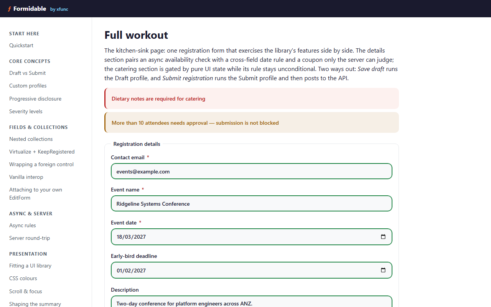

<p align="center">
  <picture>
    <source media="(prefers-color-scheme: dark)" srcset="docs/assets/hero-dark.png">
    
  </picture>
</p>

<h1 align="center">Formidable</h1>
<p align="center">Form validation for Blazor, built on FluentValidation — profiles, progressive disclosure, row-stable collections, and one wire format shared by client and server.</p>

<p align="center">
  <a href="https://github.com/xfunc/formidable/actions/workflows/ci.yml"></a><!-- publish-day: verify -->
  <a href="https://github.com/xfunc/formidable/actions/workflows/deploy-pages.yml"></a><!-- publish-day: verify -->
  <a href="https://www.nuget.org/packages/Formidable.Blazor/"></a><!-- publish-day: verify -->
  <a href="LICENSE"></a><!-- publish-day: verify -->
</p>

Blazor hands you `EditForm`. FluentValidation hands you rules. The layer in between —
deciding which rules run while someone is still typing, which messages they have earned the
right to see, and what to do when the server disagrees with the browser — is the layer I kept
rebuilding by hand, one client form at a time, slightly differently each time. Formidable is
that layer, built once and covered by tests.

It runs one real client project's forms today. Exactly one: a number I'd rather give you
straight than round up. What that buys you is a library that met a deadline before it met a
README, so the awkward parts were found by shipping rather than by guessing.

If you'd rather see it than read about it, there is a [live demo](#live-demo) and a
[five-minute quickstart](#5-minute-quickstart) below.

## What it is

- **Draft and Submit from one validator** — two lifecycles ship built in: a lenient Draft
  profile for save-as-you-go, a strict Submit profile for the real thing, both defined once in
  the same FluentValidation class. Wizard steps and approval stages are custom profiles over
  that same definition.
- **A headless component kit** — `FormidableForm`, `FormidableField`, `FormidableFieldMessage`,
  and `FormidableSummary` own the `EditContext` and render whatever the validator reports. The
  library ships no CSS, so the same kit fits a UI library, a design system, or plain HTML.
- **One validator, client and server** — the same FluentValidation rules run in the browser and
  again on the server, and the server's `ValidationProblemDetails` response applies straight
  into the engine, so a rejected save lights up the exact fields inline.
- **Progressive disclosure** — errors follow what is actually on screen. A field the visitor
  cannot see never nags, and a defensive gate catches the case where every failure would
  otherwise go unseen.
- **Collections that keep their errors** — a message belongs to the row object, not to the row
  number, so adding, removing, and reordering rows can never move an error onto the wrong row.

## Packages

| Package | Depends on | Contents |
|---|---|---|
| `Formidable` | FluentValidation only | Validation profiles, `ProfiledValidator<T>` / `DraftSubmitValidator<T>`, the `IModelValidator` seam, `ValidationIssue` / `ValidationReport`, `INormalizableModel`, model introspection. No Blazor dependency. |
| `Formidable.Blazor` | `Formidable` + `Microsoft.AspNetCore.Components.Web` | The validation engine (EditContext integration, field registry, validation flows) and the headless component kit (`FormidableForm`, `FormidableField`, `FormidableFieldMessage`, `FormidableSummary`, …). |
| `Formidable.AspNetCore` | `Formidable` + ASP.NET Core | Minimal-API endpoint filter and MVC `[Validate]` action filter, returning `ValidationProblemDetails` in the same path format the Blazor client consumes. |

A shared contracts assembly (your models and validators) references `Formidable` only and
stays free of Blazor and ASP.NET Core dependencies. A Blazor client adds `Formidable.Blazor`;
an API adds `Formidable.AspNetCore`. Neither leaf package depends on the other — both depend
only on `Formidable`.

## 5-minute quickstart

Five minutes in an interactive project: `dotnet new blazorwasm`, or a Blazor Web App page
carrying `@rendermode InteractiveServer` or `@rendermode InteractiveWebAssembly`.
`FormidableForm` refuses to render on a statically rendered page, since a form there could be
filled in but never submitted.

Install the Blazor package:

```bash
dotnet add package Formidable.Blazor
```

Register it and your FluentValidation validators in `Program.cs`, `using` directives included:

```csharp
using FluentValidation;
using Formidable.Blazor;

builder.Services.AddFormidableBlazor();
builder.Services.AddScoped<IValidator<QuickContact>, QuickContactValidator>();
```

One line in `_Imports.razor` brings every component below into scope:

```razor
@using Formidable.Blazor
```

The model and validator — a plain `AbstractValidator<T>`, no profiles required:

```csharp
using FluentValidation;

namespace Formidable.Sample.Shared;

public class QuickContact
{
    public string Name { get; set; } = string.Empty;
    public string Email { get; set; } = string.Empty;
}

// The five-minute experience: one plain FluentValidation validator, no profiles.
// Formidable's Draft/Submit profiles both include default rules, so an ordinary
// AbstractValidator works unchanged. Email field uses Cascade.Stop so a missing value
// shows one message; invalid format shows another.
public class QuickContactValidator : AbstractValidator<QuickContact>
{
    public QuickContactValidator()
    {
        RuleFor(c => c.Name).NotEmpty().WithMessage("Name is required");
        RuleFor(c => c.Email).Cascade(CascadeMode.Stop)
            .NotEmpty().WithMessage("Email is required")
            .EmailAddress().WithMessage("A valid email is required");
    }
}
```

*Source: `samples/Formidable.Sample.Shared/QuickContact.cs`*

The page — routed at `@page "/"` in the sample:

```razor
<FormidableForm Model="_contact" OnValidSubmit="HandleValid">
    <FormidableSummary />

    <div class="field"><label>Name <FormidableInputText @bind-Value="_contact.Name" /></label>
        <FormidableFieldMessage For="() => _contact.Name" /></div>
    <div class="field"><label>Email <FormidableInputText @bind-Value="_contact.Email" /></label>
        <FormidableFieldMessage For="() => _contact.Email" /></div>

    <div class="actions"><button type="submit">Submit</button></div>
</FormidableForm>

@if (_submitted)
{
    <p role="status">Submitted — thanks, @_contact.Name!</p>
}
```

*Excerpt from `samples/Formidable.Sample/Pages/Quickstart.razor`* — the `_contact` field and
`HandleValid` handler live alongside in `Quickstart.razor.cs`. The `class` attributes are the
sample app's own styling; the library ships none.

That is the whole form. `FormidableForm` owns the `EditContext`, `FormidableInputText`
registers its field and applies the validation CSS classes, and `FormidableFieldMessage` and
`FormidableSummary` render whatever the validator reports. The same four pieces taken slowly, with
each line explained and a run at the end, are in [Quickstart](docs/quickstart.md).

## Server validation in two lines

The rules you just wrote run on the server too, and they answer in the exact format the client
already knows how to apply. Minimal APIs:

```csharp
var orders = app.MapGroup("/api/orders").Validate<RoundTripOrder>();
```

*Source: `samples/Formidable.Sample.Api/Program.cs`*

MVC controllers:

```csharp
[Validate] // class-level: every action's validatable arguments run the Submit profile
```

*Source: `samples/Formidable.Sample.Api/Controllers/AgreementsController.cs`*

Both filters return `ValidationProblemDetails`. On the client, deserialize the response and hand
it to the form's `ApplyServerIssues(...)`, which lands each issue on the field it names; the
wire contract they share is in [Server integration](docs/server-integration.md).

## Documentation

The docs come in two tiers. The first is a path: read it in order and you will have built the
thing. The second is the shelf you come back to afterwards.

### Learn the library

Six pages, in reading order. Start at the top and keep going.

| Doc | What's in it |
|---|---|
| [Why Formidable](docs/why-formidable.md) | Why this layer exists, with one row per workaround it replaces. |
| [Quickstart](docs/quickstart.md) | A model, a validator, and the four components that render it. |
| [Core concepts](docs/core-concepts.md) | Draft and submit profiles, which pass runs when, and what severity decides. |
| [Fields and collections](docs/fields-and-collections.md) | Rows that keep their errors, collection-level messages, and controls the kit ships no input for. |
| [Async and server](docs/async-and-server.md) | Rules that take time, the pending state they carry, and the server running the same validator. |
| [Recipes](docs/recipes.md) | "I want to…" answered with code, plus a symptom-to-fix troubleshooting table. |

### Reference

The deep dives, grouped the way the concepts stack.

| Area | Doc | What it covers |
|---|---|---|
| Concepts | [Profiles](docs/profiles.md) | Draft, Submit, and profiles you define yourself: how a pass picks its rules. |
| Concepts | [Severity](docs/severity.md) | Errors block a submit; warnings and infos say their piece and let it through. |
| Concepts | [Disclosure](docs/disclosure.md) | Render-registration in full: why an issue surfaces only where its field is mounted. |
| Fields & collections | [Collections and row identity](docs/collections-and-row-identity.md) | How a message stays attached to its row through add, remove, and reorder. |
| Fields & collections | [Component kit](docs/component-kit.md) | Every component and parameter, plus the seams for foreign and native controls. |
| Async & server | [Async validation](docs/async-validation.md) | Pending state and the debounce that drives it, then how overlapping passes settle their order. |
| Async & server | [Server integration](docs/server-integration.md) | Two entry points, the endpoint filter and the `[Validate]` attribute, sharing one wire format. |
| Presentation | [CSS and accessibility](docs/css-and-accessibility.md) | Formidable computes the class names and wires the ARIA; both are yours to override. |
| Presentation | [Options](docs/options.md) | `FormidableOptions` property by property, from the debounce to the CSS class map. |
| Project | [Migration guide](docs/migration-guide.md) | Moving an existing FluentValidation and `EditForm` integration across. |
| Project | [Testing](docs/testing.md) | The suite's shape, how to run each layer, and the gate a release has to pass. |
| Project | [Releasing](docs/releasing.md) | The maintainer's runbook for cutting a version. |
| Project | [Manual checklist](samples/MANUAL-CHECKLIST.md) | The eyes-on walkthrough of the sample app, one check per behaviour. |

## Run the sample locally

The sample app is a runnable tour: one page per feature, each carrying the real source that
makes it work.

```bash
git clone https://github.com/xfunc/formidable.git
cd formidable
```
<!-- publish-day: verify (clone URL above) -->

From the repo root, in two terminals:

```bash
dotnet run --project samples/Formidable.Sample.Api
dotnet run --project samples/Formidable.Sample
```

The API listens on `http://localhost:5180`; open the Blazor app at
`http://localhost:5181`.

## Live demo

The same sample runs on GitHub Pages, deployed from `main`. A simulated in-browser API stands
in for the real server; every other page behaves exactly as it does locally.

**[xfunc.github.io/formidable](https://xfunc.github.io/formidable/)** <!-- publish-day: verify -->

## Contributing, security, and license

Contributions are welcome, and [CONTRIBUTING.md](CONTRIBUTING.md) is where to start: project
layout, dev setup, and what to do before opening a pull request. Found a security issue?
[SECURITY.md](SECURITY.md) has the private disclosure route.

Formidable is licensed under the [MIT License](LICENSE).
