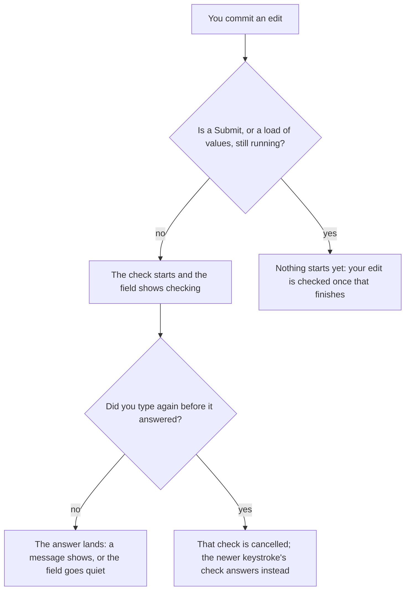

# Async validation rules

**You should already know:** the two profiles and the live-versus-submit split
([Profiles](profiles.md)), and what an async rule looks like from the outside: `MustAsync`, plus
the `IsValidating` pending flag a field carries while its check runs
([Async rules](tutorial/5-async.md)).

Async validation is hard. Not hard to write, since `MustAsync` is one method, but hard to order:
the moment a rule takes real time to answer, its answer stops being about the value on screen. A
uniqueness check finishes half a second after the visitor has moved on. Two keystrokes race, and
the older one's answer arrives last.

Formidable's answer is that you only ever see the answer for what you last typed. An async rule is
a rule that awaits. While it does, the field shows "checking"; a newer keystroke cancels the older
check, so a burst of typing settles into one answer. The check is debounced only when you ask
([`LiveDebounce`](options.md#livedebounce)) and can be memoized so the same value is not checked
twice (`MustAsyncMemoized`).

After a submit, every edit also re-checks the whole form so the summary stays honest, behind a
short timer of its own ([`RefreshDebounce`](options.md#refreshdebounce)).

Three things are yours: write the rule, honour its cancellation token, and render the field's
pending flag. The sequencing is the library's. Here is one field's async rule, from a keystroke
to its answer:



The diagram traces the default cadence, where the check starts on the edit itself; `LiveDebounce`
puts a timer in front of the first step.

## How do I write an async rule?

Nothing about writing the rule changes: `MustAsync` and its siblings work in Formidable exactly
as they do in plain FluentValidation. What decides *when* it runs is
[`LiveProfile`](options.md#liveprofile), `null` by default, meaning the submit profile: a rule in
either bucket runs as you edit, with nothing to configure. `ConfigureDraftRules()` is still where
a uniqueness check belongs, since a lenient draft save should answer it too
([Profiles](profiles.md)); narrowing `LiveProfile` is the lever for a rule too expensive to run
per change.

```csharp
using FluentValidation;

namespace Formidable.Sample.Shared;

public class Handle
{
    public string Username { get; set; } = string.Empty;
    public string DisplayName { get; set; } = string.Empty;

    // Shared by both handle validators, plain and memoized, so their taken-name checks agree
    // without either one holding its own copy of the lists.
    internal static readonly string[] Taken = ["admin", "root", "formidable"];
    internal static readonly string[] TakenDisplayNames = ["Administrator", "Root User", "Formidable"];
}

public class HandleValidator : DraftSubmitValidator<Handle>
{
    // Mutable so the sample page can slow the simulated call down and make cancellation
    // visible; a real validator would inject a clock/service rather than hold mutable state.
    // Shared with MemoizedHandleValidator, which reads the same property rather than holding
    // its own copy.
    public static int SimulatedDelayMs { get; set; } = 600;

    protected override void ConfigureDraftRules()
    {
        // Async uniqueness sits in the always-on (Draft) bucket so a lenient draft save answers
        // it too; what runs it on each committed change is the live channel, which evaluates
        // whatever would block a submit. The delay stands in for a server call and honours
        // cancellation: a newer keystroke cancels the older check before it can answer.
        RuleFor(h => h.Username)
            .MustAsync(async (username, cancellationToken) =>
            {
                await Task.Delay(SimulatedDelayMs, cancellationToken);
                return !Handle.Taken.Contains(username, StringComparer.OrdinalIgnoreCase);
            })
            .WithMessage("That username is taken")
            .When(h => !string.IsNullOrEmpty(h.Username));

        // A second, independent async field — demonstrates that the pending flag is scoped to
        // the field being edited, not the whole form.
        RuleFor(h => h.DisplayName)
            .MustAsync(async (displayName, cancellationToken) =>
            {
                await Task.Delay(SimulatedDelayMs, cancellationToken);
                return !Handle.TakenDisplayNames.Contains(displayName, StringComparer.OrdinalIgnoreCase);
            })
            .WithMessage("That display name is taken")
            .When(h => !string.IsNullOrEmpty(h.DisplayName));
    }

    protected override void ConfigureSubmitRules()
    {
        RuleFor(h => h.Username).NotEmpty().WithMessage("Username is required");
    }
}
```

<!-- Source: `samples/Formidable.Sample.Shared/Handle.cs` -->

Honour the token. A newer keystroke cancels the older check, and a rule that ignores its token
wastes the request, never the answer: you still only see the answer for what you last typed.
Then render the pending flag, which `FormidableField`'s cascaded context exposes as
`field.State.IsValidating`:

```razor
<FormidableField For="() => _handle.Username" Context="field">
    <div class="field">
        <label>Username <FormidableInputText @bind-Value="_handle.Username" UpdateOn="InputUpdateMode.OnInput" /></label>
        <em role="status">@(field.State.IsValidating ? "checking…" : null)</em>
    </div>
    <FormidableFieldMessage For="() => _handle.Username" />
</FormidableField>

<FormidableField For="() => _handle.DisplayName" Context="field">
    <div class="field">
        <label>Display name <FormidableInputText @bind-Value="_handle.DisplayName" UpdateOn="InputUpdateMode.OnInput" /></label>
        <em role="status">@(field.State.IsValidating ? "checking…" : null)</em>
    </div>
    <FormidableFieldMessage For="() => _handle.DisplayName" />
</FormidableField>
```

<!-- Excerpt from `samples/Formidable.Sample/Pages/AsyncRules.razor` -->

Both fields use `UpdateOn="InputUpdateMode.OnInput"` so a check starts on every keystroke, not
just on blur; otherwise there is nothing to cancel until the visitor tabs away. That is the whole
authoring surface an async rule requires.

## How do I stop the check firing on every keystroke?

Two ways. Commit on change instead of on every keystroke (the kit's `UpdateOn` default; the
sample above opts into `OnInput`), and the check runs when the visitor leaves the field. Or keep
per-keystroke commits and set [`LiveDebounce`](options.md#livedebounce) (`null` by default).

An edit then starts one shared timer instead of a check; another edit inside the window restarts
it, and when it elapses quietly one check runs for every field the window collected. It earns
its keep for an availability check, since each keystroke otherwise costs a started-and-cancelled
request, and it leaves the whole-form re-check's timer untouched.

By default the check starts on the edit itself, not on a timer: the moment an edit commits, work
starts, and what work depends on whether the form has been submitted. Before the first submit an
edit starts one check, which answers every field you have engaged; after a submit it also
re-checks the whole form ([below](#why-did-the-summary-change-a-moment-after-i-fixed-a-field)).

Why: [how the engine works: what starts each check](how-the-engine-works.md#the-five-pass-kinds).

## What happens if I keep typing while a check is running?

Type fast into a field whose check takes half a second and the answer left on screen is the one
for the value you last typed. A newer check cancels the one before it, and "checking" stays on
the field until the answer for the latest value lands. A committed change always gets a fresh
answer: the answer for an earlier value is never reused as the answer for a later one. Two
unrelated async fields each show their own "checking", and neither lights the other.

Why: [how the engine works: which check yields to which](how-the-engine-works.md#supersession-and-deferral).

## What happens if I press Submit while a check is running?

Press Submit and every field is answered at once, whatever partial work a half-typed field had
running: every submit rule runs, whatever a live check answered a moment before. Keep typing
while the submit spinner turns and nothing you type cancels it; the edit is not lost, because the
whole form is re-checked once the submit lands. The same holds while loaded values are being
checked (`DiscloseLoadedValuesAsync`): nothing you type cancels that, and the edit is answered by
the check that follows the load.

Only a second Submit, or a load of values, can overtake a submit; the overtaken submit blocks
without writing an error of its own, leaving what was already showing. A blocked submit focuses
the first error, or the first visible issue when no error is on screen, and a validator that
throws propagates to the caller.

Why: [how the engine works: which check yields to which](how-the-engine-works.md#supersession-and-deferral).

## Why did the summary change a moment after I fixed a field?

Because a failed submit's messages follow your fixes without a second submit. After a submit,
every edit re-checks the whole form once you pause, so what the submit showed stays honest. Doing
that on every keystroke would be too much work, which is why the re-check has a timer of its own,
and a burst of edits inside its window is one re-check.

The knob is [`RefreshDebounce`](options.md#refreshdebounce), 300 ms by default: the re-check
comes due after that much quiet, the one timer-based debounce a form gets without asking. A
change to which fields are on screen (a row leaving, a section collapsing) re-checks the whole
form at any point, against the page as it stands.

The re-check never throws away an answer you are waiting on. It waits its turn behind three
things and only three: a submit still running, the check your own edit started while it is still
running, and a load of values still being checked. It never waits for an open `LiveDebounce`
window, and it never cancels what it waits for.

A server reply's messages stay on screen until the next whole-form re-check, the next submit or a
load replaces them; a live check for one field does not. Set `LiveDebounce` wider than
`RefreshDebounce` and the re-check lands before the live check, at no extra cost. What the
submit disclosed then updates a beat before the field's own message; the settled state, and the
cost, are the same whichever lands first.

Why: [how the engine works: what starts each check](how-the-engine-works.md#the-five-pass-kinds).

## Does the library ever run my rule twice for one edit?

Not on a validator it can take rule by rule, which FluentValidation's `AbstractValidator` is
unless you set `ClassLevelCascadeMode.Stop`. Submit, then edit a field, and no rule runs twice:
one edit runs a rule declared once exactly once, however many profile names reach it. Whichever
of the live check and the whole-form re-check lands first, you see the same messages and each
rule ran once. On the default profiles the re-check runs no rule the live check already answered,
and what it refreshes is still complete.

The sample's [`/async`](../samples/Formidable.Sample/Pages/AsyncRules.razor) page makes the saving
visible: submit, then type, and one "checking" cycle runs, not two. The exceptions you can count:

- Narrow `LiveProfile` and the re-check runs the rules the live check skipped. Swap `LiveProfile`
  at runtime and it takes effect at the next check; rules both profiles select are not re-run.
- A rule inside an `Include()`, or in a child validator with rulesets of its own, may run again
  when the live and submit profiles differ. Plain rules, ruleset rules and `ChildRules` run once.
- A rule written with `RuleForEach` is checked for every row at once, so an expensive per-row
  check costs the whole collection on each edit that reaches it.
- A validator with a class-level cascade stop, or one that is not FluentValidation's
  `AbstractValidator`, has every rule re-run on every check, so after a submit a rule can run
  twice for one edit. A per-rule `.Cascade(CascadeMode.Stop)` changes nothing.
- Pressing Submit right after a live check asks the async rule again, and so can
  [`TrackFormValidity`](#what-does-trackformvalidity-cost-with-async-rules); a memo answers the
  repeat ([next question](#why-did-the-same-value-get-checked-twice-and-how-do-i-stop-it)).

Why: [how the engine works: how answers are reused](how-the-engine-works.md#the-verdict-store).

## Why did the same value get checked twice, and how do I stop it?

Type `admin`, clear it, type `admin` again, and the check runs twice for the same value, because
every edit gets a fresh answer however familiar the value looks. Pressing Submit shortly after a
live check asks the rule again too. A memo answers both from what it already knows:
`AsyncRuleMemo<TKey, TResult>` holds answers for a window you size, and `MustAsyncMemoized` puts
one on a rule, keyed by the value alone.

How: [remember a slow check's answer](recipes.md#i-want-a-slow-async-check-to-remember-its-answer).

## Why did a value my code changed keep its old message?

Because the form was never told. A value your code changes without telling the form is judged as
it was until something makes the form check afresh: your next edit, a submit, a load of values, or
a change to which fields are on screen. Mutating a bound model without notifying is outside the
contract everywhere in Formidable, and here the price is a wrong answer rather than a stale
message. Call `field.NotifyChanged()` (or `EditContext.NotifyFieldChanged`) for it.
[Collections and row identity](collections-and-row-identity.md) has the same rule from the row
side.

Why: [how the engine works: how answers are reused](how-the-engine-works.md#the-verdict-store).

## Where does "checking" show, and where doesn't it?

On the field you changed, and nowhere else, while its live check runs: `Username` and
`DisplayName` above each show their own "checking" without one lighting up the other. After a
submit, the whole-form re-check shows it on the fields you edited since. Pressing Submit shows it
form-wide, because every field is being checked at once. Loading values shows it nowhere.

Two flags answer "is something still checking?". `IFormidableEngine.IsValidating` is true
while any check but `TrackFormValidity`'s is running, whichever field started it, so it is the
one for a form-wide spinner; `GetFieldState(field).IsValidating` (`field.State.IsValidating`
inside a `FormidableField`) is scoped as above. The per-field flag drives the `Pending` class
([`CssClasses`](options.md#cssclasses)) that `FormidableInput*` components apply, and that native
`InputBase` components pick up through the class provider every engine installs on its
`EditContext`.

Loading values (`DiscloseLoadedValuesAsync`) runs every rule once, async ones included, then
checks the fields it engaged. It shows "checking" on no field (the form-wide flag is true, so a
page spinner works), moves no focus, and a form that never calls it is unaffected.

Why: [how the engine works: what starts each check](how-the-engine-works.md#the-five-pass-kinds).

## Why isn't my field green even though the check passed?

Because green means "would pass submit", not "this check passed". A field wears `Valid` only once
it is touched or modified, shows no issue of any severity, and every rule the submit profile
selects has answered for the value as it stands. A narrowed `LiveProfile` leaves some of those
rules unanswered, so no field goes green on the strength of a narrowed live check alone.

With `TrackFormValidity` on, its validity check answers the rest, so tracking can put green on a
field a narrowed live check could not.
[CSS and accessibility](css-and-accessibility.md#what-puts-green-on-a-field) has the whole
condition.

Why: [how the engine works: what green reads](how-the-engine-works.md#the-submit-coverage-vouch).

## What does `TrackFormValidity` cost with async rules?

[`TrackFormValidity`](options.md#trackformvalidity) (`false` by default) keeps `IsFormValid`
current on every field change, or once per window when `LiveDebounce` is set, judging the whole
model by the submit profile. It shows no message and no "checking". `IsFormValid` answers for the
untouched form as soon as the check started at construction lands, before anything is typed.

Where every rule answers without waiting, it adds no rule executions per edit on the default
profiles: whichever of the validity check and the check your edit started runs first has answered
by the time the other looks, and the other reuses those answers. It costs extra in two places.
Narrowing `LiveProfile` does not save the work: the rules the live check skipped still run on every
edit to keep `IsFormValid` honest.

And an async rule the live check also runs (on the default profiles, every submit rule) is paid
twice per edit: the validity check starts beside the check your edit started, and neither can
reuse what the other is still computing. A memo folds the pair into one round trip, because the
second call joins the first. With no `LiveDebounce`, ten quick edits can mean ten validity checks
running at once, each answering for the form as it stood when it started, and the latest one
wins: time, never correctness.

[Options](options.md#trackformvalidity) has the cost on a validator that cannot be taken rule by
rule.

Why: [how the engine works: what `TrackFormValidity` runs](how-the-engine-works.md#the-trackformvalidity-probe).

**Sample:** [`/async`](../samples/Formidable.Sample/Pages/AsyncRules.razor)
