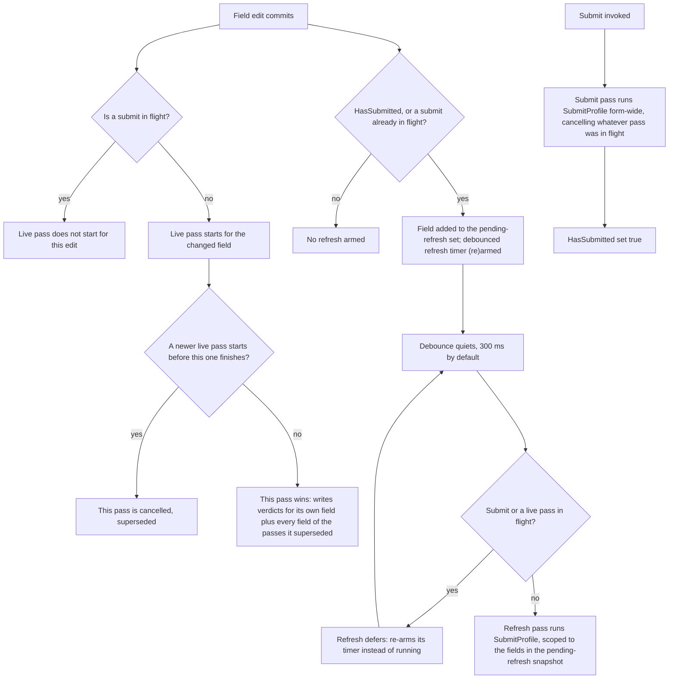

# Async validation rules

FluentValidation's async rule methods (`MustAsync` and its siblings) work in Formidable exactly
as they do in plain FluentValidation — the validator awaits them like any other rule. What
Formidable adds around them is a validation pipeline with its own opinions about when an async
rule runs, what happens to a still-running check when the value it was checking is already
stale, and how a UI reports "this is still checking" without any extra bookkeeping of its own.

## Where to put the rule

A live pass — one per field change — validates whichever profile `FormidableOptions.LiveProfile`
names (`ValidationProfile.Draft` by default; see [`docs/profiles.md`](profiles.md)). An async rule
placed in `ConfigureDraftRules()` therefore runs on every keystroke, not just at submit — the
shape a live "is this username taken?" check needs. It sits there for the same reason ordinary
format rules do: draft rules are the ones that run while the user is still typing.

```csharp
using FluentValidation;

namespace Formidable.Sample.Shared;

public class Handle
{
    public string Username { get; set; } = string.Empty;
    public string DisplayName { get; set; } = string.Empty;
}

public class HandleValidator : DraftSubmitValidator<Handle>
{
    private static readonly string[] Taken = ["admin", "root", "formidable"];
    private static readonly string[] TakenDisplayNames = ["Administrator", "Root User", "Formidable"];

    // Mutable so the sample page can slow the simulated call down and make cancellation
    // visible; a real validator would inject a clock/service rather than hold mutable state.
    public static int SimulatedDelayMs { get; set; } = 600;

    protected override void ConfigureDraftRules()
    {
        // Async uniqueness runs in the live (Draft) profile so it fires as the user types;
        // the delay stands in for a server call and honours cancellation, so a superseded
        // keystroke's check is abandoned.
        RuleFor(h => h.Username)
            .MustAsync(async (username, cancellationToken) =>
            {
                await Task.Delay(SimulatedDelayMs, cancellationToken);
                return !Taken.Contains(username, StringComparer.OrdinalIgnoreCase);
            })
            .WithMessage("That username is taken")
            .When(h => !string.IsNullOrEmpty(h.Username));

        // A second, independent async field — demonstrates that the pending indicator during a
        // live pass is scoped to the field being edited, not the whole form.
        RuleFor(h => h.DisplayName)
            .MustAsync(async (displayName, cancellationToken) =>
            {
                await Task.Delay(SimulatedDelayMs, cancellationToken);
                return !TakenDisplayNames.Contains(displayName, StringComparer.OrdinalIgnoreCase);
            })
            .WithMessage("That display name is taken")
            .When(h => !string.IsNullOrEmpty(h.DisplayName));
    }

    protected override void ConfigureSubmitRules()
    {
        RuleFor(h => h.Username).NotEmpty().WithMessage("Username is required");
    }
}
```

*Source: `samples/Formidable.Sample.Shared/Handle.cs`*

`Username` and `DisplayName` are two unrelated async checks on the same model — worth keeping in
mind for the pending-UI section below, since the two never light each other up.

## Debounce and cancellation

Only one validation pass — live, submit, or the post-submit refresh — is ever in flight on the
engine at a time; starting a new one cancels whatever pass came before it. For a live pass that
means every field change starts its own pass immediately (there's no timer sitting in front of
it), and a fast run of keystrokes cancels each prior pass the moment the next one starts. That's
exactly why an async rule must accept and honor the `CancellationToken` `MustAsync` hands it: an
ignored token lets an abandoned pass keep running toward a result nobody will read — and worse, a
result that can still land after a *later* pass has already resolved and updated the model's
state.

The one place a genuine timer-based debounce exists is the refresh that follows a submit. Once
`HasSubmitted` is true, every further field change reschedules a debounced re-run of
`SubmitProfile` after `FormidableOptions.RefreshDebounce` (300 ms by default; see
[`docs/options.md`](options.md)) of quiet. That's a different pass from the live one above — it
exists to keep already-visible submit errors and warnings current without re-validating the whole
profile on every keystroke of a form the user is still correcting after a failed submit.

A field change while a submit is itself in flight only stops the first of these — the live pass
for that keystroke never starts, because submit is the higher-intent operation and a live or
refresh pass never supersedes it. The edit still lands in the pending-refresh set and arms the
debounced refresh, though, which defers to the submit for as long as it stays in flight and runs
once the submit lands.

The refresh defers to a live pass the same way: rather than cancelling one that is still running,
it re-arms its own timer and runs once that pass has landed, so an edit whose async rule outlasts
the debounce still gets the answer its own live pass was computing. Between live passes there is
nothing to defer to — a newer live pass supersedes the older one outright — but the pass that wins
writes the verdicts for the fields of the passes it superseded as well as its own, so a field
edited moments before another still gets its answer.

The flowchart below traces that ordering end to end — what an edit starts, how the refresh
defers to whatever is already running, and how a submit sits above all of it:



## Pending UI

Two flags both answer "is something still checking?", at different scopes. The engine-level
`IsValidating` (`IFormValidationEngine.IsValidating`) is true whenever *any* pass is in flight,
regardless of which field triggered it — the right one for a form-wide spinner.
`GetFieldState(field).IsValidating` is narrower and scoped to the fields the pass actually
concerns: during a live pass it's true only for the field whose change started that pass, so
`Username` and `DisplayName` — two independent async rules on the same form — each show their own
"checking…" without one lighting up the other's. During the debounced refresh it's true only for
the fields edited within that debounce window — the ones whose changes scheduled it — even though
the refresh itself re-validates the whole model in one pass; a live pass that supersedes an
in-flight refresh takes the indicator scope with it, the same way one live pass already displaces
another's before submit. Submit is the one pass where the per-field flag goes form-wide too: it's
true for every field, because a submit really does (re-)check every field at once. The same
per-field flag also drives the `Pending` CSS class (see [`docs/options.md`](options.md)) that
ordinary `Validated*` inputs apply automatically.

`FormidableField`'s cascaded `FormidableFieldContext` exposes this as `field.State.IsValidating`:

```razor
    <FormidableField For="() => _handle.Username" Context="field">
        <div class="field">
            <label>Username <FormidableInputText For="() => _handle.Username" @bind-Value="_handle.Username" UpdateOn="InputUpdateMode.OnInput" /></label>
            @if (field.State.IsValidating)
            {
                <em role="status">checking…</em>
            }
        </div>
        <FieldMessage For="() => _handle.Username" />
    </FormidableField>

    <FormidableField For="() => _handle.DisplayName" Context="field">
        <div class="field">
            <label>Display name <FormidableInputText For="() => _handle.DisplayName" @bind-Value="_handle.DisplayName" UpdateOn="InputUpdateMode.OnInput" /></label>
            @if (field.State.IsValidating)
            {
                <em role="status">checking…</em>
            }
        </div>
        <FieldMessage For="() => _handle.DisplayName" />
    </FormidableField>
```

*Excerpt from `samples/Formidable.Sample/Pages/AsyncRules.razor`*

Both fields use `UpdateOn="InputUpdateMode.OnInput"` so a live pass starts on every keystroke, not
just on blur — otherwise there'd be nothing to cancel until the user tabbed away.

**Sample:** [`/async`](../samples/Formidable.Sample/Pages/AsyncRules.razor)
