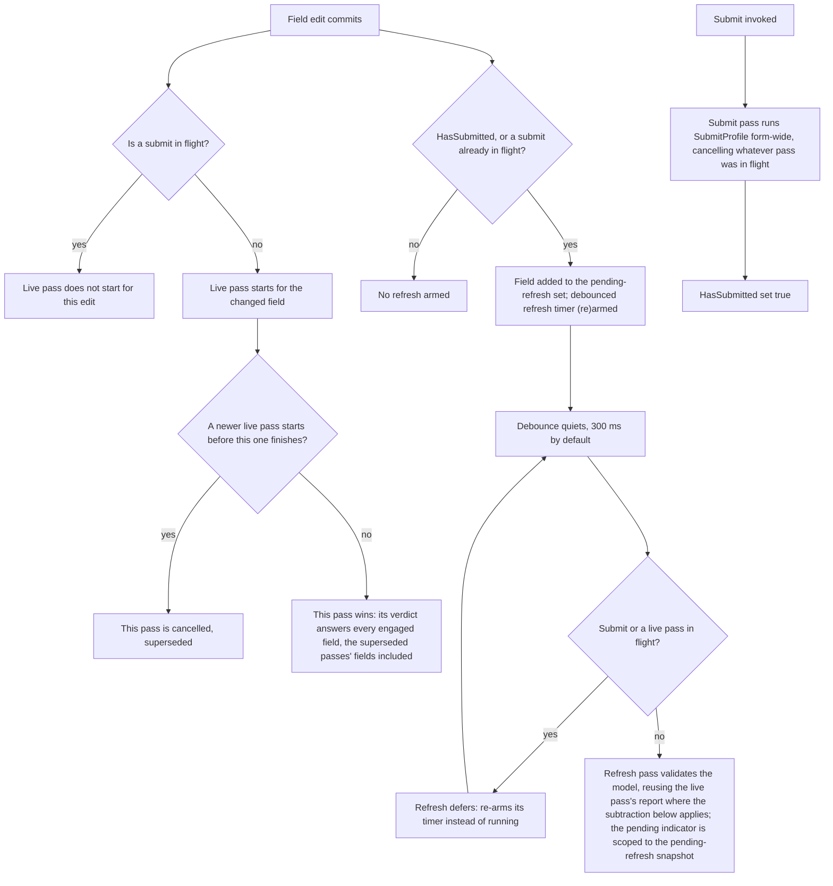

# Async validation rules

**You should already know:** the two profiles and the live-versus-submit split
([Core concepts](core-concepts.md)), and what an async rule looks like from the
outside — `MustAsync`, plus the `IsValidating` pending flag a field carries while one is in
flight ([Async and server](async-and-server.md)).

Async validation is hard. Not hard to write, since `MustAsync` is one method, but hard to
*order*: the moment a rule takes real time to answer, its answer stops being about the value on
screen. A uniqueness check finishes half a second after the user has moved on to the next
field. An edit lands while the submit it interrupted is still running. Two keystrokes race, and
the older one's answer arrives last. A re-check nobody asked for wakes up mid-word. Every one
of those puts a verdict on screen for a value that no longer exists, and every one of them is
an ordering problem rather than a rule problem.

Formidable's answer is that exactly one validation pass is ever in flight, and the engine
decides which one it is: not the rule, and not the page. This page covers when an async rule
runs, what happens to a still-running check whose value has already gone stale, and how a UI
reports "this is still checking" without keeping any bookkeeping of its own.

## Need to know

Three things are yours: put the rule in the draft profile, honour its cancellation token, and
render the field's pending flag. The sequencing is the engine's.

Nothing about writing the rule changes. `MustAsync` and its siblings work in Formidable exactly
as they do in plain FluentValidation, awaited like any other rule. What decides *when* it runs
is the profile it sits in. A live pass — one per field change — validates whichever profile
`FormidableOptions.LiveProfile` names (`ValidationProfile.Draft` by default; see
[Profiles](profiles.md)). An async rule placed in `ConfigureDraftRules()` therefore
runs on every keystroke, not just at submit: the shape a live "is this username taken?" check
needs. It sits there for the same reason ordinary format rules do, since draft rules are the
ones that run while the user is still typing.

```csharp
using FluentValidation;

namespace Formidable.Sample.Shared;

public class Handle
{
    public string Username { get; set; } = string.Empty;
    public string DisplayName { get; set; } = string.Empty;

    // Shared by both handle validators, plain and memoized, so their taken-name checks agree
    // without either one holding its own copy of the lists.
    internal static readonly string[] Taken = ["admin", "root", "formidable"];
    internal static readonly string[] TakenDisplayNames = ["Administrator", "Root User", "Formidable"];
}

public class HandleValidator : DraftSubmitValidator<Handle>
{
    // Mutable so the sample page can slow the simulated call down and make cancellation
    // visible; a real validator would inject a clock/service rather than hold mutable state.
    // Shared with MemoizedHandleValidator, which reads the same property rather than holding
    // its own copy.
    public static int SimulatedDelayMs { get; set; } = 600;

    protected override void ConfigureDraftRules()
    {
        // Async uniqueness runs in the live (Draft) profile so it fires as the user types;
        // the delay stands in for a server call and honours cancellation, so a superseded
        // keystroke's check is abandoned.
        RuleFor(h => h.Username)
            .MustAsync(async (username, cancellationToken) =>
            {
                await Task.Delay(SimulatedDelayMs, cancellationToken);
                return !Handle.Taken.Contains(username, StringComparer.OrdinalIgnoreCase);
            })
            .WithMessage("That username is taken")
            .When(h => !string.IsNullOrEmpty(h.Username));

        // A second, independent async field — demonstrates that the pending indicator during a
        // live pass is scoped to the field being edited, not the whole form.
        RuleFor(h => h.DisplayName)
            .MustAsync(async (displayName, cancellationToken) =>
            {
                await Task.Delay(SimulatedDelayMs, cancellationToken);
                return !Handle.TakenDisplayNames.Contains(displayName, StringComparer.OrdinalIgnoreCase);
            })
            .WithMessage("That display name is taken")
            .When(h => !string.IsNullOrEmpty(h.DisplayName));
    }

    protected override void ConfigureSubmitRules()
    {
        RuleFor(h => h.Username).NotEmpty().WithMessage("Username is required");
    }
}
```

*Source: `samples/Formidable.Sample.Shared/Handle.cs`*

The `CancellationToken` that `MustAsync` hands the rule is load-bearing, not decoration. A fast
run of keystrokes cancels each prior pass the moment the next one starts, and a rule that
ignores its token lets an abandoned pass keep running toward a result nobody will read. Worse,
toward a result that can still land after a *later* pass has already resolved and updated the
model's state.

`Username` and `DisplayName` are two unrelated async checks on the same model, which is worth
keeping in mind for the pending UI: the two never light each other up.

Then render the pending flag. `FormidableField`'s cascaded `FormidableFieldContext` exposes it
as `field.State.IsValidating`:

```razor
    <FormidableField For="() => _handle.Username" Context="field">
        <div class="field">
            <label>Username <FormidableInputText @bind-Value="_handle.Username" UpdateOn="InputUpdateMode.OnInput" /></label>
            @if (field.State.IsValidating)
            {
                <em role="status">checking…</em>
            }
        </div>
        <FormidableFieldMessage For="() => _handle.Username" />
    </FormidableField>

    <FormidableField For="() => _handle.DisplayName" Context="field">
        <div class="field">
            <label>Display name <FormidableInputText @bind-Value="_handle.DisplayName" UpdateOn="InputUpdateMode.OnInput" /></label>
            @if (field.State.IsValidating)
            {
                <em role="status">checking…</em>
            }
        </div>
        <FormidableFieldMessage For="() => _handle.DisplayName" />
    </FormidableField>
```

*Excerpt from `samples/Formidable.Sample/Pages/AsyncRules.razor`*

Both fields use `UpdateOn="InputUpdateMode.OnInput"` so a live pass starts on every keystroke,
not just on blur — otherwise there'd be nothing to cancel until the user tabbed away.

That is the whole authoring surface. The rest of this page is what the engine does with it.

## The ordering, end to end

Only one validation pass — live, submit, or the post-submit refresh — is ever in flight on the
engine at a time, and starting a new one cancels whatever pass came before it. Everything below
follows from that one constraint. The flowchart traces it end to end: what an edit starts, how
the refresh defers to whatever is already running, and how a submit sits above all of it.



The diagram traces the default cadence, where an edit's live pass starts on the keystroke itself.
`FormidableOptions.LiveDebounce` puts a timer in front of that first step, described under
[The live pass starts](#the-live-pass-starts) — which, once a submit has happened, reaches the
refresh-arm step downstream of it too, and the refresh's own defer decision beyond that, both
traced in the sections below.

### An edit commits

A keystroke is a small event with a large blast radius. The engine decides, at the moment the
field change lands, what work it starts — and the answer differs depending on whether the form
has been submitted yet.

Before any submit, an edit starts one thing: a live pass. Once the form has been submitted, the
same edit also arms a debounced refresh. Whether that live pass actually starts is the first
branch below; the refresh arming is the second.

### Is a submit in flight?

People keep typing while a spinner turns. If the keystroke landing mid-submit started its own
live pass, that pass would cancel the submit the user actually asked for, and the one operation
they explicitly requested would lose to one they didn't.

So it never starts. The live pass for an edit made while a submit is in flight does not begin:
submit is the higher-intent operation, and a live or refresh pass never supersedes it. The edit
is not dropped, though. It still lands in the pending-refresh set and arms the debounced
refresh, which defers to the submit for as long as it stays in flight and runs once the submit
lands.

### The live pass starts

Feedback that waits for blur is feedback the user has already outrun: they have typed six more
characters and moved on before anything told them the first three were a problem.

With no submit in flight, the edit starts its own pass immediately, triggered by the field that
changed. There is no timer sitting in front of a live pass — it begins on the keystroke itself.

Unless you ask for one. `FormidableOptions.LiveDebounce` is `null` by default, which is the cadence
just described; set it and a field change arms a single shared timer instead of starting a pass.
Another edit inside the window re-arms that timer rather than opening a second one, and when the
window elapses quietly, one live pass runs, scoped to every field the window collected. It is worth
reaching for when the live rules are expensive enough that one pass per keystroke is the wrong
trade — an async availability check being the obvious case, since supersession still costs a
started-and-cancelled request per keystroke.

A debounced live pass is a little more deferential than an immediate one: with a submit *or* a
refresh already running, it re-arms its timer instead of starting, because the edit that would
normally re-arm the refresh has already happened, and cancelling the refresh outright would leave
its verdict stale with nothing left to fix it. The option reaches the refresh's own cadence too:
once a submit has happened, the field change that arms the debounce window also arms the refresh,
and the refresh's due time answers for this window as well as for `RefreshDebounce`. Any refresh
that comes due while the window is still open with fields left in it defers to it too, not only
the one this same edit armed — see
[The refresh runs only what the live pass did not](#the-refresh-runs-only-what-the-live-pass-did-not)
below for the mechanism and what it buys.

### A newer pass supersedes an older one

Type into a field whose uniqueness check takes half a second and, left ungoverned, several
answers are in the air at once for one field. Nothing about async guarantees they come back in
the order they were asked, so the earliest question can produce the last answer, and the last
answer is the one the user is left looking at.

That can't happen here, because starting a pass cancels the one before it, which is exactly why
an async rule has to honour its token. The cancelled pass writes nothing: it is no longer the
authority on anything. The pass that wins answers every engaged field — the superseded passes'
fields were engaged before the winner began — so a field edited moments before another still
gets its answer, from the one report that saw the model last.

### After a submit, an edit also arms a refresh

A failed submit leaves errors on screen and the user starts fixing them. Those messages came
from the submit pass, so keeping them honest means re-running the submit profile. Doing that on
every keystroke, for a whole form, is a lot of work to spend on a user who is still mid-word.

That is what the refresh is for: keeping already-visible submit errors and warnings current
without re-validating the whole profile on every keystroke of a form the user is still
correcting. Once `HasSubmitted` is true, or while a submit is in flight, every further field
change adds that field to the pending-refresh set and reschedules a debounced re-run of
`SubmitProfile`. Before the first submit there is nothing to arm: an edit starts a live pass and
nothing else.

### The debounce quiets

A refresh should follow the user's pauses, not their keystrokes.

The timer fires after `FormidableOptions.RefreshDebounce` of quiet (300 ms by default; see
[Options](options.md)). This is the one timer-based debounce a form gets without asking. A live
pass has none unless [`LiveDebounce`](options.md#livedebounce) puts one there: by default it starts
on the keystroke and resolves a burst by supersession instead of by waiting.

### The refresh defers to whatever is running

The timer firing means the user stopped typing. It does not mean the engine is free. A submit
may be in flight. A live pass may be mid-rule, holding the answer the user is actually waiting
for. Since starting a pass cancels the one before it, a refresh that ran regardless would throw
away work someone asked for. The async rule that was 500 ms into a 600 ms check would have
nothing to show for it.

So it defers, to any of three. If a submit or a live pass is in flight, or a debounced live
window is still armed with fields left in it, the refresh re-arms its own timer rather than
running, and comes back when the timer next quiets — as many times as it takes. Deferring to a
submit is the higher-intent rule again. Deferring to a live pass earns its keep somewhere else:
an edit whose async rule outlasts the debounce still gets the answer its own live pass was
computing. Between two live passes that have already run there is nothing to defer to, since a
newer live pass supersedes the older one outright — a live pass not yet started, only
accumulating fields behind its own debounce timer, is the different case the third condition
above answers for. The refresh's own path is different: it cancels neither the submit nor the
live pass, it waits for them.

With nothing in flight and no debounced live window still armed with fields left in it, the
refresh pass validates the model — the whole `SubmitProfile`, or only the part of it the live
pass has not already answered (see
[The refresh runs only what the live pass did not](#the-refresh-runs-only-what-the-live-pass-did-not)
below). Either way it answers for the whole model in one pass; what the pending-refresh snapshot
scopes is the pending indicator, covered in
[Which fields show "checking…"](#which-fields-show-checking) below.

### Submit sits above all of it

Submit is the moment the user commits the form. Whatever partial work was in flight for a
half-typed field is beside the point now, and the answer they are owed is the one about the
whole model.

Submit enters the flowchart on its own edge, because nothing an edit does starts it. The submit
pass runs `SubmitProfile` form-wide, cancelling whatever pass was in flight, and it is never
superseded in turn. It sets `HasSubmitted` true, which is what arms the refresh for every edit
that follows.

### The refresh runs only what the live pass did not

Once a form has been submitted, an edit still takes both branches of the flowchart: it starts a
live pass and it arms the refresh. `ValidationProfile.Submit` is the default rules plus the
`Submit` ruleset; `ValidationProfile.Draft`, the default `LiveProfile`, is the default rules
alone — so on the default pair, everything the live pass just ran is also part of what the
refresh is about to run. The refresh subtracts it: it validates only the rules the submit
profile adds beyond the live profile, and combines that report with the live pass's own report
for the rest. An async rule written in `ConfigureDraftRules()` — the uniqueness check at the top
of this page — sits entirely inside that subset, so it answers once per post-submit edit rather
than twice: the live pass runs it, and the refresh's own pass skips past it.

The sample's [`/async`](../samples/Formidable.Sample/Pages/AsyncRules.razor) page makes the
saving visible. Submit, then type: one "checking…" cycle runs, not two.

Three things have to hold for the subtraction to apply, all about the same edit. The live
profile's rules have to be a genuine subset of the submit profile's — every ruleset the live
profile names has to also appear in the submit profile, and the live profile can't include
default rules unless the submit profile does — since subtracting a profile that reaches
somewhere the submit profile doesn't would drop rules from the verdict rather than avoid
re-running them. The live pass's report has to still answer for the model as it stands, which the
engine reads as "no field change has been notified since that pass began", plus one thing it can
see for itself: a rendered field set that moves — a collection row leaving the page, a section
collapsing — drops the retained report outright, and the refresh that follows runs the whole
`SubmitProfile` rather than trust a report describing a page, and a model, already gone. And the
retained report has to have been produced under the live profile currently in force:
`FormidableOptions.LiveProfile` is a mutable instance a consumer may swap
between the live pass and the refresh that follows it (the documented way to change a setting at
runtime, see [Engine options](options.md#formidableoptions-is-read-once)), so a swapped profile
falls back the same way a stale report does, rather than subtract against a profile the retained
answer never ran under.

Report currency is checked against notifications rather than against the model itself, and that
distinction has teeth. Change a bound model's contents without telling the form — a handler
patching a computed property, a late server response writing into the model while a refresh window
is open — and nothing the engine reads moves. The retained report goes on looking current, and the
verdict the refresh publishes combines live-profile rules answered against the model as it was
with delta rules answered against the model as it is. Mutating a bound model without notifying is
outside the contract everywhere in Formidable, and covered under
[Fields and collections](fields-and-collections.md); this is the place where the price is a wrong
verdict rather than a stale message. `field.NotifyChanged()` (or `EditContext.NotifyFieldChanged`)
is what keeps it right.

The subset condition holds by construction for the default pair (`ValidationProfile.Submit`
selects default rules plus the `Submit` ruleset, `ValidationProfile.Draft` selects default rules
alone, so `Draft` is always a subset of `Submit`), which leaves the other two (report currency and
profile identity) as the only ways the default pair ever falls back to the full profile. A custom
`LiveProfile`/`SubmitProfile` pair that only partially overlaps adds a third way: every rule the
two share keeps running twice per post-submit edit regardless. Behaviour that varies with the
shape of the two profiles is worth knowing before it's the thing a slow rule's second run
surprises someone with. Where the two are disjoint there's nothing to subtract in the first
place, so the refresh runs its own profile in full — the same fallback a broken precondition
reaches everywhere else on this page.

`FormidableOptions.LiveDebounce` changes when a keystroke's own live pass starts: it accumulates
the field and arms the debounce timer instead of starting immediately, described under
[The live pass starts](#the-live-pass-starts). After a submit, that same edit's refresh reads the
same window too — its due time is `RefreshDebounce`, or the live window plus a fixed 50&nbsp;ms
margin, whichever is later. Set `LiveDebounce` above `RefreshDebounce` (400 ms against the 300 ms
default, as `/async` does) and the refresh's own timer moves out to 450 ms rather than firing at
the plain 300. The margin only guarantees the debounced live pass has *started* by then, not
finished — what actually delivers the reuse is
[the refresh deferring to whatever is running](#the-refresh-defers-to-whatever-is-running): it
waits out the live pass rather than racing it, then subtracts against the report that pass leaves
behind, exactly as it would with `LiveDebounce` unset. The async draft rule answers once for that
edit, not twice — the margin keeps the refresh from starting before the live pass does, and the
defer keeps it from running past one still in flight, or past a debounce window still armed with
fields left to answer for. [Options](options.md#livedebounce) covers this same relationship from
the verdict side — every `LiveDebounce`/`RefreshDebounce` combination for a post-submit edit
agrees on what ends up on screen, and on what it costs to get there.

One validator-wide setting breaks the subtraction's safety net rather than its availability:
`ClassLevelCascadeMode.Stop` makes a validator give up after its first failing rule, and the
subtraction runs the live and delta profiles as two separate validator calls, each free to stop
at its own first failure without seeing the other's. A validator that would have stopped after
one failure under a single unsplit `Submit` run can report a second issue here that run never
would have reached. Nothing in this library sets `ClassLevelCascadeMode.Stop`, and
FluentValidation's own default is `Continue`, so the gap is dormant unless a validator opts in —
and since the setting isn't visible through the `IModelValidator<TModel>` seam, the engine has no
way to detect it and warn. Rule-level `.Cascade(CascadeMode.Stop)`, scoped to one rule's own
chain inside a single ruleset, is unaffected.

One rule shape breaks it the same way. Subtraction works on ruleset names, so a rule declared in
two rulesets at once — `RuleSet("Submit, Approve", ...)`, with `Approve` on the live profile and
both on the submit profile — sits in each half of the subtraction and runs in each, where a single
unsplit `Submit` run would have run it once (FluentValidation's selector runs a rule once however
many of the selected rulesets it belongs to). The combined verdict then carries its issue twice.
Nothing can detect that either: ruleset membership isn't visible through the
`IModelValidator<TModel>` seam, and a `ValidationIssue` doesn't record which ruleset produced it,
so a rule that can't be subtracted exactly is a shape to know about rather than one the engine
guards against. Keeping a rule in one ruleset avoids it entirely.

Submit itself never reaches for any of this. `SubmitAsync` always validates the whole
`SubmitProfile` from scratch, whatever a live pass answered a moment before — the retained-report
reuse belongs to the refresh that follows a landed submit, not to the submit itself. A submit
fired shortly after a live pass therefore re-asks a question the live pass just answered, which
is exactly the gap [memoizing the rule](#memoizing-an-async-rule) below closes.

One more run is opt-in and independent of all of this. `FormidableOptions.TrackFormValidity`
probes the whole model under `SubmitProfile` on every field change — or once per window when
`LiveDebounce` is set, at the same cadence as the live pass it rides alongside — and the probe
shares nothing with the refresh's subtraction, so a form with it switched on runs that same draft
rule twice per post-submit edit rather than once: the live pass answers it, and the probe answers
it again on its own terms.

### Memoizing an async rule

`AsyncRuleMemo<TKey, TResult>` holds answers and `MustAsyncMemoized` puts one on a rule, for two
gaps the engine's own reuse doesn't reach. A repeated value — typing `admin`, clearing it, typing
`admin` again — asks the same question twice with nothing in between to catch it: each keystroke
starts a fresh pass, and no pass remembers what an earlier, unrelated one already answered. And a
submit fired shortly after a live pass re-asks whatever that live pass just answered, in full,
every time, since [`SubmitAsync` never reuses a retained
report](#the-refresh-runs-only-what-the-live-pass-did-not) the way the post-submit refresh does.
A memo closes both gaps by answering from what it already knows instead of paying for the call
again.

Here is this page's uniqueness check as a validator that calls a real directory service
(`IUsernameDirectory` is the consumer's own lookup, whatever it is). It is a second validator over
the same `Handle` model, not the sample's own `HandleValidator` quoted above:

```csharp
using FluentValidation;
using Formidable;

public class UniqueHandleValidator : DraftSubmitValidator<Handle>
{
    private readonly AsyncRuleMemo<string, bool> _free = new(TimeSpan.FromSeconds(10));
    private readonly IUsernameDirectory _directory;

    public UniqueHandleValidator(IUsernameDirectory directory) => _directory = directory;

    protected override void ConfigureDraftRules() =>
        RuleFor(h => h.Username)
            .MustAsyncMemoized(_free, (username, token) => _directory.IsFreeAsync(username!, token))
            .WithMessage("That username is taken")
            .When(h => !string.IsNullOrEmpty(h.Username));

    protected override void ConfigureSubmitRules() =>
        RuleFor(h => h.Username)
            .NotEmpty()
            .WithMessage("A username is required");
}
```

`MustAsyncMemoized` is `MustAsync` with a lookup in front of it, so everything after it chains the
same way. The value reaches the check nullable even here, where `Username` is not: a `null` value
is handed straight to the check and never used as a key, since nothing keys on the absence of a
value. This rule's `.When` has already ruled null out, which is what the `!` says.

One thing does not chain the same way, and it is the token. An answer the memo holds belongs to
every caller waiting on it, so a check reached through the memo runs under
`CancellationToken.None` rather than the token FluentValidation supplies: a caller that gives up
stops waiting, and the call it was waiting on carries on for whoever else wants the answer. The
`null` path never touches the memo, so that one passes FluentValidation's own token straight
through. A check whose cancellation has to follow one caller does not belong behind a memo.

Three things decide whether that is safe on a given rule, and the first is the one that goes wrong
silently.

- **Hold the memo on the validator.** It has to outlive a single pass to be worth anything.
  Constructed inside the rule's own lambda it is rebuilt on every call, hits on nothing, and warns
  about none of it: the form behaves exactly as it did before, at exactly the cost it had before.
  A field is the whole requirement. The engine resolves its `IModelValidator<TModel>` once and
  keeps it, and FluentValidation registers validators per scope, so a field on the validator lives
  as long as the answers are worth anything.
- **The check has to be pure with respect to its key.** Its answer may depend on the value it is
  handed and on nothing else that can move inside the window. The mistake worth naming is the one
  that looks pure: a coupon check that really asks "is this code valid *for me*", keyed on the
  coupon code alone. The customer is half the question and none of the key, so a memo whose
  lifetime spans two customers answers the second with the first's verdict. A singleton-registered
  validator is exactly that lifetime, and so is a memo parked in a `static` field. Key on both
  halves instead — a key type carrying the pair — or leave that check unmemoized. The
  constructor's `IEqualityComparer<TKey>` is no way out of this one: it decides what counts as the
  same key, so it can coarsen a key that already carries the customer and never introduce one the
  key never had.
- **Size the window to the pause it has to survive, not to a system clock.** The two cases the
  memo exists for — a repeated value, a submit shortly after a live pass — are both about a
  person's own pace: the gap between retyping a value, or between answering a field and pressing
  Submit. That's seconds, not milliseconds, and genuinely variable, so err generous. The sample's
  own `MemoizedHandleValidator` (the validator its `/async` page supplies explicitly, in place of
  the plain `HandleValidator` shown above) sizes its memo to ten seconds for exactly that pause.
  It still isn't a data cache with its own invalidation story: long enough to outlast the pause,
  not so long that a value's answer goes stale while the memo keeps serving it.

`Invalidate(key)` and `Clear()` are the escape hatch for the rare case the window alone isn't
enough: `Invalidate` drops one key's held answer, `Clear` drops all of them, and either way the
next `GetAsync`/`MustAsyncMemoized` call for an affected key runs the check again regardless of
how much of the window remains. A server pushing word that a value this memo still holds as
available has just been taken is exactly the shape of news either one answers to. Both govern
future lookups only: a call already sharing an in-flight task for that key is not cancelled by
either method, and still receives the answer that call was already computing.

`MustAsyncMemoized` reaches a property of any non-nullable type — `string` and `int`, but equally
`Guid`, `decimal`, `DateOnly` — and any nullable reference type, `string?` among them. The one
shape it does not reach is a nullable value type — `int?`, `Guid?` and the rest — where inference
fails and the compiler reports CS0411: one type parameter cannot be both the memo's non-null key
and a nullable value type at once. Unwrap it and call the memo directly:

```csharp
        RuleFor(t => t.SeatNumber)
            .MustAsync((seat, token) => seat is null
                ? Task.FromResult(true)
                : _seatFree.GetAsync(
                    seat.Value,
                    (key, ct) => _seating.IsFreeAsync(key, ct),
                    token));
```

`GetAsync` is the whole surface: a key, a check, and back comes either the answer already held or
a fresh one. It is also the way in for a memoized rule answering something other than a `bool`.

### Remembering the last answer by hand

Nothing stops a validator holding its own answer instead, and over one field the shape is small —
the same validator with the memo swapped for a slot, and `using System.Diagnostics;` for the
clock:

```csharp
    private static readonly TimeSpan CacheWindow = TimeSpan.FromSeconds(10);
    private (string Username, bool Free, long Timestamp)? _last;

    protected override void ConfigureDraftRules() =>
        RuleFor(h => h.Username)
            .MustAsync((username, token) => IsFreeAsync(username!, token))
            .WithMessage("That username is taken")
            .When(h => !string.IsNullOrEmpty(h.Username));

    private async Task<bool> IsFreeAsync(string username, CancellationToken cancellationToken)
    {
        if (_last is { } last
            && last.Username == username
            && Stopwatch.GetElapsedTime(last.Timestamp) < CacheWindow)
        {
            return last.Free;
        }

        var free = await _directory.IsFreeAsync(username, cancellationToken);
        _last = (username, free, Stopwatch.GetTimestamp());
        return free;
    }
```

The three rules above apply to that just as they do to the memo, and two differences decide
whether it is enough. `AsyncRuleMemo` holds the in-flight `Task` rather than the finished value, so
two passes that happen to validate around the same time join a single call instead of each making
its own whenever the check outlasts the gap between them — a slot holding only finished answers
cannot. And it keeps a bounded set of entries rather than one, so a `RuleForEach` visiting every
item with the same validator instance hits on all of them, where a single slot is overwritten once
per item and hits on none.

## Which fields show "checking…"

A spinner in the wrong place teaches the wrong thing. Light the whole form up for one field's
uniqueness check and nobody can tell which answer they're waiting on; light nothing at all and
the input simply looks idle for half a second.

Two flags answer "is something still checking?", at different scopes. The engine-level
`IsValidating` (`IFormValidationEngine.IsValidating`) is true whenever *any* pass is in flight,
regardless of which field triggered it — the right one for a form-wide spinner.
`GetFieldState(field).IsValidating` is narrower, scoped to the fields the pass actually
concerns:

- **During a live pass**, it's true only for the field whose change started that pass, so
  `Username` and `DisplayName` — two independent async rules on the same form — each show their
  own "checking…" without one lighting up the other's.
- **During the debounced refresh**, it's true only for the fields edited within that debounce
  window, the ones whose changes scheduled it, even though the refresh itself re-validates the
  whole model in one pass.
- **When a live pass supersedes an in-flight refresh**, the live pass takes the indicator scope
  with it, the same way one live pass already displaces another's before submit.
- **During a submit**, it goes form-wide too: true for every field, because a submit really does
  (re-)check every field at once.

The same per-field flag drives the `Pending` CSS class (see [Options](options.md))
that ordinary `Validated*` inputs apply automatically.

**Sample:** [`/async`](../samples/Formidable.Sample/Pages/AsyncRules.razor)
