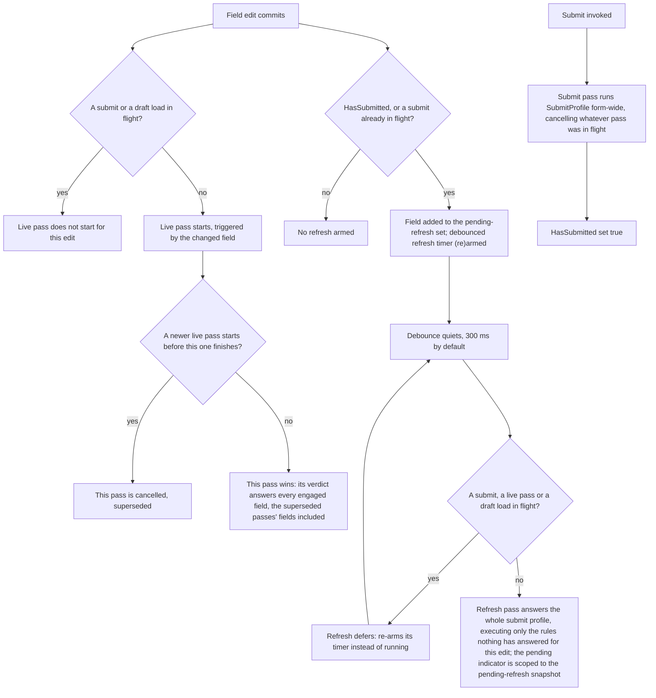

# Async validation rules

**You should already know:** the two profiles and the live-versus-submit split
([Profiles](profiles.md)), and what an async rule looks like from the outside — `MustAsync`, plus
the `IsValidating` pending flag a field carries while one is in flight
([Async rules](tutorial/5-async.md)).

Async validation is hard. Not hard to write, since `MustAsync` is one method, but hard to *order*:
the moment a rule takes real time to answer, its answer stops being about the value on screen. A
uniqueness check finishes half a second after the user has moved on to the next field.

An edit lands while the submit it interrupted is still running. Two keystrokes race, and the older
one's answer arrives last. A re-check nobody asked for wakes up mid-word. Every one of those puts a
verdict on screen for a value that no longer exists, and every one of them is an ordering problem
rather than a rule problem.

Formidable's answer is that exactly one validation pass is ever in flight, and the engine decides
which one it is: not the rule, and not the page. This page covers when an async rule runs, what
happens to a still-running check whose value has already gone stale, and how a UI reports "this is
still checking" without keeping any bookkeeping of its own.

Three things are yours: write the rule, honour its cancellation token, and render the field's
pending flag. The sequencing is the engine's, and it is what the rest of this page is about.
[Writing an async rule](#writing-an-async-rule) has all three in code.

## The ordering, end to end

Only one validation pass (whatever its kind) is ever in flight on the engine at a time, and
starting a new one cancels whatever pass came before it. Everything below follows from that one
constraint. The flowchart traces it end to end: what an edit starts, how the refresh defers to
whatever is already running, and how a submit sits above all of it.



The diagram traces the default cadence, where an edit's live pass starts on the commit itself.
`FormidableOptions.LiveDebounce` puts a timer in front of that first step, described under
[The live pass starts](#the-live-pass-starts). The refresh's own timer is no part of what it
changes: the two are armed independently, and the sections below cover why their windows are free to
land in either order.

### An edit commits

The moment an edit commits, work starts. What that work is depends on whether the form has been
submitted yet.

Before any submit, an edit starts one thing: a live pass. Once the form has been submitted, the same
edit also arms a debounced refresh. Whether that live pass actually starts is the first branch
below; the refresh arming is the second.

### Is a submit or a draft load in flight?

Keep typing while the submit spinner turns and nothing you type cancels it. The keystroke starts no
live pass of its own, because a pass that started would cancel the submit the user actually asked
for, and the one operation they explicitly requested would lose to one they didn't.

Submit is the higher-intent operation, and a live or refresh pass never supersedes it. The same goes
for the pass a page runs to say what its freshly loaded values have earned, on the same grounds: a
caller asked for it and is waiting on it.

The edit is not dropped, though. Landing mid-submit, it joins the pending-refresh set and arms the
debounced refresh, which defers to the submit for as long as it stays in flight and runs once it
lands. Landing mid-load, it arms that same refresh only if the form has submitted before. Either way
the load's own follow-on live pass answers every engaged field, the fresh edit's included.

### The live pass starts

The check starts on the edit itself, not on a timer. With nothing it stands down for in flight, the
edit starts its own pass immediately, triggered by the field that changed.

Feedback that waits behind a timer is feedback the user can outrun: on an input committing every
keystroke (`UpdateOn="InputUpdateMode.OnInput"`), they have typed six more characters and moved on
before anything told them the first three were a problem.

A timer is there for the asking. `FormidableOptions.LiveDebounce` is `null` by default, which is the
cadence just described; set it and a field change arms a single shared timer instead of starting a
pass. Another edit inside the window re-arms that timer rather than opening a second one, and when
the window elapses quietly, one live pass runs, scoped to every field the window collected.

`LiveDebounce` is worth reaching for when the live rules are expensive enough that one pass per
keystroke is the wrong trade. An async availability check is the obvious case, since supersession
still costs a started-and-cancelled request per keystroke.

A debounced live pass is a little more deferential than an immediate one. With any pass it stands
down for already running, it re-arms its timer instead of starting. That is because the edit that
would normally re-arm the refresh has already happened, and cancelling the refresh outright would
leave its verdict stale with nothing left to fix it.

The refresh's own timer is unmoved by any of this. After a submit it arms at plain
`RefreshDebounce`, whatever this window's width, so a window wider than the refresh debounce lets
the refresh land first. That order costs nothing and changes no verdict; see
[`LiveDebounce` after a submit](#livedebounce-after-a-submit) below for why either pass can go
first and the work is paid once regardless.

### A newer pass supersedes an older one

Type fast into a field whose uniqueness check takes half a second, and the answer left on screen is
the one for the value you last typed. Ungoverned, several answers would be in the air at once for
one field, and nothing about async guarantees they come back in the order they were asked, so the
earliest question could produce the last answer.

Starting a pass cancels the one before it, which is exactly why an async rule has to honour its
token. The cancelled pass writes nothing: it is no longer the authority on anything. The pass that
wins answers every engaged field (the superseded passes' fields were engaged before the winner
began), so a field edited moments before another still gets its answer, from the one report that saw
the model last.

### After a submit, an edit also arms a refresh

A failed submit leaves errors on screen, and they follow the user's fixes without waiting for a
second submit. Those messages came from the submit pass, so keeping them honest means re-running the
submit profile. Doing that on every keystroke, for a whole form, is a lot of work to spend on a user
who is still mid-word.

That is what the refresh is for: keeping already-visible submit errors and warnings current without
re-validating the whole profile on every keystroke of a form the user is still correcting. Once
`HasSubmitted` is true, or while a submit is in flight, every further field change adds that field
to the pending-refresh set and reschedules a debounced re-run of `SubmitProfile`.

Before the first submit an edit arms no refresh: it starts its live pass (or arms the `LiveDebounce`
window, where one is set), the validity probe rides alongside under `TrackFormValidity`, and nothing
else runs. The edit is not the refresh's only arm site, though. A move in the rendered field set
arms one at any point in a form's life.

### The debounce quiets

Stop typing for a moment and the refresh comes due. The timer fires after
`FormidableOptions.RefreshDebounce` of quiet (300 ms by default; see [Options](options.md)), so it
follows the user's pauses rather than their keystrokes.

`RefreshDebounce` is the one timer-based debounce a form gets without asking. A live pass has none
unless [`LiveDebounce`](options.md#livedebounce) puts one there: by default it starts on the
keystroke and resolves a burst by supersession instead of by waiting.

### The refresh defers to whatever is running

An answer the user is waiting on is never thrown away by the refresh behind it. The timer firing
means the user stopped typing. It does not mean the engine is free. A submit may be in flight. A
live pass may be mid-rule, holding the answer the user is actually waiting for. A page may be
running the pass that says what its freshly loaded values have earned.

Since starting a pass cancels the one before it, a refresh that ran regardless would throw away work
someone asked for. The async rule that was 500 ms into a 600 ms check would have nothing to show for
it.

So it defers, and only to a pass. Three are what it defers to: a submit, a live pass, or the pass a
page runs to say what its freshly loaded values have earned. While one of those is in flight, the
refresh re-arms its own timer rather than running, and comes back when the timer next quiets, as
many times as it takes.

Deferring to a submit is the higher-intent rule again, and the load pass is deferred to on the same
grounds. Deferring to a live pass earns its keep somewhere else: an edit whose async rule outlasts
the debounce still gets the answer its own live pass was computing.

An open debounce window is none of the three: it holds no pass, only fields waiting for one. So the
refresh runs right past it, and the window's own pass then finds the rules the refresh ran already
answered (see
[Reuse is keyed by rule and stamp, not by pass](#reuse-is-keyed-by-rule-and-stamp-not-by-pass)
below). The refresh's own path differs from a live pass's in one more way: it cancels none of the
passes it stands down for, it waits.

With nothing in flight, the refresh pass answers for the whole model under `SubmitProfile`,
executing only the rules nothing has answered for the current edit and assembling the rest from
verdicts already held. What the pending-refresh snapshot scopes is the pending indicator, covered in
[Which fields show "checking…"](#which-fields-show-checking) below.

### Submit sits above all of it

Press Submit and every field is answered at once, whatever partial work was in flight for a
half-typed field. Submit is the moment the user commits the form, and the answer they are owed is
the one about the whole model.

Submit enters the flowchart on its own edge, because nothing an edit does starts it. The submit pass
runs `SubmitProfile` form-wide, cancelling whatever pass was in flight. Nothing an edit starts
supersedes it in turn; only another pass a caller starts and awaits does, which is a second submit
or a draft load. It sets `HasSubmitted` true, which is what arms the refresh for every edit that
follows.

## Writing an async rule

Nothing about writing the rule changes. `MustAsync` and its siblings work in Formidable exactly as
they do in plain FluentValidation, awaited like any other rule. What decides *when* it runs is
`FormidableOptions.LiveProfile`, which a live pass validates against. It defaults to `null`, meaning
the submit profile, so a rule in either bucket runs on every committed change: the shape a live "is
this username taken?" check needs, with nothing to configure.

`ConfigureDraftRules()` is still where a uniqueness check belongs, for the reason ordinary format
rules sit there (a lenient draft save should answer it too; see [Profiles](profiles.md)). Narrowing
`LiveProfile` is the lever for the opposite case, a rule expensive enough that running it per change
is the thing to avoid.

```csharp
using FluentValidation;

namespace Formidable.Sample.Shared;

public class Handle
{
    public string Username { get; set; } = string.Empty;
    public string DisplayName { get; set; } = string.Empty;

    // Shared by both handle validators, plain and memoized, so their taken-name checks agree
    // without either one holding its own copy of the lists.
    internal static readonly string[] Taken = ["admin", "root", "formidable"];
    internal static readonly string[] TakenDisplayNames = ["Administrator", "Root User", "Formidable"];
}

public class HandleValidator : DraftSubmitValidator<Handle>
{
    // Mutable so the sample page can slow the simulated call down and make cancellation
    // visible; a real validator would inject a clock/service rather than hold mutable state.
    // Shared with MemoizedHandleValidator, which reads the same property rather than holding
    // its own copy.
    public static int SimulatedDelayMs { get; set; } = 600;

    protected override void ConfigureDraftRules()
    {
        // Async uniqueness sits in the always-on (Draft) bucket so a lenient draft save answers
        // it too; what runs it on each committed change is the live channel, which evaluates
        // whatever would block a submit. The delay stands in for a server call and honours
        // cancellation, so a superseded keystroke's check is abandoned.
        RuleFor(h => h.Username)
            .MustAsync(async (username, cancellationToken) =>
            {
                await Task.Delay(SimulatedDelayMs, cancellationToken);
                return !Handle.Taken.Contains(username, StringComparer.OrdinalIgnoreCase);
            })
            .WithMessage("That username is taken")
            .When(h => !string.IsNullOrEmpty(h.Username));

        // A second, independent async field — demonstrates that the pending indicator during a
        // live pass is scoped to the field being edited, not the whole form.
        RuleFor(h => h.DisplayName)
            .MustAsync(async (displayName, cancellationToken) =>
            {
                await Task.Delay(SimulatedDelayMs, cancellationToken);
                return !Handle.TakenDisplayNames.Contains(displayName, StringComparer.OrdinalIgnoreCase);
            })
            .WithMessage("That display name is taken")
            .When(h => !string.IsNullOrEmpty(h.DisplayName));
    }

    protected override void ConfigureSubmitRules()
    {
        RuleFor(h => h.Username).NotEmpty().WithMessage("Username is required");
    }
}
```

<!-- Source: `samples/Formidable.Sample.Shared/Handle.cs` -->

The `CancellationToken` that `MustAsync` hands the rule is load-bearing, not decoration. A fast run
of keystrokes cancels each prior pass the moment the next one starts. A rule that ignores its token
lets every abandoned pass keep running toward a result nobody will read. The engine refuses a
superseded pass's verdict, so what an ignored token burns is the work itself: each abandoned
keystroke's check running to completion against a server that has already been asked again.

Then render the pending flag. `FormidableField`'s cascaded `FormidableFieldContext` exposes it as
`field.State.IsValidating`:

```razor
<FormidableField For="() => _handle.Username" Context="field">
    <div class="field">
        <label>Username <FormidableInputText @bind-Value="_handle.Username" UpdateOn="InputUpdateMode.OnInput" /></label>
        <em role="status">@(field.State.IsValidating ? "checking…" : null)</em>
    </div>
    <FormidableFieldMessage For="() => _handle.Username" />
</FormidableField>

<FormidableField For="() => _handle.DisplayName" Context="field">
    <div class="field">
        <label>Display name <FormidableInputText @bind-Value="_handle.DisplayName" UpdateOn="InputUpdateMode.OnInput" /></label>
        <em role="status">@(field.State.IsValidating ? "checking…" : null)</em>
    </div>
    <FormidableFieldMessage For="() => _handle.DisplayName" />
</FormidableField>
```

<!-- Excerpt from `samples/Formidable.Sample/Pages/AsyncRules.razor` -->

Both fields use `UpdateOn="InputUpdateMode.OnInput"` so a live pass starts on every keystroke, not
just on blur. Otherwise there'd be nothing to cancel until the user tabbed away.

That is the whole authoring surface an async rule requires.

## Memoizing an async rule

Type `admin`, clear it, type `admin` again, and the check runs twice for the same value.
`AsyncRuleMemo<TKey, TResult>` holds answers and `MustAsyncMemoized` puts one on a rule, for two
gaps the engine's own reuse doesn't reach. Every keystroke moves the edit stamp, and the verdict
store answers for model states rather than for values, so the rule runs again however familiar the
value looks.

The other gap is a submit fired shortly after a live pass. It re-asks whatever that live pass just
answered, in full, every time, since
[`SubmitAsync` never reads the verdict store](#submit-never-reads-the-store) the way the refresh
does. A memo closes both by answering from what it already knows instead of paying for the call
again.

Here is this page's uniqueness check as a validator that calls a real directory service
(`IUsernameDirectory` is the consumer's own lookup, whatever it is). It is a second validator over
the same `Handle` model, not the sample's own `HandleValidator` quoted above:

```csharp
using FluentValidation;
using Formidable;

public class UniqueHandleValidator : DraftSubmitValidator<Handle>
{
    private readonly AsyncRuleMemo<string, bool> _free = new(TimeSpan.FromSeconds(10));
    private readonly IUsernameDirectory _directory;

    public UniqueHandleValidator(IUsernameDirectory directory) => _directory = directory;

    protected override void ConfigureDraftRules() =>
        RuleFor(h => h.Username)
            .MustAsyncMemoized(_free, (username, token) => _directory.IsFreeAsync(username!, token))
            .WithMessage("That username is taken")
            .When(h => !string.IsNullOrEmpty(h.Username));

    protected override void ConfigureSubmitRules() =>
        RuleFor(h => h.Username)
            .NotEmpty()
            .WithMessage("A username is required");
}
```

`MustAsyncMemoized` is `MustAsync` with a lookup in front of it, so everything after it chains the
same way. The value reaches the check nullable even here, where `Username` is not: a `null` value is
handed straight to the check and never used as a key, since nothing keys on the absence of a value.
This rule's `.When` has already ruled null out, which is what the `!` says.

One thing does not chain the same way, and it is the token. An answer the memo holds belongs to
every caller waiting on it, so a check reached through the memo runs under `CancellationToken.None`
rather than the token FluentValidation supplies. A caller that gives up stops waiting, and the call
it was waiting on carries on for whoever else wants the answer.

The `null` path never touches the memo, so that one passes FluentValidation's own token straight
through. A check whose cancellation has to follow one caller does not belong behind a memo.

Three things decide whether that is safe on a given rule, and the first is the one that goes wrong
silently.

- **Hold the memo on the validator.** It has to outlive a single pass to be worth anything.
  Constructed inside the rule's own lambda it is rebuilt on every call, hits on nothing, and warns
  about none of it: the form behaves exactly as it did before, at exactly the cost it had before. A
  field is the whole requirement. The engine resolves its `IModelValidator<TModel>` once and keeps
  it, and FluentValidation registers validators per scope, so a field on the validator lives as long
  as the answers are worth anything.
- **The check has to be pure with respect to its key.** Its answer may depend on the value it is
  handed and on nothing else that can move inside the window. The mistake worth naming is the one
  that looks pure: a coupon check that really asks "is this code valid *for me*", keyed on the
  coupon code alone.

  The customer is half the question and none of the key, so a memo whose lifetime spans two
  customers answers the second with the first's verdict. A singleton-registered validator is exactly
  that lifetime, and so is a memo parked in a `static` field. Key on both halves instead (a key
  type carrying the pair) or leave that check unmemoized.

  The constructor's `IEqualityComparer<TKey>` is no way out of this one: it decides what counts as
  the same key, so it can coarsen a key that already carries the customer and never introduce one
  the key never had.
- **Size the window to the pause it has to survive, not to a system clock.** The two cases the memo
  exists for (a repeated value, a submit shortly after a live pass) are both about a person's own
  pace: the gap between retyping a value, or between answering a field and pressing Submit. That's
  seconds, not milliseconds, and genuinely variable, so err generous.

  The sample's own `MemoizedHandleValidator` (the validator its `/async` page supplies explicitly,
  in place of the plain `HandleValidator` shown above) sizes its memo to ten seconds for exactly
  that pause. It still isn't a data cache with its own invalidation story: long enough to outlast
  the pause, not so long that a value's answer goes stale while the memo keeps serving it.

The key and the window both depend on how far the validator instance reaches: a field on it lives
exactly as long as the instance does, and the container decides which lifetime that is.
`AddValidatorsFromAssembly` registers validators scoped unless a `ServiceLifetime` argument says
otherwise, and `Singleton` is that one argument. Where the process serves one visitor the choice
barely shows.

Where the process serves everybody (a Blazor Server app, or an API running the same validator
behind the filters in [Server integration](server-integration.md)) scoped keeps a memo inside the
circuit or request that built it. A singleton hands every visitor the same held answers for the rest
of the window. The coupon above stops being a wrong answer and becomes somebody else's, and a check
keyed perfectly well fares no better: "is this username taken" comes back as whatever the last
person to ask was told.

`Invalidate(key)` and `Clear()` are the escape hatch for the rare case the window alone isn't
enough. `Invalidate` drops one key's held answer and `Clear` drops all of them; either way the next
`GetAsync`/`MustAsyncMemoized` call for an affected key runs the check again regardless of how much
of the window remains.

News that a value the memo still holds as available has just been taken is exactly what either one
answers to. Both govern future lookups only: a call already sharing an in-flight task for that key
is not cancelled by either method, and still receives the answer that call was already computing.

`MustAsyncMemoized` reaches a property of any non-nullable type (`string` and `int`, but equally
`Guid`, `decimal`, `DateOnly`) and any nullable reference type, `string?` among them. The one shape
it does not reach is a nullable value type (`int?`, `Guid?` and the rest) where inference fails
and the compiler reports CS0411. One type parameter cannot be both the memo's non-null key and a
nullable value type at once. Unwrap it and call the memo directly:

```csharp
        RuleFor(t => t.SeatNumber)
            .MustAsync((seat, token) => seat is null
                ? Task.FromResult(true)
                : _seatFree.GetAsync(
                    seat.Value,
                    (key, ct) => _seating.IsFreeAsync(key, ct),
                    token));
```

`GetAsync` is the whole surface: a key, a check, and back comes either the answer already held or a
fresh one. It is also the way in for a memoized rule answering something other than a `bool`.

### Remembering the last answer by hand

Nothing stops a validator holding its own answer instead. Over one field the shape is small (the
same validator with the memo swapped for a slot, and `using System.Diagnostics;` for the clock):

```csharp
    private static readonly TimeSpan CacheWindow = TimeSpan.FromSeconds(10);
    private (string Username, bool Free, long Timestamp)? _last;

    protected override void ConfigureDraftRules() =>
        RuleFor(h => h.Username)
            .MustAsync((username, token) => IsFreeAsync(username!, token))
            .WithMessage("That username is taken")
            .When(h => !string.IsNullOrEmpty(h.Username));

    private async Task<bool> IsFreeAsync(string username, CancellationToken cancellationToken)
    {
        if (_last is { } last
            && last.Username == username
            && Stopwatch.GetElapsedTime(last.Timestamp) < CacheWindow)
        {
            return last.Free;
        }

        var free = await _directory.IsFreeAsync(username, cancellationToken);
        _last = (username, free, Stopwatch.GetTimestamp());
        return free;
    }
```

The three rules above apply to that just as they do to the memo, and two differences decide whether
it is enough. `AsyncRuleMemo` holds the in-flight `Task` rather than the finished value, so two
passes that happen to validate around the same time join a single call instead of each making its
own whenever the check outlasts the gap between them. A slot holding only finished answers cannot.

The memo also keeps a bounded set of entries rather than one, so a `RuleForEach` visiting every item
with the same validator instance hits on all of them, where a single slot is overwritten once per
item and hits on none.

## Which fields show "checking…"

During a live pass the field being edited says "checking…" and the rest of the form stays quiet;
during a submit every field says it at once. A spinner in the wrong place teaches the wrong thing.
Light the whole form up for one field's uniqueness check and nobody can tell which answer they're
waiting on; light nothing at all and the input simply looks idle for half a second.

Two flags answer "is something still checking?", at different scopes. The engine-level
`IsValidating` (`IFormidableEngine.IsValidating`) is true whenever *any* pass is in flight,
regardless of which field triggered it (the right one for a form-wide spinner).
`GetFieldState(field).IsValidating` is narrower, scoped to the fields the pass actually concerns:

- **During a live pass**, it's true only for the field whose change started that pass, so `Username`
  and `DisplayName` (two independent async rules on the same form) each show their own "checking…"
  without one lighting up the other's.
- **During the debounced refresh**, it's true only for the fields edited within that debounce
  window, the ones whose changes scheduled it, even though the refresh itself re-validates the whole
  model in one pass.
- **When a live pass supersedes an in-flight refresh**, the live pass takes the indicator scope with
  it, the same way one live pass already displaces another's before submit.
- **During a submit**, it goes form-wide: true for every field, because a submit really does
  (re-)check every field at once, and because the visitor asked for it.
- **During the pass a page runs to say what its freshly loaded values have earned**
  (`DiscloseLoadedValuesAsync`), it is false for every field. That pass answers for the whole model,
  so the engine-level flag above is true and a page-level spinner works. But nobody asked for it and
  no field is waiting on it, so lighting every input (including ones no rule mentions) before the
  form has said anything about what it loaded would be a spinner about nothing.

The same per-field flag drives the `Pending` CSS class (see [Options](options.md)) that
`FormidableInput*` components (and, through the class provider every engine installs on its
`EditContext`, native `InputBase` components) apply automatically.

**Sample:** [`/async`](../samples/Formidable.Sample/Pages/AsyncRules.razor)

## The fine print

Everything below is precision a first reader can skip. It earns its place when a form behaves in a
way the sections above do not quite account for.

### The refresh runs only what the live pass did not

Submit, then edit a field, and its live pass and the refresh behind it run no rule twice, on a
validator the engine can take rule by rule. `LiveProfile` defaults to `null`, meaning
`SubmitProfile`, so by default the live pass and the refresh behind the edit select the same rules.
The engine keeps a verdict store: every pass but a submit serves the stored verdicts still fresh for
the rules it selects, runs the rest, and assembles a whole-profile answer from both, however little
it ran.

An async rule written in `ConfigureDraftRules()` (the uniqueness check in
[Writing an async rule](#writing-an-async-rule)) answers once per post-submit edit: the live pass
runs it, and the refresh serves the stored verdict.

On the default profiles the whole refresh is served from the store: the live pass selects everything
the refresh selects, so once it has landed the refresh executes nothing and still publishes a full,
current answer. A `LiveProfile` narrowed past some of the rules the refresh selects leaves the
refresh those rules to execute; so does a live window wide enough to let the refresh go first, the
ordering case below.

Granularity stops at the declared rule. A `RuleForEach` is one declared rule however many rows it
covers, so one verdict answers for every row, and whichever pass owes that rule an answer runs it
whole.

The sample's [`/async`](../samples/Formidable.Sample/Pages/AsyncRules.razor) page makes the saving
visible. Submit, then type: one "checking…" cycle runs, not two.

### Reuse is keyed by rule and stamp, not by pass

Whichever of the live pass and the refresh lands first pays for the stale rules, and the other finds
them answered. Reuse is keyed by rule and stamp rather than by pass order. A verdict belongs to its
rule and to the edit it answers for, not to the pass that produced it, so nothing about the reuse
depends on which pass gets there first.

### What "fresh" means

Every committed change makes every stored verdict stale, and so does any move in the rendered field
set. A verdict answers for the model state its pass began at: a committed change moves the engine's
edit count, and a rule whose stored verdict carries an older count runs again rather than being
served.

A move in the rendered field set (a row leaving the page, a section collapsing) is the one silent
change the engine can see for itself: it can change which issues may show, and the model behind
them, without any field change being notified. So it empties the store outright, and the next pass
re-answers everything against the page as it stands.

### Verdicts are facts about rules, not about profiles

Swap `LiveProfile` at runtime and the rules both profiles select keep their verdicts. A verdict is
served to any pass that selects its rule, whichever profile that pass runs under. So a swap (the
documented way to change a setting, see [Engine options](options.md#formidableoptions-is-read-once))
needs no special handling: the new profile re-selects, shared rules keep their verdicts, and rules
the store has never answered run.

One exception runs a rule again rather than serve a verdict that could be wrong. A rule whose child
scope the profile itself filters can answer differently under two profiles: an `Include()`'s
internals, or a `SetValidator` child whose rules ride rulesets of their own or the default bucket
under a ruleset-tagged parent. Such a verdict answers only for the profile it ran under. Every rule
on this page, and every shape the samples ship (plain rules, rules in rulesets, `ChildRules` on a
collection), is outside it.

### The edit count moves on notifications, not on mutations

Change a bound model without telling the form and the verdicts already stored go on being served as
if nothing had changed. A handler patching a computed property, or a late server response writing
into the model while a refresh window is open, moves nothing the engine reads. That refresh then
answers from verdicts computed against the model as it was.

Mutating a bound model without notifying is outside the contract everywhere in Formidable, and
covered under [Collections and row identity](collections-and-row-identity.md); this is the place
where the price is a wrong verdict rather than a stale message. `field.NotifyChanged()` (or
`EditContext.NotifyFieldChanged`) is what keeps it right.

### `LiveDebounce` after a submit

Set `LiveDebounce` wider than `RefreshDebounce` and, after a submit, the refresh runs first at no
extra cost. `LiveDebounce` delays the live pass and leaves the refresh's timer alone: after a submit
the edit arms the refresh at plain `RefreshDebounce`, so a wider live window (400 ms against the 300
ms default, as `/async` does) puts the refresh first. It runs right past the open window, which
holds no pass for [the refresh to defer to](#the-refresh-defers-to-whatever-is-running), and the
window's own pass then has nothing left to execute.

The async draft rule answers once for a post-submit edit in either order. What varies is transient:
with the refresh in front, what submit disclosed updates a beat before the field's own live message
does, and the settled state is identical either way. Every `LiveDebounce`/`RefreshDebounce`
combination agrees on what ends up on screen and on what it costs.

### `ClassLevelCascadeMode.Stop` opts out of reuse

Set `ClassLevelCascadeMode.Stop` on a validator and every pass validates its full profile, with
nothing reused between passes. `Stop` makes a validator give up after its first failing rule, and
running part of a profile could reproduce neither the stopping nor its verdict. So the
FluentValidation adapter reports the capability absent, and the engine gives every pass the whole
profile in one call: correct, and costing exactly what it reads.

The same whole-profile path serves any `IModelValidator<TModel>` that never exposes rule-level
access at all. FluentValidation's own default is `Continue`, and nothing in this library changes it.
Rule-level `.Cascade(CascadeMode.Stop)`, scoped to one rule's own chain, is unaffected: the chain
stops inside its one rule exactly as it always does, and the verdict reuses like any other.

### Submit never reads the store

Press Submit and every rule the submit profile selects runs, whatever a live pass answered a moment
before. `SubmitAsync` runs its whole selection regardless: it is the disclosure event, the verdict a
caller is actually awaiting. Its full run repopulates the store, so the passes behind it start from
answered rules. The flip side is that a submit fired shortly after a live pass re-asks a question
the live pass just answered, which is exactly the gap [memoizing the rule](#memoizing-an-async-rule)
above closes.

### The `TrackFormValidity` probe

`FormidableOptions.TrackFormValidity` answers `IsFormValid` for the whole model under
`SubmitProfile`, riding the same store. It probes at the live pass's own cadence, behind every field
change or once per window when `LiveDebounce` is set. It plans against the store exactly as a pass
does: it executes the submit-selected rules that have no fresh verdict when it starts, and files
what it ran.

On the default profiles a probe behind a landed live pass finds the whole submit profile answered
and executes nothing. Where `LiveProfile` narrows, what it executes is the difference: the rules the
live pass never selected, which is where the expensive ones tend to have been put on purpose.

Genuine overlap is never collapsed: an evaluation beginning while another still awaits an async rule
has no verdict to serve yet, so it runs that rule itself. Reuse is decided by what has landed, not
by what is in flight.

What a probe never does is disclose (no message, no pending indicator, nothing written where a
native component would read it). [Options](options.md#trackformvalidity) covers the cost on a
validator with no rule-level seam, where every probe is a whole-profile validation of its own.

One probe runs at construction, so a pristine form nobody has touched still answers truthfully.
Probes overlap rather than cancel one another: the stamp each took as it started decides which
answer sticks, so a superseded probe discards its own rather than overwriting a fresher one. That
leaves cost as the concern, not correctness: with a slow async rule in `SubmitProfile` and no
[`LiveDebounce`](options.md#livedebounce), ten quick edits can mean ten probes in flight together,
each answering for the model state it started at.
