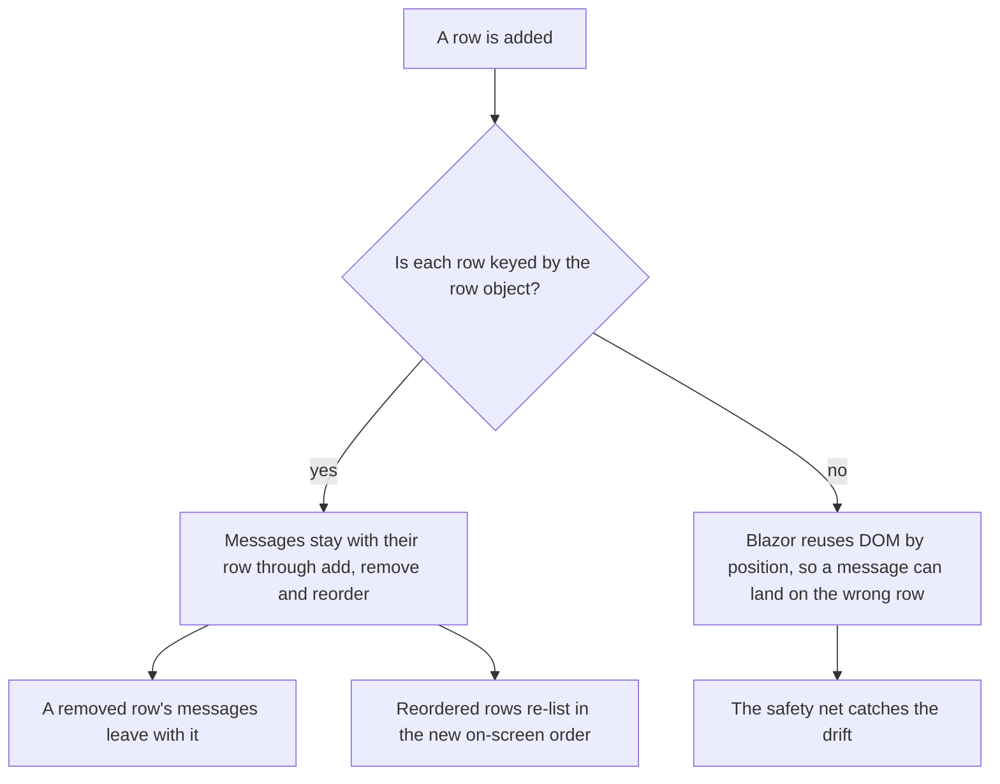

# Collections and row-stable error identity

**You should already know:** the draft/submit split
([Draft and submit rules](tutorial/2-draft-and-submit.md)), and the row-stable habits, `@key` by
instance, `For` closed over it, at a glance ([A list of members](tutorial/4-collections.md)).

Delete row two from a list of three and, in a validator that keys errors by position, row three
quietly inherits row two's error. FluentValidation reports collection failures as positional paths:
`Items[0].Sku`, `Teams[1].Members[0].Alias`. Positions are the one thing about a list that never
survives an edit. Add a row, remove one, or drag two into a different order, and every index below
the change now names a different object than the one the validator meant.

Key an error against that path string and the mistake above stops being hypothetical: an error meant
for the row that's gone shows up on the row that inherited its position, a field the user already
fixed looks broken again after a reorder, and the form ends up complaining about the wrong line.

Formidable never keys by path. It resolves every failure down to the actual object sitting at that
position and keys the error to the instance itself, so add, remove, and reorder can never separate
an error from the row it belongs to.

Here is one row of a list, from the moment the page adds it to the moment its messages leave with
it:



The sections below take that picture one branch at a time, each starting with what you see.

## What does `@key` actually buy?

Key a row by the row object and the row keeps what belongs to it. Remove the row above it, drag it
up two places, add three more below: its message is still its own, and so is the half-typed value in
its input.

Two habits do that, and the sample's member list carries both:

```razor
<ul class="member-list">
    @foreach (var member in team.Members)
    {
        <li class="field" @key="member">
            <label>Alias <FormidableInputText @bind-Value="member.Alias" /></label>
            <FormidableFieldMessage For="() => member.Alias" />
            <div class="actions">
                <button type="button" @onclick="() => RemoveItem(team.Members, member, membersField)">Remove</button>
                <button type="button" @onclick="() => MoveUp(team.Members, member, membersField)">Move up</button>
            </div>
        </li>
    }
</ul>
```

<!-- Excerpt from `samples/Formidable.Sample/Pages/Collections.razor` -->

`@key="member"` keys the `<li>` by the object itself, not its position in the list. Blazor's diffing
then keeps that element attached to the row as it moves, instead of reusing DOM nodes by index, so
its focus, scroll position, and any in-progress edit travel with the row.

`() => member.Alias` closes over the actual `Member` reference from this iteration of the loop, so
the component's field and a failure reported for that row name the same `Member`. Both sides arrive
at the same object without coordinating.

### Why does an error follow the row object and not its index?

Because the error is keyed to the row object itself, not to its position. Every reported path
resolves to an object and a member (`ResolvedField(Owner, PropertyName)`, the public record in
`Formidable.Introspection`), and the error is keyed to that instance. For
`Teams[0].Members[1].Alias` that is the real `Member` at that position when the check runs, and the
error kept for `Member` "ace" stays attached to that `Member` however a reorder rearranges the list
around it.

`@key` alone could not do that. Key every `<li>` by instance and Blazor still shows the right DOM
element, but an error read as an address, `Teams[0].Members[1]`, would be filed against whatever
object next occupies that slot once a remove or reorder changes what is there, before any markup is
involved. Keying the error to the instance is the half Formidable does for you.

One shape trades that stability away: a member whose owner is a struct (the object the path reaches
just before the member) keys its error to the root model and the path string instead, because
`FieldIdentifier` cannot hold a value-type owner. A row object is never that struct: a row is a
reference type in any model these habits can bind at all.

Why: [how the engine works: how a path resolves to an object](how-the-engine-works.md#row-identity-how-a-path-resolves-to-an-object).

## What happens when a row leaves or the list reorders?

Keep the rows keyed and the list is free to change. Remove a row and its messages go with it.
Reorder the list and each row arrives in its new place still carrying whatever it was carrying.

A `FormidableSummary` re-lists too. Under `FormidableForm`, entries list in the document order of
the fields that render them, and the form re-resolves that order when its own elements move, so the
entries match the rows on screen ([Component kit](component-kit.md#the-order-entries-appear-in) has
that seam).

The two buttons in the excerpt above are not part of the row-identity story on their own. They are
what a page needs when it drives the list itself. `membersField` is the `FormidableFieldContext` a
wrapping `FormidableField` hands its content (the wrapper itself is in
[the nesting question](#how-do-i-nest-one-collection-inside-another) below), and `NotifyChanged()`
on it tells the engine a page-driven edit happened.

Without that call the edit is silent. Short of a submit or a server reply, live checking discloses
only for the fields something has engaged, so an edit to a field nothing has engaged is one whose
fresh answer nothing shows.

The next check to run still judges the new value. Putting that verdict on screen takes an engaged
field, a submit, or a server apply naming it, and a silent page-driven edit supplies none of those.

Removing the last member does more than shrink a list on screen. It can flip a collection rule from
passing to failing, and no prune can invent a failure no check produced.

The engine does notice the row leave. It prunes that row's live issues rather than go on showing a
verdict for a row that is gone, and re-checks the whole form. After a submit, or a server apply
that put fields on watch, that re-check brings the messages on screen back into line with the
shorter list. With nothing disclosed yet it answers in silence, keeping the `Valid` class's promise
current.

Why: [how the engine works: what a row leaving changes](how-the-engine-works.md#the-verdict-store).

## Why did my message move rows?

A message is sitting on a row that did not earn it. A row the user fixed reads as broken again after
a reorder, or a deleted row's error has moved down to the row that took its place. The markup looks
right and, by default, nothing throws.

The list is rendered without `@key`, or under a key that is not the row object. Blazor then reuses
each row's components for the next item along.

A field is the object owning the value plus a member name, so a fresh owner is a different field.
The registration, the element id, the aria attributes and the messages all stay with the row that
moved away, while the input shows the new row's value.

Messages are not the only casualty. A renderless `FormidableField` wrapping a row needs the same key
for the same reason: key it by the row, and its registration, its notify target and its container id
all travel with the object.

Skip the key and Blazor reuses that wrapper positionally. A moved row's own Remove and Move up
buttons then notify the field belonging to whichever row first rendered in that screen slot, and its
container wears that row's id.

The misfiled message is a real message from a real rule. It is simply on the wrong row, and nothing
on screen says so.

## How do I catch a message on the wrong row?

Two options catch it, and both are off by default. Nothing on screen says a message is misfiled,
so each watches the one thing that gives it away: a bound component whose accessor no longer names
the field it registered. They are the safety net in the diagram above.

[`VerifyRowKeys`](options.md#verifyrowkeys) throws. Turned on, that divergence raises an
`InvalidOperationException` from the component carrying it, and the message names both the field and
the fix. Nothing about the misfiling shows on screen, which is what earns it an exception rather
than a diagnostic where a developer is watching.

[`ReportStaleRegistrations`](options.md#reportstaleregistrations) reports. It answers the same
divergence through the diagnostic channels instead of throwing, and the form renders on, misfiled
messages and all.

Pair them: the throwing check in Development builds, the reporting one everywhere else. A form that
reaches production with the mistake should misfile a message rather than take the page down.

A row list rendered without `@key` is the common way to produce the divergence, and not the only
one. Another shape needs no collection anywhere on the page: a page that replaces the object a
component is bound to leaves the components under it speaking for the instance that left.
[Replacing the object a field is bound to](#what-happens-when-my-code-replaces-the-object-a-field-is-bound-to)
has the ordering rule that avoids it.

Keep the key and neither check fires for anything done to the list itself. Replacing, removing,
adding or reordering a keyed row leaves every component speaking for the row it registered.

Any component that speaks for a field is a candidate: an input, a message component, or the
renderless `FormidableField` around a row. Each re-reads its own accessor and compares it against
the field it registered. That is not free, and
[what the two checks cost](#what-do-the-two-checks-cost) sizes it by accessor shape.

Why: [how the engine works: why a keyed list never trips the checks](how-the-engine-works.md#why-a-keyed-list-never-trips-the-checks).

### What do the two checks cost?

An accessor resolution per bound component per parameter set, priced by the accessor's shape. One
whose owner is a single step from the expression's root resolves in nanoseconds:
`() => member.Alias` over a loop-captured row, as above, or `() => _order.Total` on the page. One
that navigates further, `() => Order.Customer.Name`, compiles its owner expression on every
resolution, which costs microseconds and kilobytes each.

Budget for the deepest accessors the form renders. That cost is another reason the throwing check
belongs in Development builds.

### Can the reporting check take the page down?

Not by itself. An accessor it cannot resolve at all (a navigated owner gone null, say) it skips
rather than judges, and nothing the check itself does takes a rendering form down. A throwing
[`StaleRegistrationDiagnostic`](options.md#staleregistrationdiagnostic) of your own still can: that
callback is invoked unguarded. The throwing check resolves without the net around the accessor, one
more reason it belongs in Development.

## Where does a collection-level rule's message go?

The two habits above keep a message on its row. Neither helps a rule that has no field of its own.
`Teams` and `Members` are both `List<T>` properties, so nothing renders an input for the list
itself. A whole-collection rule like "Add at least one team" would have nowhere to register and
nowhere to become visible. `FormidableCollectionMessage` closes that gap:

```razor
<FormidableCollectionMessage For="() => _roster.Teams" />
```

<!-- Excerpt from `samples/Formidable.Sample/Pages/Collections.razor` -->

It renders the collection-level issues and registers the field in the same component. Use one per
collection that carries its own rule: the roster's teams and each team's members both get one.

That is the whole authoring surface: key the row, close the lambda, register the collection.

## How do I nest one collection inside another?

With the same three habits at every level: key each row by its object, close each `For` over it,
and register each collection that carries a rule of its own. The sample nests two collections
(teams, and each team's members) and does exactly that:

```razor
<FormidableForm Model="_roster" OnValidSubmit="HandleValid" Options="_options">
    <div class="summary-slot">
        <FormidableSummary />
    </div>
    <FormidableCollectionMessage For="() => _roster.Teams" />

    @* A collection rule fails against the list, not against any one input, so its summary entry
       has nothing to focus unless some element carries the collection's id AND can take focus:
       the container holding every team for the roster's own rule, and each team's box for that
       team's member rule, each with the tabindex a div and a fieldset need to be focusable at
       all. Both ids come from the model via FormidableField's own ElementId, so no page-owned
       state is needed to keep them in step. *@
    <FormidableField For="() => _roster.Teams" Context="teamsField">
        <div class="team-list" id="@teamsField.ElementId" tabindex="-1">
            @foreach (var team in _roster.Teams)
            {
                @* @key="team" is what keeps THIS component bound to this team as the list
                   reorders — without it, Blazor would reuse the component positionally, and a
                   moved row's member actions and message list would stay pointed at whichever
                   team originally rendered in that screen slot. *@
                <FormidableField For="() => team.Members" Context="membersField" @key="team">
                    <fieldset id="@membersField.ElementId" tabindex="-1">
                        <legend>Team</legend>
                        <div class="field">
                            <label>Name <FormidableInputText @bind-Value="team.Name" /></label>
                            <FormidableFieldMessage For="() => team.Name" />
                        </div>

                        <FormidableCollectionMessage For="() => team.Members" />
                        <ul class="member-list">
                            @foreach (var member in team.Members)
                            {
                                <li class="field" @key="member">
                                    <label>Alias <FormidableInputText @bind-Value="member.Alias" /></label>
                                    <FormidableFieldMessage For="() => member.Alias" />
                                    <div class="actions">
                                        <button type="button" @onclick="() => RemoveItem(team.Members, member, membersField)">Remove</button>
                                        <button type="button" @onclick="() => MoveUp(team.Members, member, membersField)">Move up</button>
                                    </div>
                                </li>
                            }
                        </ul>
                        <div class="actions">
                            <button type="button" @onclick="() => AddItem(team.Members, new Member(), membersField)">Add member</button>
                            <button type="button" @onclick="() => RemoveItem(_roster.Teams, team, teamsField)">Remove team</button>
                            <button type="button" @onclick="() => MoveUp(_roster.Teams, team, teamsField)">Move team up</button>
                        </div>
                    </fieldset>
                </FormidableField>
            }
        </div>

        <div class="actions">
            <button type="button" @onclick="() => AddItem(_roster.Teams, new Team(), teamsField)">Add team</button>
            <button type="submit">Submit</button>
        </div>
    </FormidableField>
</FormidableForm>
```

<!-- Excerpt from `samples/Formidable.Sample/Pages/Collections.razor` -->

The page also carries a teaching panel above the form; the `class` attributes belong to the sample
app's own styling, since the library ships none. `Options="_options"` is how this page turns
`VerifyRowKeys` on for itself, covered in
[the safety net](#how-do-i-catch-a-message-on-the-wrong-row) above.

The `id`/`tabindex` pair on each container is what gives a collection's summary entry somewhere to
land. A collection rule fails against the list, not against any one input, so the element carrying
the collection's `FormidableFieldId` is what takes the click (see
[CSS and accessibility](css-and-accessibility.md)).

The validator behind it mirrors the nesting with `RuleForEach(...).ChildRules(...)`, one level for
teams and a second, nested level for each team's members:

```csharp
RuleFor(r => r.Teams).NotEmpty().WithMessage("Add at least one team");
RuleForEach(r => r.Teams).ChildRules(team =>
{
    team.RuleFor(t => t.Name).NotEmpty().WithMessage("Team name is required");
    team.RuleFor(t => t.Members).NotEmpty().WithMessage("Every team needs at least one member");
    team.RuleForEach(t => t.Members).ChildRules(member =>
        member.RuleFor(m => m.Alias).NotEmpty().WithMessage("Alias is required"));
});
```

<!-- Source: `samples/Formidable.Sample.Shared/Roster.cs` -->

Submit with gaps (an empty team name, an empty alias) then reorder or delete rows. Each error
stays put on its row, because `@key="team"` / `@key="member"` keep the right DOM element attached to
the right row. The `For` lambdas keep resolving to the same instances the engine validated against,
regardless of the index either one currently occupies.

**Sample:** [`/collections`](../samples/Formidable.Sample/Pages/Collections.razor)

## What happens when my code replaces the object a field is bound to?

Render before you notify. A fresh instance is a fresh field, and the components bound to the old
instance keep speaking for it until something rebuilds them. Notify first and the divergence opens
in the middle of your own notify call, with the components' accessors naming the replacement while
their registrations still name the instance that left.

With `VerifyRowKeys` on, that divergence is the row-key exception, raised in the middle of the
page's own notify. With it off, those components keep speaking for the old instance until something
rebuilds them, which is the silent misfiling `VerifyRowKeys` exists to catch.

Render first, `row.Child = selected; await InvokeAsync(StateHasChanged);`, so the keyed diff
rebuilds the bound components against the replacement, then notify with
`EditContext.NotifyFieldChanged(...)`, its identifier built from the accessor at the call.

`NotifyChanged()` on a captured field context is the wrong notify here: a context carries the
`Field` it was handed out with, so one your handler captured before the replacement notifies the
departed instance instead. The replacement then goes unengaged, and nothing rendered diverges for
`VerifyRowKeys` to catch.

Why: [how the engine works: what a notification publishes before it returns](how-the-engine-works.md#a-notification-publishes-before-it-returns).
