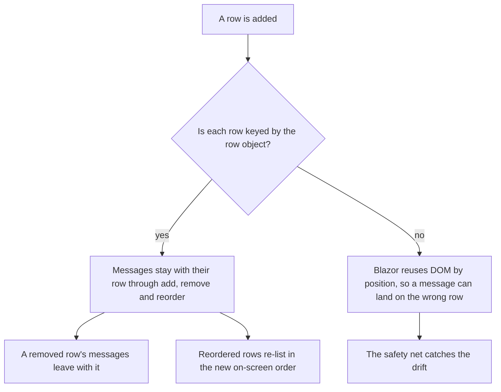

# Collections and row-stable error identity

**You should already know:** the draft/submit split
([Draft and submit rules](tutorial/2-draft-and-submit.md)), and the row-stable habits, `@key` by
instance, `For` closed over it, at a glance ([A list of members](tutorial/4-collections.md)).

Delete row two from a list of three and, in a validator that keys errors by position, row three
quietly inherits row two's error. FluentValidation reports collection failures as positional paths:
`Items[0].Sku`, `Teams[1].Members[0].Alias`. Positions are the one thing about a list that never
survives an edit. Add a row, remove one, or drag two into a different order, and every index below
the change now names a different object than the one the validator meant.

Key an error against that path string and the mistake above stops being hypothetical: an error meant
for the row that's gone shows up on the row that inherited its position, a field the user already
fixed looks broken again after a reorder, and the form ends up complaining about the wrong line.

Formidable never keys by path. For a row that is an object, it resolves every failure down to the
actual object sitting at that position and keys the error to the instance itself, so add, remove,
and reorder can never separate an error from that row. A row with no members of its own (a string in a list of tags,
a number in an array) has no object to key an error to, so it is identified by its index, as
[a list of strings or numbers](#how-do-i-bind-a-list-of-strings-or-numbers) shows.

Here is one row of a list, from the moment the page adds it to the moment its messages leave with
it:


```mermaid
flowchart TD
    A["A row is added"] --> K{"Is each row keyed by the row object?"}
    K -- "yes" --> STAY["Messages stay with their row through add, remove and reorder"]
    K -- "no" --> DRIFT["Blazor reuses DOM by position, so a message can land on the wrong row"]
    STAY --> RM["A removed row's messages leave with it"]
    STAY --> RO["Reordered rows re-list in the new on-screen order"]
    DRIFT --> NET["The safety net catches the drift"]
```

The sections below take that picture one branch at a time, each starting with what you see.

## What does `@key` actually buy?

Key a row by the row object and the row keeps what belongs to it. Remove the row above it, drag it
up two places, add three more below: its message is still its own, and so is the half-typed value in
its input.

Two habits do that, and the sample's member list carries both:

```razor
<ul class="member-list">
    @foreach (var member in team.Members)
    {
        <li class="field" @key="member">
            <label>Alias <FormidableRequiredIndicator For="() => member.Alias" /> <FormidableInputText @bind-Value="member.Alias" /></label>
            <FormidableFieldMessage For="() => member.Alias" />
            <div class="actions">
                <button type="button" @onclick="() => membersField.RemoveItem(team.Members, member)">Remove</button>
                <button type="button" @onclick="() => membersField.TryEdit(() => MoveUp(team.Members, member))">Move up</button>
            </div>
        </li>
    }
</ul>
```

<!-- Excerpt from `samples/Formidable.Sample/Pages/Collections.razor` -->

`@key="member"` keys the `<li>` by the object itself, not its position in the list. Blazor's diffing
then keeps that element attached to the row as it moves, instead of reusing DOM nodes by index, so
its focus, scroll position, and any in-progress edit travel with the row.

`() => member.Alias` closes over the actual `Member` reference from this iteration of the loop, so
the component's field and a failure reported for that row name the same `Member`. Both sides arrive
at the same object without coordinating.

### Why does an error on an object row follow the row and not its index?

Because the error is keyed to the row object itself, not to its position. Every reported path
resolves to an object and a member (`ResolvedField(Owner, PropertyName)`, the public record in
`Formidable.Introspection`), and the error is keyed to that instance. For
`Teams[0].Members[1].Alias` that is the real `Member` at that position when the check runs, and the
error kept for `Member` "ace" stays attached to that `Member` however a reorder rearranges the list
around it.

`@key` alone could not do that. Key every `<li>` by instance and Blazor still shows the right DOM
element, but an error read as an address, `Teams[0].Members[1]`, would be filed against whatever
object next occupies that slot once a remove or reorder changes what is there, before any markup is
involved. Keying the error to the instance is the half Formidable does for you.

One shape trades that stability away: a member whose owner is a struct (the object the path reaches
just before the member) keys its error to the root model and the path string instead, because
`FieldIdentifier` cannot hold a value-type owner. A row object is never that struct: a row is a
reference type in any model these habits can bind at all.

A row with no members (a string or a number) takes neither route. It has no object of its own, so
it is identified by its index and the check answers for each position, as
[a list of strings or numbers](#how-do-i-bind-a-list-of-strings-or-numbers) explains.

Why: [how the engine works: how a path resolves to an object](how-the-engine-works.md#row-identity-how-a-path-resolves-to-an-object).

## What happens when a row leaves or the list reorders?

Keep object rows keyed by their objects and the list is free to change. Remove a row and its messages go with it.
Reorder the list and each row arrives in its new place still carrying whatever it was carrying.

A `FormidableSummary` re-lists too. Under `FormidableForm`, entries list in the document order of
the fields that render them, and the form re-resolves that order when its own elements move, so the
entries match the rows on screen ([Component kit](component-kit.md#the-order-entries-appear-in) has
that seam).

The two buttons in the excerpt above are not part of the row-identity story on their own. They are
what a page needs when it drives the list itself. `membersField` is the `FormidableFieldContext` a
wrapping `FormidableField` hands its content (the wrapper itself is in
[the nesting question](#how-do-i-nest-one-collection-inside-another) below), and `NotifyChanged()`
on it tells the engine a page-driven edit happened.

Without that call the edit is silent. Short of a submit or a server reply, live checking discloses
only for the fields something has engaged, so an edit to a field nothing has engaged is one whose
fresh answer nothing shows.

The next check to run still judges the new value. Putting that verdict on screen takes an engaged
field, a submit, or a server apply naming it, and a silent page-driven edit supplies none of those.

In the excerpt, Remove calls the context's own `RemoveItem`, which removes the row and then tells the
form. Add member, in the full page further down, calls `AddItem` the same way. Move up is a reorder,
which neither call covers, so the page hands its `MoveUp` to the context's `TryEdit`. `MoveUp`
returns whether the row moved, and `TryEdit` tells the form only when it did. Move up on the top
row changes nothing, so the form hears nothing.

Removing the last member does more than shrink a list on screen. It can flip a collection rule from
passing to failing, and no prune can invent a failure no check produced.

The engine does notice the row leave. It prunes that row's live issues rather than go on showing a
verdict for a row that is gone, and re-checks the whole form. After a submit, or a server apply
that put fields on watch, that re-check brings the messages on screen back into line with the
shorter list. With nothing disclosed yet it answers in silence, keeping the `Valid` class's promise
current.

Why: [how the engine works: what a row leaving changes](how-the-engine-works.md#the-verdict-store).

## How do I bind a list of strings or numbers?

Bind each row by its index, give each row its own message, and key the element around the loop by
the list:

```razor
<div @key="model.Tags">
    @for (var i = 0; i < model.Tags.Count; i++)
    {
        var index = i;
        <div class="field">
            <FormidableInputText @bind-Value="model.Tags[index]" />
            <FormidableFieldMessage For="() => model.Tags[index]" />
        </div>
    }
</div>
```

Copy the loop variable into `index` first. A lambda that captures `i` itself reads the value the
loop ended on, so every row would bind past the end of the list. Over an array, the loop reads
`model.Tags.Length` where a list reads `Count`. A native `InputText` and
`ValidationMessage` bound to the same expression work too, with the `FormidableFieldAnchor` any
native input takes.

Keying the element around the loop is the object-row habit one level up: it tells Blazor which list
the rows belong to. Editing the list in place keeps the key, and nothing changes. Replacing the list
hands Blazor a new key, so every row is rebuilt against the new list. The rows themselves take no
key: each row is its index, and a key taken from its value would move its components to another
index.

To add or remove a row, wrap the loop in `<FormidableField For="() => model.Tags" Context="tagsField">`
and call `tagsField.AddItem` and `tagsField.RemoveItem`, as the member list above does. `RemoveItem`
matches a string or a number by value and removes the first equal row. To remove one particular row
of two equal values, remove it by its index: `tagsField.Edit(() => model.Tags.RemoveAt(index))`.

An array cannot grow in place, so `AddItem` throws for one. Replace it instead, as
[what changes when the page replaces the list](#what-changes-when-the-page-replaces-the-list) shows.

A string or a number has no members, so there is no row object for an error to follow. Formidable
identifies the row by its index instead, the field `FieldIdentifier.Create(() => model.Tags[index])`
names and Blazor's own `EditContext` uses. Each row's message shows at its own input, its state
class reads its own value, and a blocked submit's summary lists it under its display name.

That holds in an array and in any list that implements the non-generic `IList`, as `List<T>` and
`Collection<T>` do, unless the list is also a dictionary. Once the page replaces the list, it holds
only with the key on the element around the loop. A collection that implements only the
generic `IList<T>` is one exception: Formidable does not identify its rows by index, so their
messages never reach inputs bound that way.

A dictionary is the other exception, an `OrderedDictionary<TKey, TValue>` included, though it is a
list too. FluentValidation numbers its entries by position, while an input bound to
`model.Answers[key]` is named by its key. So an entry's message reaches no input rather than land on
another key's. When nothing on screen explains a blocked submit, the
[defensive gate](disclosure.md#why-is-the-submit-blocked-with-no-message-in-sight) does. A load
never reads an entry by its position either, so it leaves every entry's input silent (unless your
own `IModelIntrospector` names and reads entries by key).

A load discloses a filled-in value that fails and confirms one that passes, whether the rule is
written `RuleForEach(m => m.Tags)` or `RuleFor(m => m.Tags).ForEach(...)`. In an array, a `List<T>`
or a `Collection<T>`, filled in means what `NotEmpty()` means. In any other list, a zero or a
`false` held as a nullable or an `object` counts as empty, so a load leaves it silent.

A row whose input waits for Submit (`WaitForSubmit`) is still confirmed at a load when its value
passes. A failing value shows no message and no state class until a submit or server reply answers.

A presence rule written either way, such as `RuleForEach(m => m.Tags).NotEmpty()`, marks each
row's input required. It demands nothing of the list itself, so a component bound to `m.Tags`
carries no mark for it, and a load does not paint the list valid. Rows that are objects work the
same way: a presence rule inside `ChildRules` or a child validator marks that member's input in each
row, and puts no mark on the list.

A list of lists works the same way, cell by cell. Bind each cell by both indexes
(`() => model.Matrix[row][column]`, with both loop variables copied first), and key the element
around each row's cells by that row's list (`@key="model.Matrix[row]"`), so that replacing a row's
list rebuilds its cells. A presence rule on the
cells marks each cell's input required, whether written `RuleForEach(m => m.Matrix).ForEach(...)` or
as nested `ForEach` calls. A blocked submit shows each cell's message at its own input, and a load
confirms each filled cell that passes.

One rule covers what a remove or a reorder does to a list of strings or numbers: the index is the
row's identity, so the check answers per position. Each position is judged by the value that now
sits there, and once the form re-checks, no row keeps a message that belonged to the value that
left. What shows at a position follows that position's own history (whether the user has touched
or edited it, and what the last submit showed there), not the value that moved in.

So a position the user has edited stays edited, and a passing value that moves into it turns green.
And after a blocked submit, a remove or a reorder can move a failing value onto a row that passed at
that submit. If the user has not edited that row, the value's message shows there at the next
submit. Until then the row stays silent, never green.

Why: [how the engine works: how a path resolves to an object](how-the-engine-works.md#row-identity-how-a-path-resolves-to-an-object).

### What changes when the page replaces the list?

With the element around the loop keyed by the list, every row is rebuilt against the new list, and
each row's message, state class and required mark follow. Replacing the list is how an array grows
(`AddItem` throws for one) and how an immutable list changes:

```razor
<button type="button" @onclick="() => tagsField.Edit(() => model.Tags = [.. model.Tags, string.Empty])">Add tag</button>
```

The new list is a new key, so Blazor builds new components for every row, for kit inputs and a
native `InputText` alike. Without the key, Blazor reuses the rows by position, and they go on
speaking for the list that left. A row cleared after the replacement then shows no message, no
invalid class and no required mark, and a blocked submit can only say that something not on screen
is invalid.

[`VerifyRowKeys`](options.md#verifyrowkeys), the check for Development builds, catches that shape:
the first render after the replacement throws, naming the key on the element around the loop.

A rebuilt row is a new field, so a replacement starts every row afresh. A message a row showed
before it, from an edit or a blocked submit, comes back at that row's next edit or at the next
submit.

Why: [how the engine works: what a component registers and re-reads](how-the-engine-works.md#what-a-component-registers-and-re-reads).

## Why did my message move rows?

A message is sitting on a row that did not earn it. A row the user fixed reads as broken again after
a reorder, or a deleted row's error has moved down to the row that took its place. The markup looks
right and, by default, nothing throws.

The list is rendered without `@key`, or under a key that is not the row object. Blazor then reuses
each row's components for the next item along.

A field is the object owning the value plus a member name, so a fresh owner is a different field.
The registration, the element id, the aria attributes and the messages all stay with the row that
moved away, while the input shows the new row's value.

Messages are not the only casualty. A renderless `FormidableField` wrapping a row needs the same key
for the same reason: key it by the row, and its registration, its notify target and its container id
all travel with the object.

Skip the key and Blazor reuses that wrapper positionally. A moved row's own Remove and Move up
buttons then notify the field belonging to whichever row first rendered in that screen slot, and its
container wears that row's id.

The misfiled message is a real message from a real rule. It is simply on the wrong row, and nothing
on screen says so.

A row with no members (a string or a number) has no object of its own to key, and it follows its
index by design: [a list of strings or numbers](#how-do-i-bind-a-list-of-strings-or-numbers) says
what a remove or a reorder shows there. Keying such a row by its value would move its components to
another index, so the row takes no key. The element around its loop does take one, set to the list,
and a page that replaces the list needs it
([what changes when the page replaces the list](#what-changes-when-the-page-replaces-the-list)).

## How do I catch a message on the wrong row?

Two options catch it, and both are off by default. Nothing on screen says a message is misfiled,
so each watches the one thing that gives it away: a bound component whose accessor no longer names
the field it registered. They are the safety net in the diagram above.

[`VerifyRowKeys`](options.md#verifyrowkeys) throws. Turned on, that divergence raises an
`InvalidOperationException` from the component carrying it, and the message names both the field and
the fix. Nothing about the misfiling shows on screen, which is what earns it an exception rather
than a diagnostic where a developer is watching.

[`ReportStaleRegistrations`](options.md#reportstaleregistrations) reports. It answers the same
divergence through the diagnostic channels instead of throwing, and the form renders on, misfiled
messages and all.

Pair them: the throwing check in Development builds, the reporting one everywhere else. A form that
reaches production with the mistake should misfile a message rather than take the page down.

A row list rendered without `@key` is the common way to produce the divergence, and not the only
one. Another shape needs no collection anywhere on the page: a page that replaces the object a
component is bound to leaves the components under it speaking for the instance that left.
[Replacing the object a field is bound to](#what-happens-when-my-code-replaces-the-object-a-field-is-bound-to)
has the ordering rule that avoids it.

Keep the key and neither check fires for anything done to the list itself. Replacing, removing,
adding or reordering a keyed row leaves every component speaking for the row it registered.

A list of strings or numbers keeps that promise with its rows unkeyed and the element around the
loop keyed by the list. Replace the list without that key and the checks fire, naming it. Key a row
by its value and they fire at a remove or a reorder, telling you to drop that key.

Any component that speaks for a field is a candidate: an input, a message component, or the
renderless `FormidableField` around a row. Each re-reads its own accessor and compares it against
the field it registered. That is not free, and
[what the two checks cost](#what-do-the-two-checks-cost) sizes it by accessor shape.

Why: [how the engine works: why a keyed list never trips the checks](how-the-engine-works.md#why-a-keyed-list-never-trips-the-checks).

### What do the two checks cost?

An accessor resolution per bound component per parameter set, priced by the accessor's shape. One
whose owner is a single step from the expression's root resolves in nanoseconds:
`() => member.Alias` over a loop-captured row, as above, or `() => _order.Total` on the page. Two
shapes compile their owner expression on every resolution instead: one that navigates further,
`() => Order.Customer.Name`, and one that reads an element by its index, `() => model.Tags[index]`,
however short its path.

Each compiled resolution costs tens of microseconds and about 4 KB on desktop .NET 10 in a Release
build; WebAssembly is not measured. Budget for the deepest accessors the form renders, and for every
row bound by its index. That cost is another reason the throwing check belongs in Development
builds.

### Can the reporting check take the page down?

Not by itself. An accessor it cannot resolve at all (a navigated owner gone null, say) it skips
rather than judges, and nothing the check itself does takes a rendering form down. A throwing
[`StaleRegistrationDiagnostic`](options.md#staleregistrationdiagnostic) of your own still can: that
callback is invoked unguarded. The throwing check resolves without the net around the accessor, one
more reason it belongs in Development.

## Where does a collection-level rule's message go?

The two habits above keep a message on its row. Neither helps a rule that has no field of its own.
`Teams` and `Members` are both `List<T>` properties, so nothing renders an input for the list
itself. A whole-collection rule like "Add at least one team" would have nowhere to register and
nowhere to become visible. `FormidableCollectionMessage` closes that gap:

```razor
<FormidableCollectionMessage For="() => _roster.Teams" />
```

<!-- Excerpt from `samples/Formidable.Sample/Pages/Collections.razor` -->

It renders the collection-level issues and registers the field in the same component. Use one per
collection that carries its own rule: the roster's teams and each team's members both get one.

That is the whole authoring surface: key the row, close the lambda, register the collection.

## How do I nest one collection inside another?

With the same three habits at every level: key each row by its object, close each `For` over it,
and register each collection that carries a rule of its own. The sample nests two collections
(teams, and each team's members) and does exactly that:

```razor
<FormidableForm Model="_roster" OnValidSubmit="HandleValid" Options="_options">
    <div class="summary-slot">
        <FormidableSummary />
    </div>
    <FormidableCollectionMessage For="() => _roster.Teams" />

    @* A collection rule fails against the list, not against any one input, so its summary entry
       has nothing to focus unless some element carries the collection's id AND can take focus:
       the container holding every team for the roster's own rule, and each team's box for that
       team's member rule, each with the tabindex a div and a fieldset need to be focusable at
       all. Both ids come from the model via FormidableField's own ElementId, so no page-owned
       state is needed to keep them in step. *@
    <FormidableField For="() => _roster.Teams" Context="teamsField">
        <div class="team-list" id="@teamsField.ElementId" tabindex="-1">
            @foreach (var team in _roster.Teams)
            {
                @* @key="team" is what keeps THIS component bound to this team as the list
                   reorders — without it, Blazor would reuse the component positionally, and a
                   moved row's member actions and message list would stay pointed at whichever
                   team originally rendered in that screen slot. *@
                <FormidableField For="() => team.Members" Context="membersField" @key="team">
                    <fieldset id="@membersField.ElementId" tabindex="-1">
                        <legend>Team</legend>
                        <div class="field">
                            <label>Name <FormidableRequiredIndicator For="() => team.Name" /> <FormidableInputText @bind-Value="team.Name" /></label>
                            <FormidableFieldMessage For="() => team.Name" />
                        </div>

                        <FormidableCollectionMessage For="() => team.Members" />
                        <ul class="member-list">
                            @foreach (var member in team.Members)
                            {
                                <li class="field" @key="member">
                                    <label>Alias <FormidableRequiredIndicator For="() => member.Alias" /> <FormidableInputText @bind-Value="member.Alias" /></label>
                                    <FormidableFieldMessage For="() => member.Alias" />
                                    <div class="actions">
                                        <button type="button" @onclick="() => membersField.RemoveItem(team.Members, member)">Remove</button>
                                        <button type="button" @onclick="() => membersField.TryEdit(() => MoveUp(team.Members, member))">Move up</button>
                                    </div>
                                </li>
                            }
                        </ul>
                        <div class="actions">
                            <button type="button" @onclick="() => membersField.AddItem(team.Members, new Member())">Add member</button>
                            <button type="button" @onclick="() => teamsField.RemoveItem(_roster.Teams, team)">Remove team</button>
                            <button type="button" @onclick="() => teamsField.TryEdit(() => MoveUp(_roster.Teams, team))">Move team up</button>
                        </div>
                    </fieldset>
                </FormidableField>
            }
        </div>

        <div class="actions">
            <button type="button" @onclick="() => teamsField.AddItem(_roster.Teams, new Team())">Add team</button>
            <button type="submit">Submit</button>
        </div>
    </FormidableField>
</FormidableForm>
```

<!-- Excerpt from `samples/Formidable.Sample/Pages/Collections.razor` -->

The `class` attributes belong to the sample app's own styling, since the library ships none.
`Options="_options"` is how this page turns `VerifyRowKeys` on for itself, covered in
[the safety net](#how-do-i-catch-a-message-on-the-wrong-row) above.

The `id`/`tabindex` pair on each container is what gives a collection's summary entry somewhere to
land. A collection rule fails against the list, not against any one input, so the element carrying
the collection's `FormidableFieldId` is what takes the click (see
[CSS and accessibility](css-and-accessibility.md)).

The validator behind it mirrors the nesting with `RuleForEach(...).ChildRules(...)`, one level for
teams and a second, nested level for each team's members:

```csharp
RuleFor(r => r.Teams).NotEmpty().WithMessage("Add at least one team");
RuleForEach(r => r.Teams).ChildRules(team =>
{
    team.RuleFor(t => t.Name).NotEmpty().WithMessage("Team name is required");
    team.RuleFor(t => t.Members).NotEmpty().WithMessage("Every team needs at least one member");
    team.RuleForEach(t => t.Members).ChildRules(member =>
        member.RuleFor(m => m.Alias).NotEmpty().WithMessage("Alias is required"));
});
```

<!-- Source: `samples/Formidable.Sample.Shared/Roster.cs` -->

Submit with gaps (an empty team name, an empty alias) then reorder or delete rows. Each error
stays put on its row, because `@key="team"` / `@key="member"` keep the right DOM element attached to
the right row. The `For` lambdas keep resolving to the same instances the engine validated against,
regardless of the index either one currently occupies.

**Sample:** [`/collections`](../samples/Formidable.Sample/Pages/Collections.razor)

## What happens when my code replaces the object a field is bound to?

Render before you notify. A fresh instance is a fresh field, and the components bound to the old
instance keep speaking for it until something rebuilds them. Notify first and the divergence opens
in the middle of your own notify call, with the components' accessors naming the replacement while
their registrations still name the instance that left.

With `VerifyRowKeys` on, that divergence is the row-key exception, raised in the middle of the
page's own notify. With it off, those components keep speaking for the old instance until something
rebuilds them, which is the silent misfiling `VerifyRowKeys` exists to catch.

Render first, `row.Child = selected; await InvokeAsync(StateHasChanged);`, so the keyed diff
rebuilds the bound components against the replacement, then notify with
`EditContext.NotifyFieldChanged(...)`, its identifier built from the accessor at the call.

`NotifyChanged()` on a captured field context is the wrong notify here: a context carries the
`Field` it was handed out with, so one your handler captured before the replacement notifies the
departed instance instead. The replacement then goes unengaged, and nothing rendered diverges for
`VerifyRowKeys` to catch.

Why: [how the engine works: what a notification publishes before it returns](how-the-engine-works.md#a-notification-publishes-before-it-returns).
