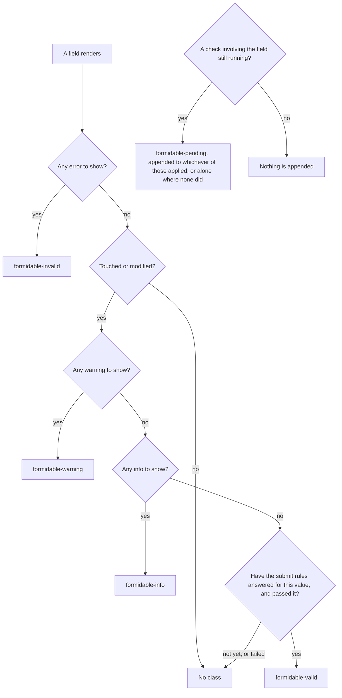

# CSS and accessibility

**You should already know:** how a Formidable form wires up end to end
([Quickstart](quickstart.md)).

A form can validate perfectly and still look or sound wrong. A border turns green for a field the
visitor only tabbed through. A screen reader announces a field as "Title star". A summary reads
every remaining error back each time one is fixed. A click on Submit vanishes because a message
appeared above the button and moved it. None of those is a validation bug; each is decided by what
the library renders and by what your stylesheet does with it.

Formidable ships no CSS and no visual opinion. What it ships is a small surface of class names and
ARIA attributes, and every field exposes it the same way. A kit input, a renderless
`FormidableField` template and a plain `InputBase` beside them all answer alike. The questions
below take that surface one problem at a time, each starting with what you see. The sections after
them are the reference (the fixed structural names, `FormidableCssClasses`, and the bridge that
classes native inputs) and the sample list.

## Need to know

One static rule computes a field's state class, shared by every Formidable component that computes
one. `FormidableCss.Compute` reads a `FieldState` and returns a space-joined class string. The five
names it applies are [`FormidableOptions.CssClasses`](options.md#cssclasses), each configurable and
each with a default.

The rule is an order rather than a set. The first of the five tiers that matches decides the class,
and pending is decided separately, on top of whatever that left:

| In order | When | Class |
|---|---|---|
| 1 | The field has error-severity issues | `Invalid` (`formidable-invalid`), gated by nothing else: a field the user must still fix never reads as merely advisory |
| 2 | The field is neither touched nor modified | No class at all, whatever it carries |
| 3 | It has a warning-severity issue | `Warning` (`formidable-warning`) |
| 4 | Its only issues are info-severity | `Info` (`formidable-info`) |
| 5 | It has no issues left to show *and* would pass submit | `Valid` (`formidable-valid`) |
| Always | A check involving the field is still running | `Pending` (`formidable-pending`), appended to whichever tier applied, or standing alone where none did — it never replaces a tier's own class |

That is the entire class-name contract: rename the five strings, and the order above still decides
when each one applies.

## What puts green on a field?

A field wears `Valid` once three things hold at the same time. The field is touched or modified (a
committed change does both). It has no issue to show, of any severity. And every rule the submit
profile selects has answered for the value as it stands, with none of those answers failing the
field. Here is one field, from the moment it renders to the class it wears:



The second and third conditions are separate on purpose. A field still carrying a warning or an
info is not `Valid`: it still has something the user might act on. Green is a promise about submit
rather than a note that the visitor stopped by, so a failing answer counts even where no message
shows it. That is why an emptied required box wears no confirmation border. Until an answer has
landed, a clean-looking field wears no tier class rather than a green one.

Why: [how the engine works: what green reads](how-the-engine-works.md#the-submit-coverage-vouch).

### Which check turns a field green?

On the default profiles, the live check behind a committed change supplies that answer on a
validator the engine can take rule by rule. [`LiveProfile`](options.md#liveprofile) tracks the
submit profile, so that check runs the submit rules. One answer covers the form, not only the
changed field. A submit, and the whole-form re-check after one, turn fields green the same way.

A validator the engine cannot take rule by rule earns green only from a check that answers the
whole model: a submit, the whole-form re-check, a load of values, or `TrackFormValidity`, never a
live check. [`TrackFormValidity`](options.md#trackformvalidity)'s validity check covers what is
left: a form that narrows `LiveProfile` past the submit rules, and a validator the engine cannot
take rule by rule. A page that calls `DiscloseLoadedValuesAsync` answers for the values it loaded
itself, with no validity check needed.

Why: [how the engine works: which checks count](how-the-engine-works.md#the-submit-coverage-vouch).

### Why does green survive a row arriving, or an edit elsewhere?

Because the answer behind a border is kept until a fresh one lands. A row arriving or a virtualized
panel scrolling does not blink a green border: the engine keeps the answer it last gave until the
whole-form re-check that same move starts lands a fresh one. That re-check also answers for a model
changed alongside the markup without a notification, so green describes the model, not the markup.

And while a check that answers the submit rules is on its way, one edit does not blank every other
field's confirmation border. On the default profiles every committed change has one on its way.
Every field the edit did not touch keeps its green while that check is on its way, and its answer
then decides. The edited field itself earns no green until its own answer lands.

The hold across an edit is bounded rather than indefinite: a check still running past thirty
seconds loses it. A check that throws, or a submit or load its caller cancels, drops either hold
outright. A check a newer one replaces is not a drop while a fresh answer is still on its way.
Until the check behind a held answer lands, the border describes the values that answer was
computed from.

Why: [how the engine works: how a green border is held](how-the-engine-works.md#the-submit-coverage-vouch).

## How do I show severity without relying on colour?

Put it into a word, a heading or an icon with a text alternative, because on the item itself
severity is a class name and nothing more. An inline message item is its own text plus two
classes: `formidable-message`, and one of `--error`, `--warning` or `--info`. That modifier is the
only thing on the item saying which severity it is.

`FormidableSummary` can put that difference into words. `ErrorsHeading`, `WarningsHeading` and
`InfosHeading` label each band in your own wording, with no English default standing in for them.
An inline list has no such parameter. Its cue has to come from the stylesheet or from the message
text: a word ahead of the message, an icon with a text alternative, anything visible that survives
being read in one colour.

`formidable-valid` and `formidable-pending` are the same question with less to fall back on.
`formidable-invalid` at least pairs with the input's `aria-invalid` and with the message that
explains it. The kit renders no text for a confirmed field or a checking one, and no `aria-busy`
anywhere. Severity, confirmed and checking each want a cue of their own; which cue, and how it is
worded, is yours.

## What id does a field's element get?

One derived from the owning object and the field name together. Every id Formidable assigns comes
from one function, `FormidableFieldId.For`, keyed by the owning object instance and the field name.
An input's `id`, a message list's `id` and the target the focus service looks for are all derived
there. The shape is `formidable-{owner-hash}-{name-hash}-{sanitized-name}`, so the name stays the
id's suffix.

Sanitizing lowercases letters and digits and turns everything else into `-`. That is what makes an
id legible and selectable: `Url`, `URL` and `url` all end `-url`, so a stylesheet or a browser
locator can say `[id$='-url']` and mean it. Those are three different fields, and the hash of the
original name, case and punctuation intact, is what keeps their ids apart.

The name hash is the same in every run of the app, so a test can compute the tail an id ends with
and match the one the app renders.

The owner segment names the instance, so a different model or a different collection row gives a
different one, all but certainly (the exception is
[below](#can-two-fields-end-up-with-the-same-id)). Nothing you write can name that segment. The
model-level field gets `form` as its name segment rather than an empty one: that is the field with
an empty `FieldIdentifier.FieldName`, the one the defensive all-suppressed gate in
[Disclosure](disclosure.md) targets.

Why: [how the engine works: how an id is derived](how-the-engine-works.md#how-an-id-is-derived).

### Can two fields end up with the same id?

Yes, in two ways, and validation is untouched by either: the engine tells fields apart by the owner
reference and never by the id. Two elements sharing a DOM id is invalid HTML, and it misdirects
everything keyed by the id:

| Site | What a duplicate does to it |
|---|---|
| Focus | A summary click or a blocked submit's focus lands on the first of the two in the document, so it reaches the first row. |
| `aria-describedby` | The second row's value names the first row's message list. |
| The DOM value sync on blur | It writes into the first row's box. |
| The field-order service | A shared id can name only one field. The one the registry lists later keeps it and takes the first row's place in the resolved order; the other never enters that order, so its issues sort after every placed field's. |

The first way is scale. Among enough owner objects rendered at once, two can draw the same owner
segment, and their same-named fields then render the same id:

| Owner objects rendered at once | Chance two share a value |
|---|---|
| the hundreds of rows a form usually shows | negligible |
| a thousand | under one percent |
| five thousand | about one in six |

Virtualizing a form that large keeps the rendered set to the rows in view, which is the count that
matters.

The second way is two roots over one model instance. The owner segment separates instances, not
roots, so two `FormidableForm`s, or a `FormidableForm` and a `FormidableValidator`, over the same
model compute identical ids for every field they both render. That duplicates ids the same way a
sanitizer collision would. Two `FormidableForm`s duplicate the `<form>` element's own id whatever
else they render, since each puts the model-level field's id there. Bind each root to its own model
instance.

Why: [how the engine works: why two owners can hash alike](how-the-engine-works.md#when-two-owners-hash-alike).

### How do I compute an id by hand?

Call `FormidableFieldId.For`, for markup the kit did not render. Every kit input renders its own
id, and `FormidableForm` renders the model-level id on its own `<form>` element
([Component kit](component-kit.md#formidableformtmodel)), so the by-hand cases are whatever you
write that names a field's element: a `<label for>`, a native input, a collection container, the
`<form>` element in attach mode.

An overload of `For` takes a member-access expression instead of a `FieldIdentifier` for that case:
`FormidableFieldId.For(order, o => o.Description)`. The id can then be computed without a `nameof`
step to keep in sync with the property it names. It evaluates the object part the way
`FieldIdentifier.Create` evaluates its own, so `o => o.Address.City` names the field the `Address`
instance owns, which is the one a component renders.

There is no expression shape for the model-level field itself. Construct
`new FieldIdentifier(model, string.Empty)` and pass it to the `FieldIdentifier` overload, as
`FormidableForm` does internally.

The message list's id is the same id with `-messages` appended, and `FormidableFieldId.MessagesFor`
is the one place that appends it. Call it when wiring a control by hand. The kit's inputs, the
message components and `FormidableFieldContext.AriaDescribedBy` all get their string from it.

## Which ARIA attributes does an input get, and when?

Three, each from a source of its own. A kit input (`FormidableInputBase<TValue>.AddCommonAttributes`)
renders `aria-invalid` from the same field state the class rule reads, `aria-describedby` from the
field's issues, and `aria-required` from what the submit profile's rules demand:

| Attribute | Renders while | Value |
|---|---|---|
| `aria-invalid="true"` | the field has an error-severity issue | Fixed. Warnings and infos do not raise it. |
| `aria-describedby` | the field has an issue of any severity, warnings and infos included, since those are still rendered and still worth announcing | The field's messages id, merged behind anything the consumer splatted. |
| `aria-required="true"` | `IFormidableEngine.GetFieldRequirement` reports `FieldRequirement.Required` | Fixed, and untouched by any check. |

The `aria-describedby` merge puts a persistent hint's own value first and appends the messages id
after it while issues exist. That is the same consumer-first policy as the `class` merge, so an
error joining the field extends the announced sequence instead of replacing the hint.

With nothing splatted, the value is the messages id alone: `FormidableFieldId.MessagesFor(field)`,
the field's id plus `-messages`. That is exactly the id a field's own message list carries, whether
`FormidableFieldMessage` or `FormidableCollectionMessage` rendered it. A splatted `id` on that list
is ignored rather than honoured: this one is the contract every `aria-describedby` on the page
relies on. [Component kit](component-kit.md#formidablefieldmessagetvalue) has the three positions
the list takes against the splat.

`FormidableFieldContext`, the renderless path's equivalent, computes the identical pair from the
same inputs and reports the field's requirement beside them. A hand-rolled control driven by
`FormidableField` gets the same wiring a `FormidableInputBase` descendant does. One deliberate
difference: `AriaDescribedBy` there is always the single messages id, never a merged list, because
the consumer composes the markup themselves. A control that also carries a hint writes the hint's
id and `field.AriaDescribedBy` into the attribute in that order, by hand.

### Why `aria-required` and not `required`?

Because `required` makes every empty required field match `:invalid` from first paint, which is
the opposite of the untouched-fields-stay-quiet discipline the state classes follow. `novalidate`
does not reach that: it switches off interactive validation rather than the constraint
computation.

`aria-required` also follows a different question from the other two attributes. `aria-invalid`
and `aria-describedby` describe what the field's values are currently doing; `aria-required`
describes what the submit profile's rules demand of the field, so no check touches it.
[`RequiredOverride`](options.md#requiredoverride) is asked afresh on every render, so an override
whose answer changes is honoured at the next render.

`required` also arms the browser's own submit-time enforcement. `FormidableForm`'s default
`novalidate` ([Component kit](component-kit.md#formidableformtmodel)) keeps that from firing. A
form without it is the case to know: attach mode's consumer-owned `EditForm`, or a splat that
removed the default. There the browser refuses the submit before Formidable's submit check ever
runs. It puts its own bubble in front of the message the form was going to show, in the browser's
wording and placement.

Why: [how the engine works: what a kit input reads per render](how-the-engine-works.md#the-state-classes-how-formidablecss-computes-them).

### Why is the required mark `aria-hidden`?

Because the visible mark and the announced fact are deliberately separate elements.
[`FormidableRequiredIndicator`](component-kit.md#formidablerequiredindicatortvalue) draws the mark
as `<span class="formidable-required" aria-hidden="true">`, and the input beside it carries
`aria-required="true"`. Splitting them is what stops a screen reader announcing the field as
"Title star". An `aria-hidden` subtree is excluded from the accessible name computed from the label
around it, so the mark can sit inside the `<label>`, where sighted readers expect it, without
changing the input's name by a character.

Style the mark through `formidable-required`; the library ships no styling.
[`RequiredIndicatorContent`](options.md#requiredindicatorcontent) supplies the text inside it, and
an empty string keeps the empty element for a glyph drawn with `::before`. Turning
[`ShowRequiredIndicators`](options.md#showrequiredindicators) off removes the mark and leaves
`aria-required` in place, because whether a value is demanded is a fact about the input rather than
a decoration.

### What do I write on an input I render myself?

`aria-required` and `aria-describedby`, by hand, since neither arrives from a field context the
input never had. `GetFieldRequirement(field)` answers the first. The second carries a condition a
kit input paired with a `FormidableFieldMessage` never meets: it has to name an element that is on
the page. A native `ValidationMessage` renders one `<div>` per message and nothing at all when there
are none, where `FormidableFieldMessage` renders its list empty and leaves it standing.

So a page pointing at a native message element renders the attribute only while that element exists.
The question to ask is the one that component itself answers,
`EditContext.GetValidationMessages(field)`. Every sample pairing a hand-rendered input with a native
`ValidationMessage` does it that way: `/workout`'s venue input, `/attach`'s "Submitted by", and
`/vanilla`'s nickname. `aria-invalid` is the one a Blazor `InputText` sees to itself, and it has a
question of its own below.

### Why did my own `aria-invalid` vanish from a native `InputText`?

Because a Blazor `InputText` answers `aria-invalid` from the field's messages rather than from
anything the markup says. It recomputes every time its parameters are set and every time validation
state changes, and each time it reads the splat it is holding right then rather than the markup:

| What the component is holding | With messages on the field | With none |
|---|---|---|
| The `aria-invalid` key, at any value | It leaves the held value alone: a `"false"` stands, and so does a `null`, which the Razor compiler still counts as naming the attribute and which renders nothing. | It removes the key and writes nothing, whatever the markup says. |
| No such key | It writes `aria-invalid="true"`. | It writes nothing. |

The removal is what puts render order in charge, since it empties the component's own copy rather
than the markup. The page's value returns at the next render of the page around the input, and not
before. Until that render, a page naming the attribute behaves exactly like one that does not. A
validation-state change arriving before it puts `"true"` on the input over whatever the page asked
for.

An edit is not the case to watch, because its change event runs through the page and re-renders it.
Formidable's other updates do not. A debounced live check, an async rule landing, the whole-form
re-check after a submit and a background `ApplyServerIssues` all move validation state with no
render of the page in the loop.

What supplies one is a subscription a hand-rendering page already wants. `Engine.StateChanged` keeps
an engine-derived attribute fresh, and the render it triggers is also what puts the page's own
`aria-invalid` back. Without it the framework's answer is the one that stands.

`/vanilla` and `/workout` name the attribute and answer `"true"` or nothing from
`GetFieldState(field).HasErrors`. That is the same pair of answers the framework writes, so the
ordering cannot put a third thing on the input. Both take out that subscription. `/attach` names
nothing and takes the framework's.

### Why does axe flag an `aria-describedby` that points at nothing?

Because the attribute renders whether or not its target exists, and a scanner cannot tell whether
the reference was meant to resolve. A kit input points `aria-describedby` at the field's messages
id only while the field carries issues. `FormidableForm` points its `<form>` element's at the
model-level messages id unconditionally, whether or not the model has anything to say.

Either id resolves only where the matching component is actually placed: a field's
`FormidableFieldMessage` or `FormidableCollectionMessage`, or, for the form, a
`FormidableModelMessage`. Leave the component out and the attribute still renders, naming an id
nothing on the page carries.

That is not a bug to chase down. WAI-ARIA 1.2 §8.6.1 tells user agents to ignore a reference that
resolves to nothing, and ARIA 1.3 permits an author to leave one dangling too. The real cost is the
scan: axe-core reports the reference as `needs review` at `impact: critical` rather than as a
violation, once per run for each element whose reference resolves to nothing. Add the matching
component and the finding disappears with it.

## How does the summary announce to a screen reader?

Through a live region per urgency, rendered from the first paint. `FormidableSummary`'s persistent
wrapper holds fixed-role region elements that stand empty until there is something to say:

| Region | Role | Holds |
|---|---|---|
| `formidable-summary__region--errors` | `alert` | The blocking half, announced assertively. |
| `formidable-summary__region--advisories` | `status` | Warnings and infos, announced politely. |

Blocking problems and commentary therefore announce at different urgencies by construction, since
errors band into the `alert` region and warnings and infos into the `status` one. A follow-up edit
that clears the last error empties the assertive region rather than changing what any element is.

The component subscribes to the engine's `StateChanged` event itself, so a region's content stays
current through every kind of update rather than only the moment of submit: a submit that fails, a
live-typed correction that clears an error, a server-applied issue landing.

### Why does the summary render empty regions before anything is wrong?

Because a live region announces reliably only when the element carrying the role was in the DOM
before the content arrived. Assistive technology is inconsistent about a role that enters, or
changes, in the same render as the text it should announce. The announcement that matters most, the
first blocked submit, is exactly the one that shape most plausibly drops.

`FormidableSummary` is built so that moment cannot depend on it. No role on any element ever
changes, and every issue that arrives after a region's own first render inserts into a live region
whose role was already there. The element the role sits on stays the same DOM node across renders.
[Component kit](component-kit.md#formidablesummary) has that half of the wiring.

Why: [how the engine works: how the summary keeps its regions stable](how-the-engine-works.md#the-summarys-regions-and-entries).

### Why does fixing one field not re-read the rest?

Because each region spells out `aria-atomic="false"`. `status` and `alert` are atomic by DEFAULT
(each role carries an implicit `aria-atomic` of true), and a region left to itself announces the
whole of itself again on every change: fix one field on a form blocked by five and the visitor is
read the four that remain, assertively, before they reach the next box. Spelling the attribute out
narrows each announcement to the entries that actually changed.

A bare `aria-live`, which is what [`InlineMessageLive`](options.md#inlinemessagelive) puts on a
message list, carries no such implication and needs no such correction.

The entries are keyed for the same reason. Correcting one field removes its own entry and changes
no other, so the region has nothing new to announce, where unkeyed entries would rewrite the text
of every entry below the one that left, and rewritten text is announced.

Why: [how the engine works: how the summary's entries are keyed](how-the-engine-works.md#the-summarys-regions-and-entries).

### What changes when `Show` splits the summary?

Which regions each summary renders, and nothing about how either announces. The regions are per
summary, not per form: `Show` decides which regions a summary renders
([Component kit](component-kit.md#showing-one-severity-band)), so an `Errors` summary carries only
the `alert` region and an `Advisories` one only the `status` region.

A submit that produces both kinds announces from both regions, the blocking half assertively and the
advisory half politely. That is equally true of one combined summary and a split pair, which render
the same two regions between them. What `All` saves is coordination, not announcements: one summary
cannot double-list an issue the way a default summary rendered beside a filtered one can.

Because `Show` is a parameter, changing it at runtime is where a region's persistence has its
boundary. A region added while matching issues are already on screen renders together with its first
band; only what arrives afterwards lands in a region the DOM already held. A `Show` fixed in the
markup, which is the usual case, never reaches that.

## Where does focus go on a blocked submit?

To the first error on the page. `FormidableForm` moves focus on every blocked submit, unless
`FocusFirstErrorOnInvalidSubmit="false"` or the invalid-submit handler says otherwise, and whenever
a page asks by calling `FocusFirstErrorAsync()` ([Component kit](component-kit.md#formidableformtmodel)).

The move aims at the first error rather than the first visible issue, because issue order follows
the page and the topmost field may be carrying only a warning. In the rare case where a submit blocks with no
error on screen at all, it falls back to the first visible issue. Focus still moves rather than
being left wherever the submit button was.

Every entry in `FormidableSummary` is a button that calls the same service for the field it names,
`IFormidableFocusService.FocusAsync`, which locates and focuses the DOM element carrying a field's
deterministic id:

```csharp
ValueTask<bool> FocusAsync(FieldIdentifier field);
```

<!-- Source: `src/Formidable.Blazor/IFormidableFocusService.cs` -->

Focus and scroll come apart there, deliberately. Focus always lands on the field's own element,
because that is what a keyboard visitor has to be able to type into. The scroll prefers the field's
message list, so an issue with no input of its own brings the message that named the problem into
view rather than the middle of the group. A collection-level rule is that case: its element is the
container holding every row.

Then the target's own height decides the alignment: taller than 60% of the viewport and it aligns
to its top, smaller and it centres.

Why: [how the engine works: what a focus move does](how-the-engine-works.md#focus-what-the-js-side-does).

### Why did nothing take focus?

Because no element carries the field's id, or the element that does will not take focus.
`FocusAsync` returns `true` when the element took focus and `false` when nothing did, by two routes:

| Route | What it looks like |
|---|---|
| No element carries the field's id | A virtualized row outside the render window; a control that renders no such id at all. |
| The element carries it and will not take focus | Disabled, hidden, not a focusable kind of element, or sealed off by an ancestor: a closed `<details>`, an `inert` subtree, a native `<dialog>` open elsewhere on the page. |

Both reach the caller as one answer, because the visitor is in the same place on either. An element
merely covered by an overlay does take focus, so that shape answers `true`. A field with no message
list is not a miss: the scroll lands on the field's own element.

What happens next diverges by caller. `FormidableSummary`'s click-to-focus handler no-ops silently
when `FocusAsync` reports a miss and no `FocusFallback` is set, or the fallback itself fails to
recover it. The form's own moves read the identical miss and retry it through its own
`FocusFallback` parameter, the same name and delegate shape as the summary's, and typically wired
to the same callback.

With no `FocusFallback` wired, the form does not share the summary's silent no-op: it reports a
diagnostic instead ([Component kit](component-kit.md#focusfallback)). A visitor sent to a field
nobody clicked has nowhere else to land, where a summary click simply has no effect. The gap
`FocusFallback` recovers, on either component, matters for three cases:

| The case | What it is |
|---|---|
| A field scrolled out of a `Virtualize` window | It has no current DOM element, so the focus misses (the case `FocusFallback` exists to recover; see [Component kit](component-kit.md#focusfallback)). |
| A raw or foreign control whose markup never rendered `field.ElementId` as its `id` | Which is why `FormidableField`'s `ForeignControl.razor` sample splats `@attributes="field.InputAttributes"` onto its `<select>`: one splat carrying the id, the state class, and `aria-invalid`, `aria-describedby` and `aria-required` whenever each applies (see [Component kit](component-kit.md)). |
| An element that carries the id and will not take focus | A disabled control, one inside a closed `<details>` or an `inert` subtree, or a container given the id without the `tabindex="-1"` that makes a `<div>` or a `<fieldset>` focusable at all. |

A `FormidableFieldAnchor`-only registration with no id on the control it anchors has nothing for the
focus service to find. [`/workout`](../samples/Formidable.Sample/Pages/Workout.razor) closes that
gap, giving its native `InputText` the field's id alongside the anchor.
[`/attach`](../samples/Formidable.Sample/Pages/AttachMode.razor) illustrates it instead, holding the
id back until a focus misses and supplying it from `FocusFallback` for the retry.

Why: [how the engine works: how a miss is detected](how-the-engine-works.md#focus-what-the-js-side-does).

### How do I make the scroll smooth, or keep it still?

In your stylesheet, on the root element. The scroll asks for `behavior: "auto"`, which means each
scrolling box the move touches uses its own `scroll-behavior`. A page that says nothing gets an
instant jump; a page that asks for `scroll-behavior: smooth` gets an animation. A visitor who has
asked their system for less motion is answered by the same stylesheet, through a media query the
library is in no position to write:

```css
html {
    scroll-behavior: smooth;
}

@media (prefers-reduced-motion: reduce) {
    html {
        scroll-behavior: auto;
    }
}
```

Put it on the root element: `scroll-behavior` propagates to the viewport from `html` and, unlike
`overflow`, not from `body`. A scrollable container of your own (a panel holding a `Virtualize`,
say) is a second scrolling box and needs its own declaration. A focus move inside one scrolls the
container as well as the page.

Write the guard rather than assuming it. Browsers differ on whether `scroll-behavior: smooth` reads
the preference by itself, and Chromium does not. Without the media query a visitor who asked for
less motion gets the animation anyway. Watch what else the declaration catches, too. Assigning
`scrollTop`, or calling `scrollTo` without an explicit `behavior`, animates once the box is smooth,
which is rarely what a programmatic jump wants.

### How do I send focus to something that is not an input?

Give any element the field's `FormidableFieldId.For(...)` id and a `tabindex="-1"` so it can hold
focus, and that element is where the summary entry lands. The field's deterministic id is the whole
of the lookup, so a field with no input of its own can be focused just as well.

`FormidableForm` does this for the model-level field itself, on the `<form>` element it renders
([Component kit](component-kit.md#formidableformtmodel)). The all-suppressed defensive gate's
summary entry lands there with no page wiring. A collection's rules fail against the list rather
than against any one control, so nothing renders that id automatically. The `/collections` sample
gives the container holding every row the collection's id by hand.

A container shows nothing when it takes focus, so the sample stylesheet marks those landings with an
outline, scoped to `:focus-visible`. The scope matters because `tabindex="-1"` leaves an element
focusable by mouse, and a plain `:focus` rule would paint the whole container whenever a click
landed on its padding. Activating a summary entry from the keyboard carries focus-visible through
to the programmatic focus, so the keyboard path keeps the mark while a mouse click gets
`scrollIntoView` alone.

## What stops a click on Submit vanishing when a message moves the button?

A guard Formidable installs by default. A click is a press and a release, and the browser fires one
only when both landed on the same element. So a button that moves out from under a still pointer
between the two produces no click at all, and the visitor's submit is silently discarded.
Disclosing a message above the button is exactly what moves it, which makes this the ordinary case
on a form rather than an exotic one.

Keyboard activation is immune, because focus follows the element rather than a coordinate. Tab to
the button, press Enter or Space, and the button is still the button whatever the layout does.
Pointer and touch are the whole of the gap, and Formidable closes it by default. A root installs a
guard that re-delivers the displaced click to the button it began on. `FormidableForm` renders the
element that guard scopes to, so it always has one; attach mode looks for one and reports it when
there is nothing to find.

[Component kit](component-kit.md#the-click-a-disclosure-displaces) has the mechanism, the
conditions and the attach-mode diagnostic, and [`ClickRecovery`](options.md#clickrecovery) is the
opt-out.

## The structural class inventory

The five configurable names cover what the engine computes onto elements *you* render. Every class
on an element the library itself renders is fixed. These names are contract: a stylesheet can key on
any of them and know it is keying on something that will not change. This is all of them
(twenty-three names):

| Class | Where it renders |
|---|---|
| `formidable-message-list` | the persistent message list (`<ul>`) all three message components render — `FormidableFieldMessage`, `FormidableCollectionMessage`, `FormidableModelMessage` |
| `formidable-message` | every message item (`<li>`) in those lists |
| `formidable-message--error`, `formidable-message--warning`, `formidable-message--info` | appended to the item for its severity |
| `formidable-required` | the marker `<span>` `FormidableRequiredIndicator` renders |
| `formidable-summary` | `FormidableSummary`'s persistent wrapper |
| `formidable-summary__region` | every fixed-role live region the wrapper holds — which ones, `Show` decides |
| `formidable-summary__region--errors` | appended to the `role="alert"` region |
| `formidable-summary__region--advisories` | appended to the `role="status"` region |
| `formidable-summary__band` | one band per non-empty severity group |
| `formidable-summary__band--error`, `--warning`, `--info` | appended to the band for its severity |
| `formidable-summary__group` | the band's message list (`<ul>`) |
| `formidable-summary__group--error`, `--warning`, `--info` | appended to the group for its severity |
| `formidable-summary__heading` | the optional heading above a band's list |
| `formidable-summary__item` | each summary entry (`<li>`) |
| `formidable-summary__link` | the entry's click-to-focus button |
| `formidable-summary__overflow` | the list item holding what an `OverflowTemplate` renders for the entries `MaxItems` held back |
| `formidable-render-mode-message` | the paragraph `FormidableForm` renders in place of a form on a statically rendered page that [has no render mode](hosting-models.md#does-the-page-need-a-render-mode) |

The message components and `FormidableSummary` use that fixed convention for the messages they
render. [Severity](severity.md) has the `formidable-message--{severity}` and
`formidable-summary__group--{severity}` class families, and
[Component kit](component-kit.md#heading-each-band) the `formidable-summary__band--{severity}` band
each group sits inside.

These names are deliberately not configurable. A `FormidableCssClasses`-style seam for the
structural names is additive later, and the names above are what a stylesheet keys on whether or not
one arrives.

What exists today is the splat. The message lists and the summary wrapper accept unmatched
attributes, so utility classes and data hooks reach the containers. A splatted `class` merges ahead
of the structural name. The fixed-role regions and everything inside them, the message items, the
required marker and the render-mode message take no splat; they are what the table freezes.

## Configuring `FormidableCssClasses`

`FormidableCssClasses` is a plain settings object: a mutable class with one `string` property per
name in the tier table under [Need to know](#need-to-know). Construct one, set whichever names
should match your own stylesheet or design system, and assign it to `FormidableOptions.CssClasses`
(see [Options](options.md)).

`FormidableInputBase<TValue>.CssClass`, and `FormidableFieldContext.CssClass` for the renderless
path, call `FormidableCss.Compute` with whatever `CssClasses` instance the form's options currently
hold. A kit input merges the result behind any consumer-splatted `class`
([Component kit](component-kit.md) has the merge itself); the renderless context hands you the
class to place.

`CssClasses` is read at each class computation, by kit components and by the provider that classes
native `InputBase` components alike. So renaming a class reaches both surfaces from the next
computation each makes. That holds whether you set properties on the instance you already hold or
assign a whole new `FormidableCssClasses`.

The `FormidableOptions` object around it is the thing that cannot be swapped. Handing the form a
different instance on a later render throws rather than quietly changing nothing. See
[Options](options.md#formidableoptions-is-read-once) for that rule.

## The `FieldCssClassProvider` bridge

A field rendered by a plain Blazor `InputBase` still needs a class that reflects its validation
state. `InputBase` gets its class from the `EditContext`'s `FieldCssClassProvider` rather than from
anything Formidable's own components compute. So the engine installs
`FormidableFieldCssClassProvider` on the `EditContext` as it is built, and a native input picks up
the same configured class names with nothing wired for it.

The provider applies the same class names as `FormidableCss.Compute`, under the same rule, and
hands its state to `FormidableCss.Compute`, the one place the invalid/warning/info/valid/pending
decision is made. Concretely: a field the engine considers touched (`FieldState.IsTouched`, set by
`MarkTouched()`) reaches the `Valid` tier through this path on exactly the terms a Formidable input
reaches it on, `WouldPassSubmit` included. That holds even before the `EditContext` has ever seen
`NotifyFieldChanged` for it. A hand-rolled provider, or a test double, that builds a `FieldState`
without setting `WouldPassSubmit` keeps the `Valid` tier reachable too.

A native input inside a Formidable form also shows the same "checking…" cue a Formidable input does,
automatically. See the Vanilla interop section of [Component kit](component-kit.md) for the provider
wired into a native `InputText` beside a Formidable one.

**Installation is the engine's job**, so a form never constructs a provider to get these classes.
The public constructor is for the case where an `EditContext` no longer has Formidable's provider on
it. `SetFieldCssClassProvider` holds exactly one, so a consumer's own call replaces it. The way back
is `new FormidableFieldCssClassProvider(engine)`, with the engine read from
`FormidableFormContext.Engine`. The same construction lets a consumer's own provider delegate to
Formidable's and append classes of its own.

It takes the engine and nothing else, so the names it applies are always the ones the form's kit
inputs apply. A provider that should answer with a different map is a provider of your own, built
out of the same two public pieces this one uses: `FormidableCss.Compute` over
`IFormidableEngine.GetFieldState`.

One lifetime note for `FormidableValidator`, which attaches to an `EditContext` it does not own.
Disposing the validator leaves Formidable's provider installed on that `EditContext`, still pointing
at the disposed engine. A page that keeps using the `EditContext` afterwards should install
whichever provider it wants for that next life.

Why: [how the engine works: how a native input's class is computed](how-the-engine-works.md#the-state-classes-how-formidablecss-computes-them).

## Where this is demonstrated

- The class rule and its interaction with the `Pending` state — every sample using
  `FormidableInputText` shows it implicitly; [Async validation](async-validation.md)'s pending-UI
  section is the most direct look at `Pending` specifically.
- Renaming two of `FormidableCssClasses`' five class names to fit a UI library's own —
  [`/bootstrap`](../samples/Formidable.Sample/Pages/BootstrapFitting.razor), which points
  `Invalid`/`Valid` at Bootstrap's `is-invalid`/`is-valid` and leaves `Warning`, `Info` and
  `Pending` at their defaults. Bootstrap has no advisory tier to remap onto, so the page invents
  none. That is harmless there: its validator never raises a warning or an info.
- A consumer stylesheet keying off those same class names with CSS custom properties instead of
  fixed colours — [`/css-colours`](../samples/Formidable.Sample/Pages/CssColours.razor).
- The `FieldCssClassProvider` bridge and a native `InputBase` picking up the same classes —
  [`/vanilla`](../samples/Formidable.Sample/Pages/VanillaInterop.razor), covered in
  [Component kit](component-kit.md).
- `aria-invalid`/`aria-describedby` on a hand-rolled control —
  [`/foreign`](../samples/Formidable.Sample/Pages/ForeignControl.razor).
- `FormidableSummary`'s live regions and click-to-focus, including the virtualize limit —
  [`/virtualized`](../samples/Formidable.Sample/Pages/Virtualized.razor).
- The field id on markup the page renders itself (a native input, a collection's container) —
  [`/vanilla`](../samples/Formidable.Sample/Pages/VanillaInterop.razor),
  [`/collections`](../samples/Formidable.Sample/Pages/Collections.razor) and
  [`/workout`](../samples/Formidable.Sample/Pages/Workout.razor) (the venue region input and the
  attendees group). The model-level gate id needs no page wiring:
  [`/disclosure`](../samples/Formidable.Sample/Pages/Disclosure.razor) and `/workout` both show the
  all-suppressed gate landing on the `<form>` element `FormidableForm` renders it on.
