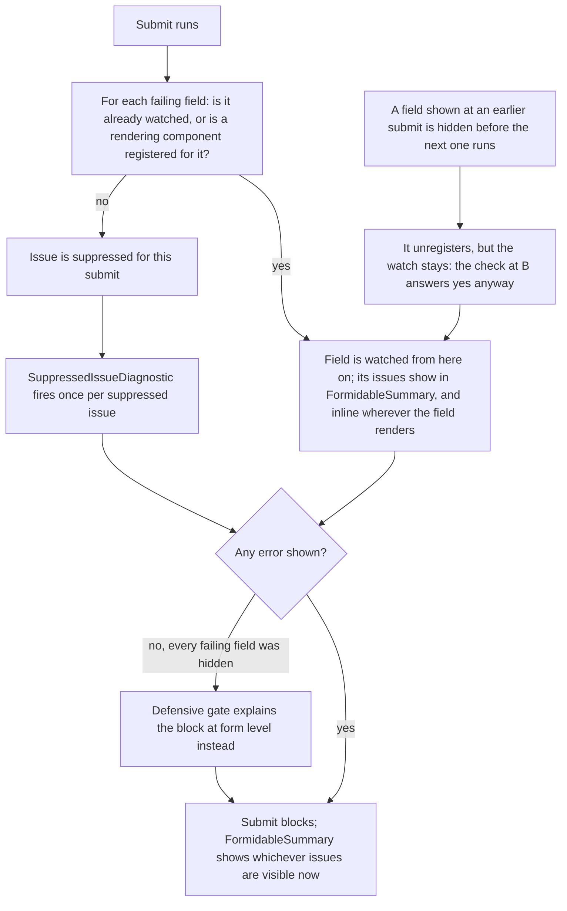

# Progressive disclosure

**You should already know:** how a live pass differs from submit
([Core concepts](core-concepts.md)), and how a `ValidationProfile` picks which rules run
at which moment ([Profiles](profiles.md)).

Hiding a field looks simple until its validation rule keeps running. Gate a shipping address
behind "ship to a different address," gate step two behind step one passing, and the rule
underneath never blinks — it still runs, still fails, against a field that isn't on screen. Show
that failure anyway and the user hits a dead end with no field to fix. Suppress it by hand, per
form, and you're one missed `@if` away from a submit button that quietly does nothing. Formidable
exists because that failure needs an audience-aware home, not a per-form workaround: at submit, an
issue surfaces because the markup that would show it is actually mounted, and a submit that can
show nothing says so out loud.

## Need to know

At submit, a field's issue reaches the screen if something is currently rendering that
field — `FormidableInputText` and other `FormidableInputBase<TValue>` descendants, the renderless
`FormidableField`, or the registration-only `FormidableFieldAnchor`. Each of those registers the
field for as long as it stays mounted. Showing a field's error also starts watching that field,
and the watch outlives the registration: until the form passes or is reset, that field's answer
keeps surfacing whether or not anything still renders it. (The live pass that runs between submits
answers to a different rule entirely — engagement, not registration —
[below](#the-live-channel-plays-by-its-own-rule).) The one guardrail: if
everything that's failing is unregistered and unwatched, submit still blocks with a form-level
explanation instead of quietly doing nothing —

> [!NOTE]
> Suppressing every failing field would let a submit silently do nothing, so a defensive gate
> blocks that case with a form-level explanation instead.

```csharp
    /// <summary>The defensive gate's form-level issue, synthesized by the channel views whenever
    /// <see cref="GateActive"/> holds: a blocked submit disclosed nothing, so this one model-level
    /// explanation stands in for the errors the user cannot see.</summary>
    private static readonly ValidationIssue GateIssue = new(
        string.Empty,
        "The form cannot be submitted because information that is not currently displayed is invalid.");
```

*Source: `src/Formidable.Blazor/FormValidationEngine.cs`*

That model-level issue needs somewhere to land, the same as any other: `FormidableSummary`'s
click-to-focus addresses it by `FormidableFieldId.For(new FieldIdentifier(model, string.Empty))`,
exactly like a named field. `FormidableForm` renders that id — plus `tabindex="-1"` so the
otherwise-inert `<form>` element can hold focus — on its own `<form>` automatically, so the gate's
summary entry works without a page rendering anything for it (see
[CSS and accessibility](css-and-accessibility.md) for the id mechanics, and
[Component kit](component-kit.md) for what `FormidableForm` renders). Attach mode's
`FormidableValidator` renders no `<form>` of its own, so a page using it still renders that id by
hand — see [Component kit](component-kit.md)'s `FormidableValidator` section for the pattern.

That explanation is derived, not filed. There is no gate entry anywhere to keep or lose, only the
conditions that make one true: a submit that blocked with nothing to show, an answer that still
carries errors, and nothing disclosed since. So the debounced refresh that follows every
post-submit edit cannot take it off the screen while the form stays blocked. It gives way the
moment there's a real message to give way to — an error the user can see, a server-declared error
arriving, or an answer that finally comes back clean. Every submit decides it again from scratch,
so it can stand at one submit, give way at the next, and come back at the one after that. What it
cannot come back for is a failure the form has already shown: that field stays watched until a
successful submit or a `ResetAsync` clears the watch, so its own failure explains itself from then
on. What raises the gate afresh is a field nothing has ever shown — one whose section is still
collapsed at the submit where everything visible finally passes.

That gate only fires when nothing about the failure can be shown; the ordinary case is narrower.
At submit, the engine resolves each FluentValidation failure's property path to a
`FieldIdentifier` through the model introspector, then asks the registry (`FieldRegistry`)
whether that identifier is currently revealed. [Collections and row
identity](collections-and-row-identity.md) covers how that resolution walks indexed paths. A field
has no matching registration when the markup that would render it sits behind an `@if` that isn't
satisfied. The rule still ran and the issue still exists in the validator's report, but it never
reaches the `EditContext`'s message store, `FormidableFieldMessage`, or `FormidableSummary`. It's
suppressed instead, and `SuppressedIssueDiagnostic` (see [Options](options.md)) is invoked once
per suppressed issue so you can still observe it outside the UI.

That registry answer decides one thing: whether the field joins the watched set. It is asked at
the moment `ValidateForSubmitAsync` runs, not continuously, and the set it feeds only grows. Later
blocked submits add to it, applying a server's verdict adds to it, and nothing removes a field
until a successful submit or a `ResetAsync` empties the set. So the debounced refresh that follows
a submit re-validates the whole model and re-answers the watched fields, rather than deciding
membership again: a field whose error the user fixed loses its message because the rule stopped
producing one, and if the value breaks again the message returns on the next refresh, with no
second submit needed. The entry follows the answer; the watch follows the submit. A field nothing
has ever watched stays quiet even while it's failing, and rendering it doesn't change that — it
surfaces at the *next* submit.

End to end, that's submit as the disclosure event, an unregistered field's issue getting
suppressed, the watch a shown field keeps, and the defensive gate catching the case where nothing
could be shown at all:



That's the submit channel's mechanism in full: render a failing field and its issue shows, and
goes on showing until the answer comes clean; leave it unrendered and unwatched and it says
nothing until the next submit. The live channel that runs between
submits works differently — covered next. What's left after that is the shape of the rules that
keep a UI condition and a `.When(...)` condition honest with each other, and the escape hatches
for controls Formidable doesn't wrap.

## The live channel plays by its own rule

Everything above is the submit channel's story: an issue reaches the screen because a rendering
component was registered for its field *at the moment submit ran*, or because an earlier submit
already put that field under watch. The live pass that runs after every field change has no such
gate. By default registration filters it nowhere: the engine files a live verdict for every
engaged field without consulting the registry, and every surface reads that verdict back the same
way, whether or not anything currently renders the field — the engine's own issue reads,
`FormidableFieldMessage`, `FormidableSummary`, and the `EditContext`'s message store a native
`ValidationMessage` renders from. That default is deliberate, and it is what keeps the store
usable as a bridge for native components: a form built out of plain `InputBase` inputs registers
nothing at all, and its live errors have to reach the store regardless (see
[Server integration](server-integration.md#client-round-trip)).
[`FormidableOptions.LiveDisclosure`](options.md#livedisclosure) is the one way to narrow that, and
it narrows every surface at once rather than one of them. There's one bound on how long a live
verdict stands either way: a live issue for a field that has since left the page goes with the
next rendered-field-set change, along with everything else the departure invalidates. *Left* is
the operative word there. A field something rendered once and nothing renders now has left; a
field nothing has ever registered never arrived, and no amount of churn elsewhere on the page
takes its live verdict away. That distinction is the whole of what registration decides on this
channel.

What gates the live channel is a different question: not *is this field rendered*, but *has this
field been engaged*. The engine keeps a first-class engaged-field set, and a field enters it the
moment a field-changed notification names it — a kit input committing a value (in every
`UpdateOn` mode, `OnBlur` included, since a committed change is the only thing that ever
notifies), a native input's own change, or an explicit `FormidableFieldContext.NotifyChanged()`.
A live pass validates the whole model on every change, the same as any other pass, and its
verdict answers every engaged field: the report's issues where it has them, an empty verdict
where it says nothing. An engaged field's message therefore clears — or appears — because of an
edit to a *different* field, which is what keeps a cross-field rule current between submits. A
field never engaged keeps no live verdict at all, however loudly its rule is failing underneath.
That's the entire mechanism behind [disclosing a rule on
engagement](recipes.md#i-want-a-rule-to-disclose-on-engagement-instead-of-waiting-for-submit)
without moving it out of the submit bucket, and it's also why a fresh, untouched row in a
collection stays silent even when its rule is already failing against it: nothing has engaged its
fields yet. Engagement ends the way a live issue does — a field pruned from the rendered set
leaves the engaged set with it, one committed change away from re-engaging.
[The live/refresh asymmetry](recipes.md#i-want-to-validate-while-typing-on-blur-or-only-at-submit)
covers how this interacts with the debounced refresh that follows a submit.

One more distinction is worth being precise about, since it looks related and isn't: whether a
field has been touched or modified gates its CSS class only, never a message. `formidable-invalid`
paints the moment there's an error, ungated; the warning, info and valid tiers wait for the field
to be touched or modified, and valid waits for one thing more — the engine being able to say a
submit would not fail the field. So an error-free field the visitor hasn't touched earns no state
class at all, whatever it carries (see [CSS and accessibility](css-and-accessibility.md) for the
full rule). A message list, a summary entry, and the message store all read whatever the engine
currently holds
for the field regardless — live issues included — so a field can carry a visible message before it
ever earns a class describing it.

## The two patterns

The disclosure sample teaches two different shapes, and they are not interchangeable — using the
wrong one either nags the user for fields they haven't reached, or makes a valid answer
unsubmittable.

### Pattern 1 — UI-gated sections

A section is collapsed by pure UI state that has nothing to do with the model. The rule behind
it is unconditional, so it always runs; whether it is *visible* depends entirely on whether the
user has opened the section:

```razor
    <p>
        <button type="button"
                @onclick="() => _showDetails = !_showDetails">
            @(_showDetails ? "Hide" : "Show") traveler details
        </button>
    </p>
    @if (_showDetails)
    {
        <div class="field">
            <label>Traveler name
                <FormidableInputText @bind-Value="_request.TravelerName" /></label>
            <FormidableFieldMessage For="() => _request.TravelerName" />
        </div>
    }
```

*Source: `samples/Formidable.Sample/Pages/Disclosure.razor`*

The corresponding rule has no `.When(...)` at all:

```csharp
        RuleFor(t => t.TravelerName).NotEmpty().WithMessage("Traveler name is required");
```

*Source: `samples/Formidable.Sample.Shared/TravelRequest.cs`*

Submit while collapsed and the missing-name error is genuinely suppressed — logged to the
diagnostic, not shown inline. Expanding the section registers the field, but (per the refresh
rule above) the earlier suppressed error does not retroactively appear; submitting again is what
lets the now-registered field pick it up. Use this pattern for disclosure that is a pure UI
convenience: an expandable "more details" panel, a collapsed advanced section. It fits whenever
the rule should count toward validity regardless of whether the user chose to look.

### Pattern 2 — data-gated cascades

A field's relevance is driven by another field's value, and the rule's `.When(...)` condition
mirrors the same condition the `@if` uses to render it. The accommodation type is a native
`<select>` — nothing Formidable would otherwise wrap — so it renders inside `FormidableField`.
Its context supplies the plumbing the control needs: `ElementId`, `AriaInvalid`,
`AriaDescribedBy`, `CssClass` — spelled out one attribute at a time here, though
`@attributes="field.InputAttributes"` splats the same four in one go. It also exposes the
`NotifyChanged()` the `@onchange` handler calls
explicitly, so the engine's live pass runs on every change the same way it would for a
Formidable-wrapped input:

```razor
    @if (_request.NeedsAccommodation == true)
    {
        <fieldset>
            <legend>Accommodation</legend>
            <FormidableField For="() => _request.AccommodationType" Context="field">
                <label>Type
                    <select id="@field.ElementId" class="@field.CssClass"
                            aria-invalid="@(field.AriaInvalid ? "true" : null)"
                            aria-describedby="@field.AriaDescribedBy"
                            value="@_request.AccommodationType"
                            @onchange="args => OnTypeChanged(args, field)">
                        <option value="">Choose…</option>
                        <option>Hotel</option>
                        <option>Serviced apartment</option>
                        <option>Accessible</option>
                    </select>
                </label>
            </FormidableField>
            <FormidableFieldMessage For="() => _request.AccommodationType" />

            @if (_request.AccommodationType == "Accessible")
            {
                <div class="field">
                    <label>Special requirements
                        <FormidableInputText @bind-Value="_request.SpecialRequirements" /></label>
                    <FormidableFieldMessage For="() => _request.SpecialRequirements" />
                </div>
            }
        </fieldset>
    }
```

*Source: `samples/Formidable.Sample/Pages/Disclosure.razor`*

```csharp
        RuleFor(t => t.AccommodationType).NotEmpty().WithMessage("Choose an accommodation type")
            .When(t => t.NeedsAccommodation == true);
        RuleFor(t => t.SpecialRequirements).NotEmpty().WithMessage("Describe the special requirements")
            .When(t => t.NeedsAccommodation == true && t.AccommodationType == "Accessible");
```

*Source: `samples/Formidable.Sample.Shared/TravelRequest.cs`*

Because the rule simply does not run unless `NeedsAccommodation == true`, there is never a
hidden failing issue to suppress in the first place — the model's own state keeps the rule and
the UI in lockstep, by construction. This is more than a nicety. Without the matching `.When`,
answering "No" would leave `AccommodationType`'s unconditional rule permanently failing and
permanently unregistered — exactly the all-suppressed case the defensive gate exists for. The
"No" data path could never submit. Mirroring the condition is what lets that alternate path
submit at all. Use this pattern whenever a field's relevance is determined by data, not by a
UI-only toggle.

## FormidableFieldAnchor for raw and foreign controls

Anything Formidable doesn't wrap — a plain `<input>`, a native `<select>`, a third-party
component — never registers on its own. `FormidableFieldAnchor` is a registration-only marker
that renders nothing; placing it next to a raw control keeps automatic disclosure truthful for
it. It suits
controls that already notify the `EditContext` of changes through the ordinary Blazor forms
pipeline — a native `InputText` is itself an `InputBase<TValue>` descendant, so it calls
`EditContext.NotifyFieldChanged` on its own without any help. The vanilla-interop sample's
nickname field is the remaining genuine example:

```razor
    <div class="field">
        <label>Nickname (native InputText)
            <InputText @bind-Value="_order.Nickname"
                       id="@NicknameId"
                       aria-invalid="@NicknameAriaInvalid"
                       aria-describedby="@NicknameMessagesId" /></label>
        <ValidationMessage For="() => _order.Nickname" id="@NicknameMessagesId" />
        <FormidableFieldAnchor For="() => _order.Nickname" />
    </div>
```

*Source: `samples/Formidable.Sample/Pages/VanillaInterop.razor`*

The `id`, `aria-describedby` and `aria-invalid` alongside it answer a different question —
click-to-focus and the input's assistive-technology story, both covered in
[CSS and accessibility](css-and-accessibility.md). Registration is the anchor's job alone.

Without the anchor, no submit would ever reveal `Nickname`: the native `InputText` mounts no
Formidable component, so nothing registers the field, and its submit errors are suppressed as
unrevealed while its issues sort last in a resolved issue order. What the anchor is not needed for
is the live channel — Blazor's own binding notifies the engine on every change, which engages the
field, and an engaged field's live verdict discloses on every surface regardless. The anchor is
how the *submit* channel learns the field is on the page. The disclosure page's
accommodation radio group and type `<select>` used to be anchored the same way, but a hand-wired
`@onchange` on a raw element doesn't call `EditContext.NotifyFieldChanged` the way `InputBase`
does. So both now render inside `FormidableField` instead, whose context exposes the
`NotifyChanged()` their handlers call explicitly. Reach for `FormidableFieldAnchor` when a raw or
foreign control already drives the engine's live pass by some other means and only needs
registering; reach for `FormidableField` when a raw or hand-wired control needs to trigger that
pass itself.

## KeepRegistered and virtualization

Every registering component — `FormidableInputBase<TValue>` descendants, `FormidableFieldAnchor`,
`FormidableField`, and `FormidableCollectionMessage` — exposes a `KeepRegistered` parameter. A container
such as `Virtualize` disposes rows that scroll out of view, even though they remain part of the
form. Without `KeepRegistered`, a scrolled-away row's field unregisters, and its live messages go
quiet with it while the row still sits in the model, still failing. Setting `KeepRegistered` on
the row's fields keeps them revealed after disposal, so scrolling takes no message away, and a
submit can still disclose a row the visitor scrolled past. See the Virtualize section of
[Component kit](component-kit.md) for the full pattern.

## DisclosureOverride: the escape hatch

`FormidableOptions.DisclosureOverride` is consulted per issue *before* the registry check: return
`true` to force an issue visible regardless of registration, `false` to force it suppressed
regardless of registration, or `null` to defer to the registry as described above. It's the way
out for issues that don't fit the render-registration model — forcing a rule visible without
wrapping its field, or silencing a known-noisy rule outright.

What each answer decides at submit is whether that issue puts its field under watch, and the
watch is per field rather than per issue. So a `false` on one of two issues failing on the same
field keeps that issue from being the reason the field is watched, and no more: once the other
issue starts the watch, the field's answer shows whole, and the suppressed-issue diagnostic
reports neither of them, since neither is in fact hidden. The live channel is a separate question
again — under its default policy nothing filters it, this override included, and its
[`LiveDisclosure`](options.md#livedisclosure) opt-in is what applies the override there, issue by
issue.

Server-applied *errors* (`Engine.ApplyServerIssues`, see
[Server integration](server-integration.md)) bypass
the registry check entirely rather than defer to it. They're visible unless `DisclosureOverride`
explicitly returns `false`: the server already validated the submitted data, and an error that
blocks the save has to reach the user whether or not the client happened to render its field.
Advisories in the same payload defer to the registry like the client's own, and a suppressed one
fires the diagnostic. Nothing is stranded by that: an advisory blocks no submit, so hiding one
leaves the user nothing to fix.

**Samples:** [`/disclosure`](../samples/Formidable.Sample/Pages/Disclosure.razor) — the
suppressed-issue list on the page reflects only the most recent submit. It's cleared at the start
of each submit, and the diagnostic repopulates it as that submit runs. A fully disclosed submit
leaves it empty instead of carrying forward what an earlier submit hid.
[`/workout`](../samples/Formidable.Sample/Pages/Workout.razor) shows the same UI-gating pattern
(catering toggled off over an unconditional `DietaryNotes` rule) and the all-suppressed defensive
gate, both appearing inside a composite form alongside every other feature.
