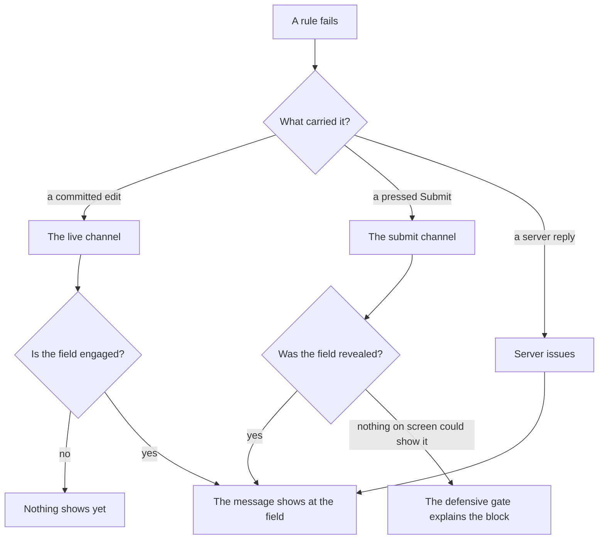

# Progressive disclosure

**You should already know:** that a submit runs both rule buckets while an unchanged field stays
quiet until one ([Draft and submit rules](tutorial/2-draft-and-submit.md)), and how a
`ValidationProfile` picks which rules run at which moment ([Profiles](profiles.md)).

Hiding a field looks simple until its validation rule keeps running. Gate a shipping address behind
"ship to a different address," gate step two behind step one passing, and the rule underneath never
blinks. It still runs, still fails, against a field that isn't on screen. Show that failure anyway
and the user hits a dead end with no field to fix. Suppress it by hand, per form, and you're one
missed `@if` away from a submit button that quietly does nothing.

Formidable exists because that failure needs an audience-aware home, not a per-form workaround. Two
channels carry a message to the screen, and they play by different rules. As you edit, a message
shows at a field you have changed, and a field nobody has changed stays quiet. At submit, an issue
surfaces when something says it has an audience: mounted markup, a watch from an earlier
disclosure, or an explicit override. A submit that can show nothing says so out loud.

Here is one failing rule, from the moment it fails to the moment the user reads it:



The questions below take that picture one branch at a time, each starting with what you see; the
sections after them are the page's own components.

## Why isn't my message showing yet?

Because nothing has changed the field yet. Short of a submit or a server reply, a message shows
only at a field you have engaged, and engagement is a committed value change: typing something, or
clearing something that was there. Focusing a field and tabbing back out is not a change, so a
field you only visited says nothing, however loudly its rule fails underneath. A message for a
field the visitor was only passing through is how people learn to stop reading a form's messages
at all.

The knob is `LiveProfile` (`null` by default, meaning the submit profile). Engagement is why a
submit rule can run as you type without a fresh page nagging about fields nobody has reached, and
why a new collection row stays silent while its rule already fails it. Narrowing `LiveProfile` is
the blunter lever, for rules too expensive to run per change rather than for rules merely strict
([the narrowing recipe](recipes.md#i-want-to-narrow-what-the-live-channel-validates)).

A field is engaged the moment a field-changed notification names it: a kit input committing a
value (in every `UpdateOn` mode, `OnBlur` included, since only a commit ever notifies), a native
input's own change, or an explicit `FormidableFieldContext.NotifyChanged()`. A page that fills the
model itself, from a saved draft or a record opened for editing, engages those fields with
`IFormidableEngine.DiscloseLoadedValuesAsync()`, since writing model properties notifies nothing.

Loaded values are engaged rather than merely marked touched so that a bad saved value can speak.
Touched alone would paint the good ones green and leave the wrong one silent among them, and
silence in a row of green reads as "not filled in yet".

An engaged field's message shows on every surface, its own message component and
`FormidableSummary` alike, and its errors reach what a native `ValidationMessage` renders, whether
or not anything renders the field. That is deliberate: a form of plain `InputBase` inputs registers
nothing, and its live errors still have to reach Blazor's own components.
[`LiveDisclosure`](options.md#livedisclosure) (`Engaged` by default) is the one way to narrow that,
and `EngagedAndVisible` narrows every surface at once.

An edit anywhere answers every engaged field, so a message can clear, or appear, because of an
edit to a *different* field, which keeps a cross-field rule current between submits.

Engagement ends when the field leaves the page: its message goes with the next change to which
fields are on screen, one committed change away from returning. A field nothing has ever rendered
has not left, so churn elsewhere on the page never takes its message away. Under the default, that
is the whole of what rendering decides on this channel.

Why: [how the engine works: the live view](how-the-engine-works.md#the-live-view).

## Why did it appear when I pressed Submit?

Because Submit is the disclosure event. At submit, which errors show is decided by what is on
screen at that moment: a field's error reaches the screen if something is rendering that field,
and goes on showing until the answer comes clean.

A field behind an unsatisfied `@if`, one no earlier submit or server reply has shown, has nothing
rendering it, so its error reaches no message component, no summary and no native
`ValidationMessage`. It still blocks the submit; it is suppressed instead, and
[`SuppressedIssueDiagnostic`](options.md#suppressedissuediagnostic) is invoked once per suppressed
*error* so you can observe it outside the UI.

The components that count as rendering a field are `FormidableInputText` and the other
`FormidableInputBase<TValue>` descendants, the renderless `FormidableField`, the registration-only
`FormidableFieldAnchor`, and `FormidableCollectionMessage` for its collection-level path, each for
as long as it stays mounted (`KeepRegistered`, below, extends that). `FormidableFieldMessage` alone
registers nothing, so a submit's error needs one of those beside it (a live message reaches it
regardless).

A warning or an info at submit shows only where something renders its field too; a hidden one is
dropped in silence, since it blocks nothing.

The decision is taken as you press Submit, not continuously, and it decides which fields the form
watches. That set only grows: a later blocked submit adds to it, and so does a server reply. A
watch also outlives the markup. Until the form passes or is reset, the field's answer keeps
surfacing whether or not anything still renders it, so a field one submit showed and you hid again
still discloses at the next.

Pressing Submit also replaces every live message with the submit's own answer; on a rendered field
you see no change, because the submit shows the same message.

Why: [how the engine works: what a submit reveals](how-the-engine-works.md#the-reveal-ledgers).

## Why did a server error show on a hidden field?

Because the server already judged what was actually submitted, and an error that blocks the save
has to reach the user whether or not the client happened to render its field. A server error
(`Engine.ApplyServerIssues`, see [Server integration](server-integration.md)) shows regardless of
what is on screen, and only a `DisclosureOverride` that returns `false` for it hides one. Applying
a reply also puts the fields it shows under the same watch a blocked submit does.

Advisories in a server reply follow the client's own rule instead: they show only where something
renders the field, and a hidden one reports `SuppressedIssueDiagnostic`, which a submit's own hidden
advisories do not. Nothing is stranded by that: an advisory blocks no submit, so hiding one leaves
the user nothing to fix.

Why: [how the engine works: what a server reply reveals](how-the-engine-works.md#the-reveal-ledgers).

## Why is the submit blocked with no message in sight?

Because everything that is failing is hidden and unwatched. With nothing on screen to point at, a
defensive gate blocks the submit with a model-level explanation of its own rather than letting the
button quietly do nothing:

```csharp
public string DefensiveGateMessage { get; set; } =
    "The form cannot be submitted because information that is not currently displayed is invalid.";
```

<!-- Source: `src/Formidable.Blazor/FormidableOptions.cs` -->

That sentence is a default rather than a fixture. It is English, so a form that addresses its users
in another language, or in a wording of its own, replaces it through
[`DefensiveGateMessage`](options.md#defensivegatemessage); a replacement reaches the next surface
that asks.

The explanation is a model-level issue, belonging to the form rather than to a field, so every
surface that reads model-level issues shows it. `FormidableSummary` lists it, and its click focuses
the form: `FormidableForm` renders the id that click targets, plus `tabindex="-1"`, on its own
`<form>`, while a `FormidableValidator` page renders no `<form>` and adds the id by hand
([Component kit](component-kit.md#formidablevalidatortmodel-attaching-to-an-existing-form) has
the pattern). Blazor's own `<ValidationSummary />` shows it too, and on a form with inline messages
only, [`FormidableModelMessage`](component-kit.md#formidablemodelmessage) is the surface built for
it.

A page that renders none of those can read it itself, through
`Engine.GetIssues(new FieldIdentifier(model, string.Empty))` or `GetVisibleIssues()`. Render the
container always and let items come and go, as the shipped components do; otherwise the
announcement the gate exists to make is the one most likely to be dropped
([CSS and accessibility](css-and-accessibility.md#why-does-the-summary-render-empty-regions-before-anything-is-wrong) has why).

The gate gives way the moment there is a real message to give way to: an error the user can see, a
server error arriving, or an answer that comes back clean. Nothing short of a reset removes it: an
edit, and the whole-form re-check that follows one after a submit, leave it standing while nothing
on screen explains the block. Every submit decides it again from scratch, so it can stand at one
submit, give way at the next, and come back at the one after that.

The gate never stands in for a failure the form is still watching, because that field's own
message explains the block. What raises it is a failure nothing currently discloses, by one of two
routes. The first is a field nothing has ever shown, its section still collapsed at the submit
where everything visible finally passes. The second is a field an earlier submit did show: a
successful submit has since ended every watch, and a later submit finds the field hidden again.

Why: [how the engine works: the gate](how-the-engine-works.md#the-gate-latch).

## Why is it still showing, and when does it clear?

Because a message a submit revealed keeps answering for its field as you edit, and neither its
going nor its coming back waits for a second submit. Fix the value and the message clears, because
the rule stopped producing it; break the value again and the message returns. What ends the watch
itself is a successful submit or a reset of the form (`ResetAsync`, or a model swap, either of
which rebuilds it), each clearing every watch at once. Nothing else removes a field from it.

With the defaults (`LiveProfile` and `LiveDebounce` both `null`) the clearing and the return both
happen on the edit itself rather than after `RefreshDebounce`. Otherwise the clearing waits for the
whole-form re-check that follows every post-submit edit (`RefreshDebounce`, 300 ms by default), or
for your own live check where that runs the submit profile, whichever lands first. A return can be
quicker: your live check shows the error again as soon as it runs the rule.

A message a server reply put on screen follows a different rule. A live check for its field leaves
it standing, and it goes at the whole-form re-check after your next committed edit (or after a
change to which fields are on screen), at the next submit, or when a page discloses freshly loaded
values. A client rule failing the same way keeps its message through the client's own answer
([Server integration](server-integration.md#what-happens-to-a-server-error-when-i-edit-the-field)).

A field no submit has shown stays quiet on the submit side even while it is failing, and rendering
it later does not change that: it surfaces at the *next* submit. Whether anything speaks for it
meanwhile is the live channel's business, on its own rule
([above](#why-isnt-my-message-showing-yet)).

Why: [how the engine works: what a re-check leaves standing](how-the-engine-works.md#the-reveal-ledgers).

## Why does a field show a message but no state class?

Because whether a field has been touched or modified gates its CSS class only, never a message.
`formidable-invalid` paints the moment there is an error, ungated. The warning, info and valid
tiers wait for the field to be touched or modified, and `formidable-valid` waits for one thing
more: that a submit would not fail the field.

So an error-free field the visitor hasn't touched earns no state class for what it carries, while
every message surface reads whatever the form currently holds for the field, live messages
included. [CSS and accessibility](css-and-accessibility.md#what-puts-green-on-a-field) has the
whole rule.

Why: [how the engine works: what green reads](how-the-engine-works.md#the-submit-coverage-vouch).

## The two patterns

The disclosure sample teaches two different shapes, and they are not interchangeable. The wrong one
either nags the user for fields they haven't reached, or makes a valid answer unsubmittable.

### Pattern 1 — UI-gated sections

A section is collapsed by pure UI state that has nothing to do with the model. The rule behind it is
unconditional, so it always runs; whether it is *visible* depends entirely on whether the user has
opened the section:

```razor
<p>
    <button type="button"
            @onclick="() => _showDetails = !_showDetails">
        @(_showDetails ? "Hide" : "Show") traveler details
    </button>
</p>
@if (_showDetails)
{
    <div class="field">
        <label>Traveler name <FormidableRequiredIndicator For="() => _request.TravelerName" />
            <FormidableInputText @bind-Value="_request.TravelerName" /></label>
        <FormidableFieldMessage For="() => _request.TravelerName" />
    </div>
}
```

<!-- Source: `samples/Formidable.Sample/Pages/Disclosure.razor` -->

The corresponding rule has no `.When(...)` at all:

```csharp
RuleFor(t => t.TravelerName).NotEmpty().WithMessage("Traveler name is required");
```

<!-- Source: `samples/Formidable.Sample.Shared/TravelRequest.cs` -->

Submit while collapsed and the missing-name error is genuinely suppressed: logged to the diagnostic,
not shown inline. Expanding the section renders the field, but the earlier suppressed error does
not retroactively appear, because which fields a submit shows was decided at that submit and no
edit's re-check decides it again. Submitting again is what lets the now-rendered field pick it up.

Use this pattern for disclosure that is a pure UI convenience: an expandable "more details" panel, a
collapsed advanced section. It fits whenever the rule should count toward validity regardless of
whether the user chose to look.

### Pattern 2 — data-gated cascades

A field's relevance is driven by another field's value, and the rule's `.When(...)` condition
mirrors the same condition the `@if` uses to render it. The accommodation type is a native
`<select>`, nothing Formidable would otherwise wrap, so it renders inside `FormidableField`, whose
context supplies the plumbing the control needs: `ElementId`, `AriaInvalid`, `AriaDescribedBy`,
`CssClass` (spelled out one at a time here; `@attributes="field.InputAttributes"` splats them in
one go).

The context also exposes the `NotifyChanged()` the `@onchange` handler calls, so every change is
checked live the same way it would be for a Formidable-wrapped input:

```razor
@if (_request.NeedsAccommodation == true)
{
    <fieldset>
        <legend>Accommodation</legend>
        <FormidableField For="() => _request.AccommodationType" Context="field">
            <label>Type
                <select id="@field.ElementId" class="@field.CssClass"
                        aria-invalid="@(field.AriaInvalid ? "true" : null)"
                        aria-describedby="@field.AriaDescribedBy"
                        value="@_request.AccommodationType"
                        @onchange="args => OnTypeChanged(args, field)">
                    <option value="">Choose…</option>
                    <option>Hotel</option>
                    <option>Serviced apartment</option>
                    <option>Accessible</option>
                </select>
            </label>
        </FormidableField>
        <FormidableFieldMessage For="() => _request.AccommodationType" />

        @if (_request.AccommodationType == "Accessible")
        {
            <div class="field">
                <label>Special requirements
                    <FormidableInputText @bind-Value="_request.SpecialRequirements" /></label>
                <FormidableFieldMessage For="() => _request.SpecialRequirements" />
            </div>
        }
    </fieldset>
}
```

<!-- Source: `samples/Formidable.Sample/Pages/Disclosure.razor` -->

```csharp
RuleFor(t => t.AccommodationType).NotEmpty().WithMessage("Choose an accommodation type")
    .When(t => t.NeedsAccommodation == true);
RuleFor(t => t.SpecialRequirements).NotEmpty().WithMessage("Describe the special requirements")
    .When(t => t.NeedsAccommodation == true && t.AccommodationType == "Accessible");
```

<!-- Source: `samples/Formidable.Sample.Shared/TravelRequest.cs` -->

Because the rule simply does not run unless `NeedsAccommodation == true`, there is never a hidden
failing issue to suppress in the first place: the model's own state keeps the rule and the UI in
lockstep. Without the matching `.When`, answering "No" would leave `AccommodationType`'s
unconditional rule permanently failing and permanently hidden, exactly the all-suppressed case the
defensive gate exists for, and the "No" data path could never submit. Use this pattern whenever a
field's relevance is determined by data, not by a UI-only toggle.

## FormidableFieldAnchor for raw and foreign controls

Anything Formidable doesn't wrap (a plain `<input>`, a native `<select>`, a third-party component)
never registers on its own. `FormidableFieldAnchor` is a registration-only marker that renders
nothing, and placing it next to a raw control keeps automatic disclosure truthful for it.

The anchor suits controls that already notify the `EditContext` of changes through the ordinary
Blazor forms pipeline: a native `InputText` is itself an `InputBase<TValue>` descendant, so it
calls `EditContext.NotifyFieldChanged` on its own. The vanilla-interop sample's nickname field is
one shipped example (`/workout`'s venue region and `/attach`'s submitter name are the same wiring):

```razor
<div class="field">
    <label>Nickname (native InputText)
        <InputText @bind-Value="_order.Nickname"
                   id="@NicknameId"
                   aria-invalid="@NicknameAriaInvalid"
                   aria-describedby="@NicknameAriaDescribedBy" /></label>
    <ValidationMessage For="() => _order.Nickname" id="@NicknameMessagesId" />
    <FormidableFieldAnchor For="() => _order.Nickname" />
</div>
```

<!-- Source: `samples/Formidable.Sample/Pages/VanillaInterop.razor` -->

The `id`, `aria-describedby` and `aria-invalid` alongside it serve click-to-focus and assistive
technology ([CSS and accessibility](css-and-accessibility.md)); registration is the anchor's job
alone.

Without the anchor, no submit would ever reveal `Nickname`: nothing registers the field, so its
submit errors are suppressed as unrevealed and its issues sort last in a resolved issue order. A
blocked submit also takes the field's on-screen live message with it, since the submit's answer
replaces every live message and cannot show this one; the message returns at the next edit
anywhere on the form.

What the anchor is not needed for is the live channel. Blazor's own binding notifies the form on
every change, which engages the field, and an engaged field's live message shows on every surface
regardless. The anchor is how the *submit* channel learns the field is on the page.

Reach for `FormidableFieldAnchor` when a raw or foreign control already notifies its changes by
some other means and only needs registering. Reach for `FormidableField` when a hand-wired control
needs to notify them itself: a hand-wired `@onchange` on a raw element doesn't call
`EditContext.NotifyFieldChanged` the way `InputBase` does, and the `FormidableField` context
exposes the `NotifyChanged()` its handler calls, as the accommodation `<select>` above does.

## KeepRegistered and virtualization

Every registering component (`FormidableInputBase<TValue>` descendants, `FormidableFieldAnchor`,
`FormidableField`, and `FormidableCollectionMessage`) exposes a `KeepRegistered` parameter. A
container such as `Virtualize` disposes rows that scroll out of view, even though they remain part
of the form.

Without `KeepRegistered`, a scrolled-away row's field unregisters, and its live messages go quiet
with it while the row still sits in the model, still failing. Setting `KeepRegistered` on the row's
fields keeps them registered after disposal, so scrolling takes no message away, and a submit can
still disclose a row the visitor scrolled past.
[Component kit](component-kit.md#virtualize-and-keepregistered) has the full pattern.

## DisclosureOverride: the escape hatch

`FormidableOptions.DisclosureOverride` is the escape hatch for an issue whose field nothing renders.
Where a channel consults it at all, it is asked per issue and *before* the registration check.
Return `true` to answer yes, `false` to answer no, or `null` to defer to the registry as described
above.

An answer is an input to the asking channel's own disclosure rule rather than a switch over what is
on screen, and the channels differ in what they make of it. The override is the way out for issues
that don't fit the render-registration model: reaching a rule's failure without wrapping its field,
or keeping a known-noisy one from being the reason a field is watched.

At submit an answer decides whether that issue puts its field under watch, and the watch is per
field rather than per issue. So a `false` on one of two issues failing on the same field keeps that
issue from being the reason the field is watched, and no more. Once the other issue starts the
watch, the field's answer shows whole, and the suppressed-issue diagnostic reports neither of them,
since neither is in fact hidden.

The live channel is a separate question again. Under its default policy nothing filters it, this
override included; the [`LiveDisclosure`](options.md#livedisclosure) opt-in is what applies the
override there, issue by issue. Server-applied issues are the third case, and
[the section above](#why-did-a-server-error-show-on-a-hidden-field) has it: only a `false` hides
an error, while an advisory follows the client's own rule.

A submit reports its own error-severity issues on fields it leaves unwatched, and a server response
reports the advisories its visibility answer hid. Those two sites are the whole of what gets
reported; everything else a visibility answer hides is dropped in silence. That covers a submit's
own advisories, every live issue under `LiveIssueDisclosure.EngagedAndVisible`, and a
server-declared *error* an override answered `false` for.

Both reporting sites write a `Trace`-output warning whether or not
[`SuppressedIssueDiagnostic`](options.md#suppressedissuediagnostic) is set, and log a warning too
where the host resolved an `ILoggerFactory`; on WebAssembly that is the browser console, needing
no wiring to be seen.

**Samples:** [`/disclosure`](../samples/Formidable.Sample/Pages/Disclosure.razor). Its
suppressed-issue list reflects only the most recent submit (cleared as each submit starts, so a
fully disclosed submit leaves it empty), and its summary-less form shows the defensive gate arriving
through `FormidableModelMessage` instead of a summary entry.
[`/workout`](../samples/Formidable.Sample/Pages/Workout.razor) shows the same UI-gating pattern
(catering toggled off over an unconditional `DietaryNotes` rule) and the all-suppressed defensive
gate inside a composite form.
