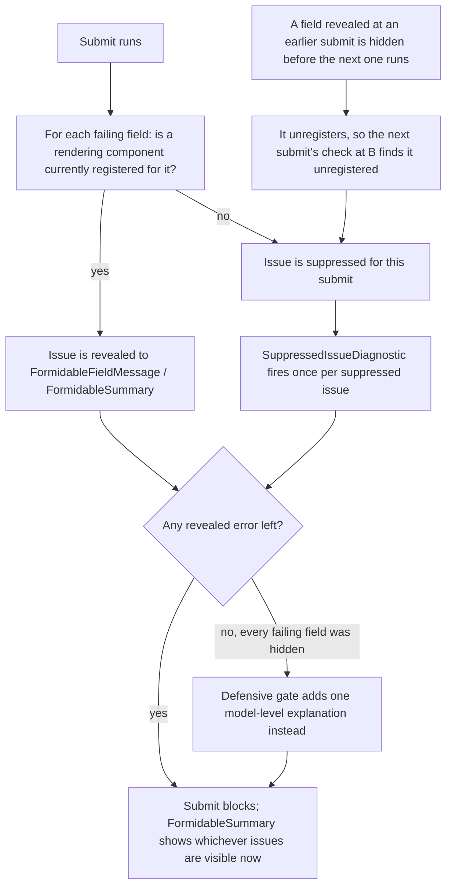

# Progressive disclosure

**You should already know:** how a live pass differs from submit
([Core concepts](core-concepts.md)), and how a `ValidationProfile` picks which rules run
at which moment ([Profiles](profiles.md)).

Hiding a field looks simple until its validation rule keeps running. Gate a shipping address
behind "ship to a different address," gate step two behind step one passing, and the rule
underneath never blinks — it still runs, still fails, against a field that isn't on screen. Show
that failure anyway and the user hits a dead end with no field to fix. Suppress it by hand, per
form, and you're one missed `@if` away from a submit button that quietly does nothing. Formidable
exists because that failure needs an audience-aware home, not a per-form workaround: an issue only
ever surfaces when the markup that would show it is actually mounted.

## Need to know

A field's issue only ever reaches the screen if something is currently rendering that field —
`FormidableInputText` and other `FormidableInputBase<TValue>` descendants, the renderless
`FormidableField`, or the registration-only `FormidableFieldAnchor`. Each of those registers the field for
as long as it stays mounted. The one guardrail: if literally everything that's failing is
unregistered, submit still blocks with a form-level explanation instead of quietly doing nothing —

> [!NOTE]
> Suppressing every failing field would let a submit silently do nothing, so a defensive gate
> blocks that case with a form-level explanation instead.

```csharp
                    if (visibleErrors.Count == 0)
                    {
                        // Defensive gate: every failing field is hidden. Block anyway, with a
                        // form-level explanation instead of a silent no-op submit.
                        var gate = new ValidationIssue(
                            string.Empty,
                            "The form cannot be submitted because information that is not currently displayed is invalid.");
                        visibleErrors = [(gate, ModelLevelField)];
                    }
```

*Source: `src/Formidable.Blazor/FormValidationEngine.cs`*

That model-level issue needs somewhere to land, the same as any other: `FormidableSummary`'s
click-to-focus addresses it by `FormidableFieldId.For(new FieldIdentifier(model, string.Empty))`,
exactly like a named field. `FormidableForm` renders that id — plus `tabindex="-1"` so the
otherwise-inert `<form>` element can hold focus — on its own `<form>` automatically, so the gate's
summary entry works without a page rendering anything for it (see
[CSS and accessibility](css-and-accessibility.md) for the id mechanics, and
[Component kit](component-kit.md) for what `FormidableForm` renders). Attach mode's
`FormidableValidator` renders no `<form>` of its own, so a page using it still renders that id by
hand — see [Component kit](component-kit.md)'s `FormidableValidator` section for the pattern.

That gate only fires when every failing field is hidden; the ordinary case is narrower. At
submit, the engine resolves each FluentValidation failure's property path to a `FieldIdentifier`
through the model introspector, then asks the registry (`FieldRegistry`) whether that identifier
is currently revealed. [Collections and row identity](collections-and-row-identity.md) covers how
that resolution walks indexed paths. A field has no matching registration when the markup that
would render it sits behind an `@if` that isn't satisfied. The rule still ran and the issue still
exists in the validator's report, but it never reaches the `EditContext`'s message store,
`FormidableFieldMessage`, or `FormidableSummary`. It's suppressed instead, and `SuppressedIssueDiagnostic` (see
[Options](options.md)) is invoked once per suppressed issue so you can still observe it outside
the UI.

This registry check happens once, at the moment `ValidateForSubmitAsync` runs — not
continuously. The debounced refresh that follows a submit re-validates but does not re-derive
visibility from the registry; it only narrows to fields that were already part of the visible set
at that submit. A field revealed after the fact stays quiet even though it's now failing; it
surfaces at the *next* submit, not the moment it renders.

End to end, that's submit as the disclosure event, an unregistered field's issue getting
suppressed, and the defensive gate catching the all-suppressed case:



That's the mechanism in full: render it and an issue can show; don't, and it can't, until the
next submit says otherwise. What's left is the shape of the rules that keep a UI condition and a
`.When(...)` condition honest with each other, and the escape hatches for controls Formidable
doesn't wrap.

## The two patterns

The disclosure sample teaches two different shapes, and they are not interchangeable — using the
wrong one either nags the user for fields they haven't reached, or makes a valid answer
unsubmittable.

### Pattern 1 — UI-gated sections

A section is collapsed by pure UI state that has nothing to do with the model. The rule behind
it is unconditional, so it always runs; whether it is *visible* depends entirely on whether the
user has opened the section:

```razor
    <p>
        <button type="button"
                @onclick="() => _showDetails = !_showDetails">
            @(_showDetails ? "Hide" : "Show") traveler details
        </button>
    </p>
    @if (_showDetails)
    {
        <div class="field">
            <label>Traveler name
                <FormidableInputText For="() => _request.TravelerName"
                                     @bind-Value="_request.TravelerName" /></label>
            <FormidableFieldMessage For="() => _request.TravelerName" />
        </div>
    }
```

*Source: `samples/Formidable.Sample/Pages/Disclosure.razor`*

The corresponding rule has no `.When(...)` at all:

```csharp
        RuleFor(t => t.TravelerName).NotEmpty().WithMessage("Traveler name is required");
```

*Source: `samples/Formidable.Sample.Shared/TravelRequest.cs`*

Submit while collapsed and the missing-name error is genuinely suppressed — logged to the
diagnostic, not shown inline. Expanding the section registers the field, but (per the refresh
rule above) the earlier suppressed error does not retroactively appear; submitting again is what
lets the now-registered field pick it up. Use this pattern for disclosure that is a pure UI
convenience: an expandable "more details" panel, a collapsed advanced section. It fits whenever
the rule should count toward validity regardless of whether the user chose to look.

### Pattern 2 — data-gated cascades

A field's relevance is driven by another field's value, and the rule's `.When(...)` condition
mirrors the same condition the `@if` uses to render it. The accommodation type is a native
`<select>` — nothing Formidable would otherwise wrap — so it renders inside `FormidableField`.
Its context supplies the plumbing the control needs: `ElementId`, `AriaInvalid`,
`AriaDescribedBy`, `CssClass`. It also exposes the `NotifyChanged()` the `@onchange` handler calls
explicitly, so the engine's live pass runs on every change the same way it would for a
Formidable-wrapped input:

```razor
    @if (_request.NeedsAccommodation == true)
    {
        <fieldset>
            <legend>Accommodation</legend>
            <FormidableField For="() => _request.AccommodationType" Context="field">
                <label>Type
                    <select id="@field.ElementId" class="@field.CssClass"
                            aria-invalid="@(field.AriaInvalid ? "true" : null)"
                            aria-describedby="@field.AriaDescribedBy"
                            value="@_request.AccommodationType"
                            @onchange="args => OnTypeChanged(args, field)">
                        <option value="">Choose…</option>
                        <option>Hotel</option>
                        <option>Serviced apartment</option>
                        <option>Accessible</option>
                    </select>
                </label>
            </FormidableField>
            <FormidableFieldMessage For="() => _request.AccommodationType" />

            @if (_request.AccommodationType == "Accessible")
            {
                <div class="field">
                    <label>Special requirements
                        <FormidableInputText For="() => _request.SpecialRequirements"
                                              @bind-Value="_request.SpecialRequirements" /></label>
                    <FormidableFieldMessage For="() => _request.SpecialRequirements" />
                </div>
            }
        </fieldset>
    }
```

*Source: `samples/Formidable.Sample/Pages/Disclosure.razor`*

```csharp
        RuleFor(t => t.AccommodationType).NotEmpty().WithMessage("Choose an accommodation type")
            .When(t => t.NeedsAccommodation == true);
        RuleFor(t => t.SpecialRequirements).NotEmpty().WithMessage("Describe the special requirements")
            .When(t => t.NeedsAccommodation == true && t.AccommodationType == "Accessible");
```

*Source: `samples/Formidable.Sample.Shared/TravelRequest.cs`*

Because the rule simply does not run unless `NeedsAccommodation == true`, there is never a
hidden failing issue to suppress in the first place — the model's own state keeps the rule and
the UI in lockstep, by construction. This is more than a nicety. Without the matching `.When`,
answering "No" would leave `AccommodationType`'s unconditional rule permanently failing and
permanently unregistered — exactly the all-suppressed case the defensive gate exists for. The
"No" data path could never submit. Mirroring the condition is what lets that alternate path
submit at all. Use this pattern whenever a field's relevance is determined by data, not by a
UI-only toggle.

## FormidableFieldAnchor for raw and foreign controls

Anything Formidable doesn't wrap — a plain `<input>`, a native `<select>`, a third-party
component — never registers on its own. `FormidableFieldAnchor` is a registration-only marker
that renders nothing; placing it next to a raw control keeps automatic disclosure truthful for
it. It suits
controls that already notify the `EditContext` of changes through the ordinary Blazor forms
pipeline — a native `InputText` is itself an `InputBase<TValue>` descendant, so it calls
`EditContext.NotifyFieldChanged` on its own without any help. The vanilla-interop sample's
nickname field is the remaining genuine example:

```razor
    <div class="field">
        <label>Nickname (native InputText)
            <InputText @bind-Value="_order.Nickname"
                       id="@NicknameId"
                       aria-invalid="@NicknameAriaInvalid"
                       aria-describedby="@($"{NicknameId}-messages")" /></label>
        <ValidationMessage For="() => _order.Nickname" id="@($"{NicknameId}-messages")" />
        <FormidableFieldAnchor For="() => _order.Nickname" />
    </div>
```

*Source: `samples/Formidable.Sample/Pages/VanillaInterop.razor`*

The `id`, `aria-describedby` and `aria-invalid` alongside it answer a different question —
click-to-focus and the input's assistive-technology story, both covered in
[CSS and accessibility](css-and-accessibility.md). Disclosure is the anchor's job alone.

Without the anchor, `Nickname`'s failure would be unrevealed forever — the native `InputText`
never mounts a Formidable component, so nothing registers the field for disclosure even though
Blazor's own binding already keeps the engine's live pass running. The disclosure page's
accommodation radio group and type `<select>` used to be anchored the same way, but a hand-wired
`@onchange` on a raw element doesn't call `EditContext.NotifyFieldChanged` the way `InputBase`
does. So both now render inside `FormidableField` instead, whose context exposes the
`NotifyChanged()` their handlers call explicitly. Reach for `FormidableFieldAnchor` when a raw or
foreign control already drives the engine's live pass by some other means and only needs
registering; reach for `FormidableField` when a raw or hand-wired control needs to trigger that
pass itself.

## KeepRegistered and virtualization

Every registering component — `FormidableInputBase<TValue>` descendants, `FormidableFieldAnchor`,
`FormidableField`, and `FormidableCollectionMessage` — exposes a `KeepRegistered` parameter. A container
such as `Virtualize` disposes rows that scroll out of view, even though they remain part of the
form. Without `KeepRegistered`, a scrolled-away row's field would unregister and its errors would
go quiet while the row still sits in the model. Setting `KeepRegistered` on the row's fields
keeps them revealed after disposal, so scrolling never suppresses an error that was already
showing. See the Virtualize section of [Component kit](component-kit.md) for the full pattern.

## DisclosureOverride: the escape hatch

`FormidableOptions.DisclosureOverride` is consulted per issue *before* the registry check: return
`true` to force an issue visible regardless of registration, `false` to force it suppressed
regardless of registration, or `null` to defer to the registry as described above. It's the way
out for issues that don't fit the render-registration model — forcing a rule visible without
wrapping its field, or silencing a known-noisy rule outright. Server-applied issues
(`Engine.ApplyServerIssues`, see [Server integration](server-integration.md)) bypass
the registry check entirely rather than defer to it. They're visible unless `DisclosureOverride`
explicitly returns `false`: the server already validated the submitted data, and hiding a field
the client happens not to have rendered isn't the concern disclosure exists to solve.

**Samples:** [`/disclosure`](../samples/Formidable.Sample/Pages/Disclosure.razor) — the
suppressed-issue list on the page reflects only the most recent submit. It's cleared at the start
of each submit, and the diagnostic repopulates it as that submit runs. A fully disclosed submit
leaves it empty instead of carrying forward what an earlier submit hid.
[`/workout`](../samples/Formidable.Sample/Pages/Workout.razor) shows the same UI-gating pattern
(catering toggled off over an unconditional `DietaryNotes` rule) and the all-suppressed defensive
gate, both appearing inside a composite form alongside every other feature.
