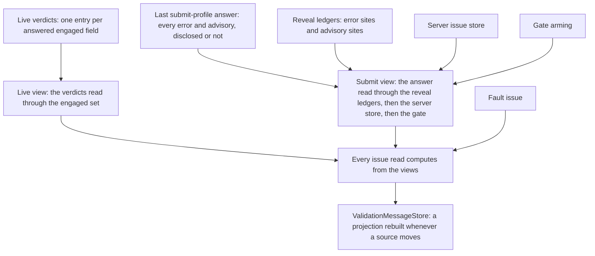

# How the engine works

You do not need this page to use the library. Get your answers from the sample, the tutorial
and the other pages first.

<!-- publish-day: verify: issues URL once the repo is public -->

Having to come here is a failure of the engine to "just work" without you thinking about its
internals, so please [raise an issue](https://github.com/xfunc/formidable/issues) describing
what you are trying to do that you cannot get working. The page is still provided so that
contributors, and anyone who is simply a sucker for punishment, have some information on the
engine's internal workings.

What follows renders the class-level documentation on `FormidableEngine<TModel>` (the doctrine),
and the parts of it that live on `SetVerdictStore` and `SubmitCoverageTracker`, into prose. It is
the one page in this corpus that speaks in the engine's own vocabulary.

## Sources and views

Disclosure state has a sources-plus-views shape. The sources are the live channel's per-field
verdicts, the submit channel's last submit-profile answer, the two reveal ledgers, the
server-issue store, the gate arming, the fault issue and `HasSubmitted`. Nothing is written to a
channel except through its sources.

Every write lands on the renderer's dispatcher, and a pass writes a source only while it is still
the current pass. `ApplyServerIssues` writes synchronously on the calling thread, and a field's
departure from the page drops its live verdict the same way.

What an issue read returns is computed from those sources at read time. The live view is the
live verdicts read through the engaged set. The submit view is the last submit-profile answer
read through the reveal ledgers, merged with the server store, plus the gate issue the view
synthesizes while the gate predicate holds.

The `ValidationMessageStore` a native `ValidationMessage` renders from is a materialized
projection of the same views, rebuilt whenever a source moves. A derived answer therefore cannot
be deleted piecemeal or disagree with the state it derives from.

## The five pass kinds

Every pass runs one lifecycle (`RunPassAsync`): begin, taking a version and a cancellation token;
validate under its profile; dispatch the verdict only if the pass is still the current one; end
exactly once however it left. The kinds differ in what they hand in, not in how they run. Four
kinds are passes; the [`TrackFormValidity` probe](#the-trackformvalidity-probe) is the fifth
thing the engine runs and is not a pass.

**Live.** Started by a committed field change (the `EditContext`'s field-changed notification),
and by the load pass's tail for the fields it adopted. It runs [`LiveProfile`](options.md#liveprofile)
when set and the submit profile instance otherwise. The pending indicator covers only the
triggering fields.

The verdict answers the whole engaged set as snapshotted when the pass began (less any field that
left the page meanwhile), so a cross-field error can clear, or appear, on a field the triggering
edit never named.

When the live profile is the submit profile instance, the same report also rebuilds the submit
channel's source. The server store is left standing: a live pass is an edit's own answer, not the
settling point a server snapshot yields to.

**Submit.** Started by `ValidateForSubmitAsync` (a root's `SubmitAsync` reaches it). It runs the
submit profile form-wide, pending indicator form-wide. On landing it sets `HasSubmitted`, clears
every live verdict (the engaged set stands, so the next live pass re-answers it), clears the
server store, unions or resets the reveal ledgers, and arms or disarms the gate. A submit reads no
stored verdict: it executes its whole selection by fiat.

**Refresh.** Started by the refresh timer, which two things arm (and a deferred fire re-arms): a
field change once `HasSubmitted` is true or a submit is in flight (`ApplyServerIssues` also sets
`HasSubmitted`), and any move in the rendered field set, the first render included. It runs the
submit profile whole-model, pending indicator scoped to the fields edited within the window.
Landing replaces the submit channel's source and clears the server store. It reveals nothing.

**Load.** Started by `DiscloseLoadedValuesAsync`. It moves the edit stamp first, because the
page is stating that the model changed without a notification, and abandons the held vouch. It
runs the submit profile with an empty pending scope, replaces the submit channel's source and
clears the server store.

The load then adopts (touched and engaged both) each field whose value reads as non-empty, among
the error sites and the fields the validator declares a rule for. A live pass follows, while
anything is engaged, to file the verdicts that disclose what those fields earned.

**The two debounces are the timers behind two kinds.** [`LiveDebounce`](options.md#livedebounce)
is `null` by default, which starts the live pass inside the notification itself. Set, it arms one
shared timer; a further change within the window re-arms it, and the fire snapshots and clears
the accumulated fields and runs one live pass for all of them.

[`RefreshDebounce`](options.md#refreshdebounce) (300 ms) arms the refresh timer the same way from
every arm site. `Timeout.InfiniteTimeSpan` arms a timer that never fires, which is how the
refresh is turned off; `TimeSpan.Zero` is the narrowest window, not a switch.

**A fault becomes what the kind allows.** A submit and a load are awaited by a caller, so a
validator that throws under either surfaces through the caller's own `try`/`catch`. A live or
refresh pass is fire-and-forget, so its exception becomes a form-level issue carrying
[`ValidationFaultMessage`](options.md#validationfaultmessage) while the pass is still current,
and raises `ValidationFaulted` either way. The next landing, or a server apply, clears that issue.

## The verdict store

On a validator the engine can take rule by rule ([the next section](#rule-level-versus-whole-profile-execution)
says which), every pass plans against `SetVerdictStore` before it executes anything. The store
holds every rule's most recent verdict, one entry per executed set rather than one per rule, and
an index maps each rule to the set that answered it.

Granularity stops at the declared rule: a `RuleForEach` is one rule however many rows it covers,
so one verdict answers for every row, and whichever pass owes that rule an answer runs it whole.

A plan serves a stored set only where the pass's selection wholly contains it, because a set's
issues belong to the set as a whole and cannot be split per rule. The rules no served set answers
are the remainder. They execute in one validator call per selection class, and the report handed
downstream is assembled from the sets served and the sets just run: always a whole-profile
answer, however little ran.

A pass whose every selected rule is fresh executes nothing and still runs the whole lifecycle,
publishing its assembled verdict like any other.

Reuse is keyed by rule and stamp, never by which pass ran first. Of a post-submit edit's live
pass and the refresh behind it, whichever lands first executes the stale rules and the other
finds them answered, so on a rule-capable validator each selected rule runs at most once across
the pair. A `TrackFormValidity` probe, and a live pass narrowed by `LiveProfile`, are outside
that promise.

Filing a set drops every stored set answering for a different model state and every stored set
sharing a rule with it, so the store's size stays bounded by rule count. A submit sets
`executeAll`: it serves nothing, and its full run repopulates the store so a pass behind it at
the same stamp starts from answered rules.

**What "fresh" means.** A verdict is fresh for a pass when the two edit stamps agree. The engine
counts field-changed notifications in `_editStamp`; a pass reads the count as it begins and
stamps every verdict it writes with what it read. The count moves on a notification, never on a
mutation. `DiscloseLoadedValuesAsync` moves it too, because a page calling it is saying outright
that the model now holds values nothing notified for.

A profile-scoped verdict is additionally fresh only for the profile instance it ran under. A
verdict is profile-scoped when its execution consulted a child-scope decision the profile itself
filters: an `Include()`'s internals, or a child validator's rules whose ruleset tags the parent
rule's own memberships do not guarantee.

A `LiveProfile` swapped at runtime is read at the next pass's begin; the rules both profiles
select keep their verdicts, a profile-scoped verdict re-runs, and a rule the store has never
answered runs.

**The rendered field set moving** is the one silent change the engine can see unaided. A row
leaving, a section collapsing or a branch swapping can change the model behind the page with no
notification anywhere, so `OnRenderedFieldsChanged` empties the store outright and moves its
generation. The same call prunes departed fields from the engaged set and arms a refresh,
whatever the form's history.

A pass in flight across that move still publishes its verdict, but its store write is refused:
`TryFile` checks the generation the pass captured at begin, so the clear cannot be undone by work
that predates it.

**A mutation nobody notified is outside the contract.** A handler patching a computed property,
or a late response writing into the model while a window is open, moves nothing the engine
reads. The stored verdicts go on comparing fresh, and the next pass at the same stamp serves them
as if nothing had changed. `NotifyChanged()` on the field, or `EditContext.NotifyFieldChanged`,
keeps the count honest.

[Collections and row identity](collections-and-row-identity.md) has the same rule from the row
side, and [Async validation](async-validation.md) has what a reader sees of the reuse.

## The submit-coverage vouch

The `formidable-valid` class means "would pass submit". `FormidableCss.Compute` grants it only
when the field has no error, is touched or modified, carries no warning or info, and
`FieldState.WouldPassSubmit` is true. That last conjunct is the vouch, held whole on
`SubmitCoverageTracker`. [CSS and accessibility](css-and-accessibility.md#what-puts-green-on-a-field)
has what a reader sees; this section has the read behind it.

**What the vouch reads.** `WouldPassSubmit` is true for a field when three things hold: the
submit-selected coverage reads fresh (earned at the current edit stamp, or held as below); none
of its answers carries an error for the field, disclosed or not; and the field is not one edited
past a held answer being served.

Freshness is judged form-level, deliberately. Which fields a passing rule speaks for is
unknowable, so one form-wide answer covers every field, while a failing answer names its fields
itself.

Coverage is a capability split. On a rule-capable validator, coverage is the verdict store: the
plan over the submit selection has no remainder, whichever pass or probe answered each rule, and
the error fields are resolved from the served sets' issues.

On any other validator, coverage is the last whole-model submit-profile evaluation a submit, a
refresh, a load or a probe completed, current while its begin stamp is still the current stamp.
A live pass is excluded by kind, whatever profile it ran.

**The held vouch.** Every fresh answer is held together with its stamp and profile, and the held
answer is served in place of a recomputed one on two grounds. First, a rendered-field-set move
emptied the store without moving the stamp, so an answer computed at that stamp is one nothing
has invalidated; the refresh the move arms replaces it with an earned one.

Second, an edit moved the stamp past the held answer while a re-answer is demonstrably on its
way. The held answer then serves every field the edit did not touch, the edited fields paint as
they would with nothing held, and the serve condition is re-checked on every read.

"On its way" (`ReAnswerOnItsWay`) means one of three things. A pass is in flight whose landing
answers the submit selection: a submit, a refresh, a load, or a live pass whose channel resolves
to the submit profile instance. A narrowed live pass promises nothing itself and counts only for
a refresh armed behind it.

With no such pass in flight, an open live-debounce window on a submit-running channel counts,
and so does an armed post-submit refresh, each only under a debounce that can fire
(`Timeout.InfiniteTimeSpan` promises nothing). The probe is never consulted.

**The bound.** A pass in flight counts only while it is younger than `HeldVouchBound`, thirty
seconds. The bound is the current pass's age, never the held answer's, and past it nothing armed
behind the pass can stand in for it.

A hold across an edit is therefore bounded: a form whose pass hangs loses those borders at the
next read rather than keeping them for ever, and a rule slower than the bound loses the held
green early, the conservative direction.

**What drops the hold** is `Abandon`, reached from two places. A current pass ending without
landing calls it: a fault of any kind, or a caller's cancellation of a submit or a load, the only
two kinds that carry an external token. The opening of `DiscloseLoadedValuesAsync` calls it too,
declaring the model moved out from under everything the hold describes.

A superseded pass is not a drop. Its end sits behind the version gate, so it never abandons, and
the answer then stands or falls on whether its displacer, or an arm, still promises a re-answer.

## Supersession and deferral

Only one pass is in flight at a time. Starting a new pass cancels the one before it, moves the
engine's version, and takes over the descriptor that names the current pass. The older pass's
answer, if it arrives at all, is discarded: every write a pass makes is gated on its version
still being the engine's own.

The engine calls this supersession, and the newer pass supersedes the older. On screen it is the
reason you only ever see the answer for what you last typed ([Async validation](async-validation.md)
has the reader's view). Deferral is the other relationship, a pass that stands down rather than
superseding, and which pass yields to which is written in kinds.

- A **live pass** never starts while a submit or a load is in flight: an immediate one returns
  without running, and a debounced fire re-arms its timer and tries again. Either kind supersedes
  an older live pass, and the winner's verdict answers every engaged field, the superseded pass's
  fields included.
- A **debounced live fire** also defers to a refresh in flight, because the edit that opened the
  window already happened and nothing else would re-arm that refresh if the live pass cancelled
  it.
- An **immediate live pass** supersedes a refresh in flight instead. After a submit the same edit
  re-arms it; before one, the cancelled refresh belonged to a field-set change and is not
  re-armed, so the submit-selected coverage waits for whatever next answers that profile.
- A **refresh** fire defers to a submit, a live pass or a load in flight, re-arming so the edit is
  still revalidated once that pass ends. A refresh does not defer to a refresh: the newer displaces
  the older. An open debounce window is not a pass, so nothing defers to it; a refresh that comes
  due first executes the stale rules, and the window's own pass then finds them answered.
- A **submit** and a **load** defer to nothing. Each is started and awaited by a caller, so two of
  them overlapping resolve the way two submits do: the later one takes the descriptor. A submit
  superseded before its verdict landed reports blocked with an empty summary and writes nothing,
  leaving whatever preceded it on screen. Its report is empty when the validator honoured the
  cancellation and its own otherwise.

A superseded pass's pending-indicator scope is dropped, not merged: the superseding pass owns the
indicator outright. The probe stands down for a submit or a load in flight on the same grounds
as a live pass; nothing cancels a probe short of disposal, and its own stamp decides which
probe's answer sticks.

## Rule-level versus whole-profile execution

`IRuleLevelValidator<TModel>` is the optional seam behind everything the store does:
`SelectRules` lists the rules a profile selects, `ValidateRulesAsync` runs a chosen set in one
validator call, and `GroupBySelectionClass` partitions a set into groups no profile can split.
The engine's test is `validator is IRuleLevelValidator<TModel> ruleLevel && ruleLevel.CanValidateByRule`,
asked at each evaluation and never the type test alone, because `CanValidateByRule` is a live
read.

`FluentValidationModelValidator<TModel>` (what `AddFormidable()` registers) reports the
capability true exactly when the wrapped validator is an `AbstractValidator<TModel>` whose
`ClassLevelCascadeMode` is `CascadeMode.Continue`. A class-level cascade stop lets a failing rule
suppress later rules within one whole-profile run, and executing part of a profile can reproduce
neither the stop nor its verdict, so the adapter reports the capability absent. A hand-rolled
`IValidator<T>` cannot enumerate its rules and reports absent too.

**The whole-profile path and its price.** A validator without the capability gets the whole
profile in one `ValidateAsync` call per pass: correct, unoptimised. Nothing is reused between
passes, so a post-submit edit validates the whole profile once in its live pass and once in its
refresh. The vouch reads the last whole-model answer instead of the store, and a live pass never
supplies one. Every probe is a whole submit-profile validation of its own.

Rule-level `.Cascade(CascadeMode.Stop)` is unaffected: it stops inside its one rule's chain and
never flips the capability. A decorator that derives from `DelegatingModelValidator<TModel>`
forwards the capability; one implementing `IModelValidator<TModel>` alone presents none, and
loses the rule inspection seam behind the required indicator the same way.

The load's vouching half reads the inspection seam too: `DiscloseLoadedValuesAsync` confirms a
good loaded value only where the validator lists the fields its rules speak for, so a validator
that cannot be inspected discloses a non-empty loaded value its rules fail (the error names the
field) and confirms none of the good ones.

**Selection classes.** The FluentValidation adapter's class is a rule's ruleset membership: two
rules with the same memberships are admitted together by every profile. An `Include()` rule and
any rule reaching a child validator take a group of their own, so the profile-scoped verdict such
a rule can record never marks a sibling.

## Disclosure internals

[Disclosure](disclosure.md) has what a reader sees of all this; the parts are below.

### The reveal ledgers

The reveal ledgers are two sets of fields: error sites and advisory sites. A blocked submit
resolves every error to its field and reveals each field whose visibility answer is yes
([`DisclosureOverride`](options.md#disclosureoverride) first, rendered registration otherwise).
Reveal is field-granular: a revealed field's errors then disclose whole, an override's no on one
sibling notwithstanding. The advisory ledger takes the visible advisories' fields the same way.

The ledgers merge by union. A field once revealed stays watched, so an error that returns after
being fixed rediscloses at the next pass to answer the submit profile, with no further submit. A
server apply is also a disclosure event: each issue it lands unions its field into the matching
ledger. Only a successful submit resets them, errors un-revealing wholesale and the advisory
ledger re-freezing to the fresh sites.

A refresh touches neither ledger. Its fresh answer is read through the standing ledgers, which is
why a fixed field clears (its rule stopped producing the issue) and a field revealed by nothing
stays quiet until a submit or a server apply reveals it.

### The live view

The live view is the filed verdicts read through the engaged set, and engagement is the only
predicate under the default [`LiveDisclosure`](options.md#livedisclosure). A field that has left
the page (something registered it once and nothing renders it now) leaves the engaged set and its
verdict goes with it. A field nothing ever registered has not left, which is the native-interop
bridge contract.

`EngagedAndVisible` additionally filters each live issue on the same override-aware visibility
the reveal uses, uniformly across every surface, the store included.

### The gate latch

A blocked submit that disclosed no error at all arms the gate; any submit
that disclosed something or passed disarms it. Whether the gate shows is a predicate over the
sources, recomputed on every read: armed, no server error standing, the submit answer carrying
errors that no revealed field discloses, and the live view carrying no error.

While the predicate holds, the views synthesize one model-level issue from
[`DefensiveGateMessage`](options.md#defensivegatemessage). There is no stored entry, so a refresh
has nothing to delete. An error reaching the screen on either channel dissolves it, and so does
an answer that comes back clean; a warning does not, because it does not say why a submit was
refused.

### The message-store projection

`RebuildStore` clears the `ValidationMessageStore` and re-adds,
in order: the fault issue; every field the submit error view has entries for (ledger-revealed
client errors, server errors, the gate); then every engaged field's live errors whose message the
submit view is not already showing for that field. Advisories never enter the store, so a native
`ValidationMessage` sees errors only.

The rebuild runs at every publish point: a pass's verdict apply, a server apply, a fault report,
a departure that dropped a filed verdict, and, under `EngagedAndVisible`, a field-set change
with filed verdicts standing.

### Read order

`GetIssues` lists a field's submit errors, then its advisories, then its live
issues, each later channel minus any message already showing for the field, and the fault last.
`GetVisibleIssues` collects channel by channel across the form (the fault first, then every
field's submit errors, advisories and live issues) and sorts by the page's field order when the
root resolved one.

Within the submit view the client's errors and advisories are merged first (`MergeServer`): a
server issue whose message and severity both match one the client already shows is dropped, the
client copy winning. `ExceptShadowed` is the separate, message-only filter on the issue reads
that drops any issue whose message is already showing for the field, whichever channel said it
first.

`FirstErrorFocus` is the one helper every focus move goes through. A blocked submit and a server
apply carrying errors take the first error from that visible list, or the first visible issue
when no error is on it; a summary click names its own field.

## The `TrackFormValidity` probe

[`TrackFormValidity`](options.md#trackformvalidity) keeps `IsFormValid` current with a standalone
submit-profile evaluation that is not a pass. It never calls `BeginPass`, discloses nothing,
writes no message, and never touches the pending indicator. One probe runs at construction, so a
pristine form answers truthfully, and one runs at the live pass's own cadence afterwards: inside
every field-changed notification, or once per window when `LiveDebounce` is set.

The probe stands down for a submit or a load in flight, which is about to compute the same
quantity itself. On a rule-capable validator it plans against the store exactly as a pass does,
executes the submit-selected rules with no fresh verdict at its begin stamp, and files what it
ran. On any other validator each probe is one whole submit-profile validation, recorded as the
vouch's coverage source.

The probe's store write is refused on a stale generation and additionally when an edit arrived
since the probe began: a probe has no version for a fresher landing to supersede it through.
Genuine overlap is never collapsed: an evaluation beginning while another still awaits an async
rule has no verdict to serve yet and runs that rule itself.

`IsFormValid` is written only when the value flips and only while the probe's stamp is the latest
taken. With tracking on, a submit, a refresh or a load landing adopts its own report's validity
directly and bumps the same stamp, so a probe that started earlier discards its answer rather
than overwrite a fresher one.

Probes are never cancelled short of disposal, so under a slow async rule and no `LiveDebounce`
several can be in flight together, each answering for the model state it started at. A probe
that throws raises `ValidationFaulted` and nothing else: a form-level fault issue would disclose
something an invisible probe promises never to.
