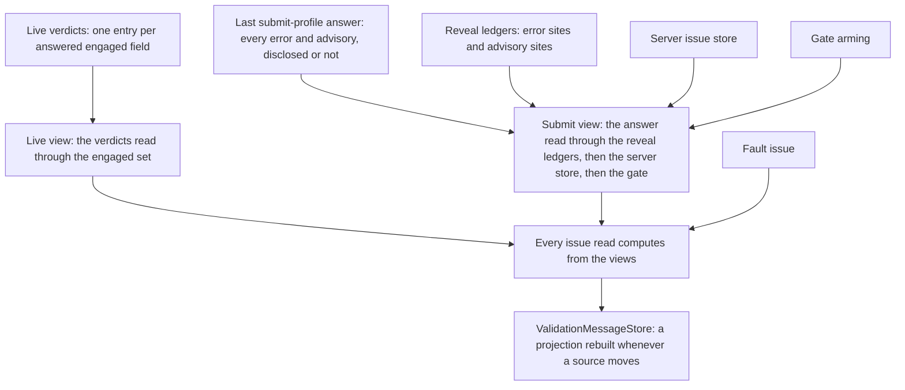

# How the engine works

You do not need this page to use the library. Get your answers from the sample, the tutorial
and the other pages first.

Having to come here is a failure of the engine to "just work" without you thinking about its
internals, so please [raise an issue](https://github.com/xfunc-pty-ltd/formidable/issues) describing
what you are trying to do that you cannot get working. The page is still provided so that
contributors, and anyone who is simply a sucker for punishment, have some information on the
engine's internal workings.

What follows renders the class-level documentation on `FormidableEngine<TModel>` (the doctrine),
and the parts of it that live on `SetVerdictStore` and `SubmitCoverageTracker`, into prose. It is
the one page in this corpus that speaks in the engine's own vocabulary. The later sections do the
same for the mechanics the kit and the core hand here, each saying at its head which page sent you.

## Sources and views

Disclosure state has a sources-plus-views shape. The sources are the live channel's per-field
verdicts, the submit channel's last submit-profile answer, the two reveal ledgers, the
server-issue store, the gate arming, the fault issue and `HasSubmitted`. Nothing is written to a
channel except through its sources.

Every write lands on the renderer's dispatcher, and a pass writes a source only while it is still
the current pass. `ApplyServerIssues` writes synchronously on the calling thread, and a field's
departure from the page drops its live verdict the same way.

What an issue read returns is computed from those sources at read time. The live view is the
live verdicts read through the engaged set. The submit view is the last submit-profile answer
read through the reveal ledgers, merged with the server store, plus the gate issue the view
synthesizes while the gate predicate holds.

The `ValidationMessageStore` a native `ValidationMessage` renders from is a materialized
projection of the same views, rebuilt whenever a source moves. A derived answer therefore cannot
be deleted piecemeal or disagree with the state it derives from.



## The five pass kinds

Every pass runs one lifecycle (`RunPassAsync`): begin, taking a version and a cancellation token;
validate under its profile; dispatch the verdict only if the pass is still the current one; end
exactly once however it left. The kinds differ in what they hand in, not in how they run. Four
kinds are passes; the [`TrackFormValidity` probe](#the-trackformvalidity-probe) is the fifth
thing the engine runs and is not a pass.

**Live.** Started by a committed field change (the `EditContext`'s field-changed notification),
and by the load pass's tail for the fields it adopted. It runs [`LiveProfile`](options.md#liveprofile)
when set and the submit profile instance otherwise. The pending indicator covers only the
triggering fields.

The verdict answers the whole engaged set as snapshotted when the pass began (less any field that
left the page meanwhile), so a cross-field error can clear, or appear, on a field the triggering
edit never named.

When the live profile is the submit profile instance, the same report also rebuilds the submit
channel's source. The server store is left standing: a live pass is an edit's own answer, not the
settling point a server snapshot yields to.

**Submit.** Started by `ValidateForSubmitAsync` (a root's `SubmitAsync` reaches it). It runs the
submit profile form-wide, pending indicator form-wide. On landing it sets `HasSubmitted`, clears
every live verdict (the engaged set stands, so the next live pass re-answers it), clears the
server store, unions or resets the reveal ledgers, and arms or disarms the gate. A submit reads no
stored verdict: it executes its whole selection by fiat.

**Refresh.** Started by the refresh timer, which two things arm (and a deferred fire re-arms): a
field change once `HasSubmitted` is true or a submit is in flight (`ApplyServerIssues` also sets
`HasSubmitted`), and any move in the rendered field set, the first render included. It runs the
submit profile whole-model, pending indicator scoped to the fields edited within the window.
Landing replaces the submit channel's source and clears the server store. It reveals nothing.

On a form that has never been submitted the ledgers are empty and the gate unarmed, so a
refresh armed by a field-set move discloses nothing: it answers for the submit-coverage vouch
and `IsFormValid` alone, and its pending scope names no field.

**Load.** Started by `DiscloseLoadedValuesAsync`. It moves the edit stamp first, because the
page is stating that the model changed without a notification, and abandons the held vouch. It
runs the submit profile with an empty pending scope, replaces the submit channel's source and
clears the server store.

Abandoning the vouch takes the valid class off any field wearing it until the load, or a later
answer, lands: invisibly on a synchronous validator, and for as long as the slowest rule on one that
is not.

The load then adopts (touched and engaged both) each field whose value reads as non-empty, among
the error sites and the fields the validator declares a rule for. A live pass follows, while
anything is engaged, to file the verdicts that disclose what those fields earned.

**The two debounces are the timers behind two kinds.** [`LiveDebounce`](options.md#livedebounce)
is `null` by default, which starts the live pass inside the notification itself. Set, it arms one
shared timer; a further change within the window re-arms it, and the fire snapshots and clears
the accumulated fields and runs one live pass for all of them.

A field-set move prunes departed fields from the window's accumulator as it prunes the engaged
set, and a fire that finds the accumulator empty starts no live pass; the validity probe still
runs on that fire.

[`RefreshDebounce`](options.md#refreshdebounce) (300 ms) arms the refresh timer the same way from
every arm site. `Timeout.InfiniteTimeSpan` arms a timer that never fires, which is how the
refresh is turned off; `TimeSpan.Zero` is the narrowest window, not a switch. Under either
timer `TimeSpan.Zero` still fires from the timer's own callback, never inside the notification
that armed it, and a fire still defers as any fire does; on the live timer it is not a spelling
of `null`.

**A fault becomes what the kind allows.** A submit and a load are awaited by a caller, so a
validator that throws under either surfaces through the caller's own `try`/`catch`. A live or
refresh pass is fire-and-forget, so its exception becomes a form-level issue carrying
[`ValidationFaultMessage`](options.md#validationfaultmessage) while the pass is still current,
and raises `ValidationFaulted` either way. The next landing, or a server apply, clears that issue.

## The verdict store

On a validator the engine can take rule by rule ([the next section](#rule-level-versus-whole-profile-execution)
says which), every pass plans against `SetVerdictStore` before it executes anything. The store
holds every rule's most recent verdict, one entry per executed set rather than one per rule, and
an index maps each rule to the set that answered it.

Granularity stops at the declared rule: a `RuleForEach` is one rule however many rows it covers,
so one verdict answers for every row, and whichever pass owes that rule an answer runs it whole.

A plan serves a stored set only where the pass's selection wholly contains it, because a set's
issues belong to the set as a whole and cannot be split per rule. The rules no served set answers
are the remainder. They execute in one validator call per selection class, and the report handed
downstream is assembled from the sets served and the sets just run: always a whole-profile
answer, however little ran.

A pass whose every selected rule is fresh executes nothing and still runs the whole lifecycle,
publishing its assembled verdict like any other.

Reuse is keyed by rule and stamp, never by which pass ran first. Of a post-submit edit's live
pass and the refresh behind it, whichever lands first executes the stale rules and the other
finds them answered, so on a rule-capable validator each selected rule runs at most once across
the pair. A `TrackFormValidity` probe, and a live pass narrowed by `LiveProfile`, are outside
that promise.

Filing a set drops every stored set answering for a different model state and every stored set
sharing a rule with it, so the store's size stays bounded by rule count. A submit sets
`executeAll`: it serves nothing, and its full run repopulates the store so a pass behind it at
the same stamp starts from answered rules.

**What "fresh" means.** A verdict is fresh for a pass when the two edit stamps agree. The engine
counts field-changed notifications in `_editStamp`; a pass reads the count as it begins and
stamps every verdict it writes with what it read. The count moves on a notification, never on a
mutation. `DiscloseLoadedValuesAsync` moves it too, because a page calling it is saying outright
that the model now holds values nothing notified for.

A profile-scoped verdict is additionally fresh only for the profile instance it ran under. A
verdict is profile-scoped when its execution consulted a child-scope decision the profile itself
filters: an `Include()`'s internals, or a child validator's rules whose ruleset tags the parent
rule's own memberships do not guarantee.

An untagged child scope under an untagged rule, and a `ChildRules` child (its tags are its parent
declaration's, propagated), never scope a verdict unless an `Include()` owns the consultation or,
before any owner is known, sits in the set.

A `LiveProfile` swapped at runtime is read at the next pass's begin; the rules both profiles
select keep their verdicts, a profile-scoped verdict re-runs, and a rule the store has never
answered runs.

**The rendered field set moving** is the one silent change the engine can see unaided. A row
leaving, a section collapsing or a branch swapping can change the model behind the page with no
notification anywhere, so `OnRenderedFieldsChanged` empties the store outright and moves its
generation. The same call prunes departed fields from the engaged set and arms a refresh,
whatever the form's history.

The registry raises no event the engine hears, so the root makes that call: `FormidableForm` from
its `OnAfterRenderAsync` whenever the registry's version moved, and `FormidableValidator` from a
continuation posted past the render batch that changed a registration (`NotifyFieldSetChanged()`
makes the same call at once). A nested component re-rendering alone moves the registry without
bringing `FormidableForm` there, so whichever of the form's renders comes next picks the move up;
the validator's continuation needs no render.

A pass in flight across that move still publishes its verdict, but its store write is refused:
`TryFile` checks the generation the pass captured at begin, so the clear cannot be undone by work
that predates it.

**A mutation nobody notified is outside the contract.** A handler patching a computed property,
or a late response writing into the model while a window is open, moves nothing the engine
reads. The stored verdicts go on comparing fresh, and the next pass at the same stamp serves them
as if nothing had changed. `NotifyChanged()` on the field, or `EditContext.NotifyFieldChanged`,
keeps the count honest.

[Collections and row identity](collections-and-row-identity.md) has the same rule from the row
side, and [Async validation](async-validation.md) has what a reader sees of the reuse.

## The submit-coverage vouch

The `formidable-valid` class means "would pass submit". `FormidableCss.Compute` grants it only
when the field has no error, is touched or modified, carries no warning or info, and
`FieldState.WouldPassSubmit` is true. That last conjunct is the vouch, held whole on
`SubmitCoverageTracker`. [CSS and accessibility](css-and-accessibility.md#what-puts-green-on-a-field)
has what a reader sees; this section has the read behind it.

**What the vouch reads.** `WouldPassSubmit` is true for a field when three things hold: the
submit-selected coverage reads fresh (earned at the current edit stamp, or held as below); none
of its answers carries an error for the field, disclosed or not; and the field is not one edited
past a held answer being served.

Freshness is judged form-level, deliberately. Which fields a passing rule speaks for is
unknowable, so one form-wide answer covers every field, while a failing answer names its fields
itself.

Coverage is a capability split. On a rule-capable validator, coverage is the verdict store: the
plan over the submit selection has no remainder, whichever pass or probe answered each rule, and
the error fields are resolved from the served sets' issues.

On any other validator, coverage is the last whole-model submit-profile evaluation a submit, a
refresh, a load or a probe completed, current while its begin stamp is still the current stamp.
A live pass is excluded by kind, whatever profile it ran. That source needs no held cover of its
own: a field-set move leaves it as current as the stamp already found it.

**The held vouch.** Every fresh answer is held together with its stamp and profile, and the held
answer is served in place of a recomputed one on two grounds. First, a rendered-field-set move
emptied the store without moving the stamp, so an answer computed at that stamp is one nothing
has invalidated; the refresh the move arms replaces it with an earned one.

Second, an edit moved the stamp past the held answer while a re-answer is demonstrably on its
way. The held answer then serves every field the edit did not touch, the edited fields paint as
they would with nothing held, and the serve condition is re-checked on every read.

The profile match guards both grounds: an answer about one selection of rules never vouches for
another. A served answer describes the model as it stood when the answer was computed until the
pass behind it lands, the same lag `IsFormValid` carries on the same terms.

"On its way" (`ReAnswerOnItsWay`) means one of three things. A pass is in flight whose landing
answers the submit selection: a submit, a refresh, a load, or a live pass whose channel resolves
to the submit profile instance. A narrowed live pass promises nothing itself and counts only for
a refresh armed behind it.

With no such pass in flight, an open live-debounce window on a submit-running channel counts,
and so does an armed post-submit refresh, each only under a debounce that can fire
(`Timeout.InfiniteTimeSpan` promises nothing). The probe is never consulted.

One configuration therefore blinks on an edit as a form with nothing scheduled does: a narrowed
live channel with `TrackFormValidity` on, before any submit, re-answers only through the probe,
and its vouch waits for that landing.

**The bound.** A pass in flight counts only while it is younger than `HeldVouchBound`, thirty
seconds. The bound is the current pass's age, never the held answer's, and past it nothing armed
behind the pass can stand in for it.

A hold across an edit is therefore bounded: a form whose pass hangs loses those borders at the
next read rather than keeping them for ever, and a rule slower than the bound loses the held
green early, the conservative direction.

Each edit against a validator that hangs again starts a fresh pass with a bound of its own, so
the same held answer can be re-served for another bound per edit, the edited fields excluded
throughout.

**What drops the hold** is `Abandon`, reached from two places. A current pass ending without
landing calls it: a fault of any kind, or a caller's cancellation of a submit or a load, the only
two kinds that carry an external token. The opening of `DiscloseLoadedValuesAsync` calls it too,
declaring the model moved out from under everything the hold describes.

A superseded pass is not a drop. Its end sits behind the version gate, so it never abandons, and
the answer then stands or falls on whether its displacer, or an arm, still promises a re-answer.

Every pass that ends while still current, landed or not, also moves the coverage version, so the
next coverage read recomputes rather than standing on a cache that predates the end.

## Supersession and deferral

Only one pass is in flight at a time. Starting a new pass cancels the one before it, moves the
engine's version, and takes over the descriptor that names the current pass. The older pass's
answer, if it arrives at all, is discarded: every write a pass makes is gated on its version
still being the engine's own.

The engine calls this supersession, and the newer pass supersedes the older. On screen it is the
reason you only ever see the answer for what you last typed ([Async validation](async-validation.md)
has the reader's view). Deferral is the other relationship, a pass that stands down rather than
superseding, and which pass yields to which is written in kinds.

- A **live pass** never starts while a submit or a load is in flight: an immediate one returns
  without running, and a debounced fire re-arms its timer and tries again. Either kind supersedes
  an older live pass, and the winner's verdict answers every engaged field, the superseded pass's
  fields included.
- A **debounced live fire** also defers to a refresh in flight, because the edit that opened the
  window already happened and nothing else would re-arm that refresh if the live pass cancelled
  it.
- An **immediate live pass** supersedes a refresh in flight instead. After a submit the same edit
  re-arms it; before one, the cancelled refresh belonged to a field-set change and is not
  re-armed, so the submit-selected coverage waits for whatever next answers that profile. With
  the live channel narrowed and `TrackFormValidity` off, nothing refills it before a submit, a
  load or the next field-set move.
- A **refresh** fire defers to a submit, a live pass or a load in flight, re-arming so the edit is
  still revalidated once that pass ends. A refresh does not defer to a refresh: the newer displaces
  the older. An open debounce window is not a pass, so nothing defers to it; a refresh that comes
  due first executes the stale rules, and the window's own pass then finds them answered.
- A **submit** and a **load** defer to nothing. Each is started and awaited by a caller, so two of
  them overlapping resolve the way two submits do: the later one takes the descriptor. A submit
  superseded before its verdict landed reports blocked with an empty summary and writes nothing,
  leaving whatever preceded it on screen. Its report is empty when the validator honoured the
  cancellation and its own otherwise.

A superseded pass's pending-indicator scope is dropped, not merged: the superseding pass owns the
indicator outright. The probe stands down for a submit or a load in flight on the same grounds
as a live pass; nothing cancels a probe short of disposal, and its own stamp decides which
probe's answer sticks.

## Rule-level versus whole-profile execution

`IRuleLevelValidator<TModel>` is the optional seam behind everything the store does:
`SelectRules` lists the rules a profile selects, `ValidateRulesAsync` runs a chosen set in one
validator call, and `GroupBySelectionClass` partitions a set into groups no profile can split.
The engine's test is `validator is IRuleLevelValidator<TModel> ruleLevel && ruleLevel.CanValidateByRule`,
asked at each evaluation and never the type test alone, because `CanValidateByRule` is a live
read.

`FluentValidationModelValidator<TModel>` (what `AddFormidable()` registers) reports the
capability true exactly when the wrapped validator is an `AbstractValidator<TModel>` whose
`ClassLevelCascadeMode` is `CascadeMode.Continue`. A class-level cascade stop lets a failing rule
suppress later rules within one whole-profile run, and executing part of a profile can reproduce
neither the stop nor its verdict, so the adapter reports the capability absent. A hand-rolled
`IValidator<T>` cannot enumerate its rules and reports absent too.

Whichever path runs, the engine takes its `IModelValidator<TModel>` once, when it is built (the
root's `Validator` parameter, else the container), and keeps that instance until the root rebuilds
it (`FormidableForm` on a `Model` swap or `ResetAsync`, `FormidableValidator` on a new cascaded
`EditContext`), so a memo held as a field on the validator outlives every pass.

**The whole-profile path and its price.** A validator without the capability gets the whole
profile in one `ValidateAsync` call per pass: correct, unoptimised. Nothing is reused between
passes, so a post-submit edit validates the whole profile once in its live pass and once in its
refresh. The vouch reads the last whole-model answer instead of the store, and a live pass never
supplies one. Every probe is a whole submit-profile validation of its own.

Rule-level `.Cascade(CascadeMode.Stop)` is unaffected: it stops inside its one rule's chain and
never flips the capability. A decorator that derives from `DelegatingModelValidator<TModel>`
forwards the capability; one implementing `IModelValidator<TModel>` alone presents none, and
loses the rule inspection seam behind the required indicator the same way.

The load's vouching half reads the inspection seam too: `DiscloseLoadedValuesAsync` confirms a
good loaded value only where the validator lists the fields its rules speak for, so a validator
that cannot be inspected discloses a non-empty loaded value its rules fail (the error names the
field) and confirms none of the good ones.

**Selection classes.** The FluentValidation adapter's class is a rule's ruleset membership: two
rules with the same memberships are admitted together by every profile. An `Include()` rule and
any rule reaching a child validator take a group of their own, so the profile-scoped verdict such
a rule can record never marks a sibling.

## Disclosure internals

[Disclosure](disclosure.md) has what a reader sees of all this; the parts are below.

### The reveal ledgers

The reveal ledgers are two sets of fields: error sites and advisory sites. A blocked submit
resolves every error to its field and reveals each field whose visibility answer is yes
([`DisclosureOverride`](options.md#disclosureoverride) first, rendered registration otherwise).
Reveal is field-granular: a revealed field's errors then disclose whole, an override's no on one
sibling notwithstanding. The advisory ledger takes the visible advisories' fields the same way.

The submit view's advisories for a field disclose where either ledger holds the field: an error
site keeps a warning it also picked up, and an advisory site keeps its own.

The ledgers merge by union. A field once revealed stays watched, so an error that returns after
being fixed rediscloses at the next pass to answer the submit profile, with no further submit. A
server apply is also a disclosure event: each issue it lands unions its field into the matching
ledger. Only a successful submit resets them, errors un-revealing wholesale and the advisory
ledger re-freezing to the fresh sites.

A refresh touches neither ledger. Its fresh answer is read through the standing ledgers, which is
why a fixed field clears (its rule stopped producing the issue) and a field revealed by nothing
stays quiet until a submit or a server apply reveals it.

### The live view

The live view is the filed verdicts read through the engaged set, and engagement is the only
predicate under the default [`LiveDisclosure`](options.md#livedisclosure). A field that has left
the page (something registered it once and nothing renders it now) leaves the engaged set and its
verdict goes with it. A field nothing ever registered has not left, which is the native-interop
bridge contract.

A field held by a keep-registered registration has not left either, which is what lets a
virtualized row scroll out of view and keep its messages.

`EngagedAndVisible` additionally filters each live issue on the same override-aware visibility
the reveal uses, uniformly across every surface, the store included.

### The gate latch

A blocked submit that disclosed no error at all arms the gate; any submit
that disclosed something or passed disarms it. Whether the gate shows is a predicate over the
sources, recomputed on every read: armed, no server error standing, the submit answer carrying
errors that no revealed field discloses, and the live view carrying no error.

The arming half matters: an error that starts failing on a never-revealed field after a submit
that disclosed everything it had raises no gate, because no blocked submit was ever short an
explanation, and on the submit channel the field stays quiet until a submit or a server apply
reveals it.

While the predicate holds, the views synthesize one model-level issue from
[`DefensiveGateMessage`](options.md#defensivegatemessage), built afresh from the option at each
read. There is no stored entry, so a refresh has nothing to delete. An error reaching the screen on
either channel dissolves it, and so does an answer that comes back clean; a warning does not,
because it does not say why a submit was refused.

### The message-store projection

`RebuildStore` clears the `ValidationMessageStore` and re-adds,
in order: the fault issue; every field the submit error view has entries for (ledger-revealed
client errors, server errors, the gate); then every engaged field's live errors whose message the
submit view is not already showing for that field. Advisories never enter the store, so a native
`ValidationMessage` sees errors only.

The rebuild runs at every publish point: a pass's verdict apply, a server apply, a fault report,
a departure that dropped a filed verdict, and, under `EngagedAndVisible`, a field-set change
with filed verdicts standing.

### Read order

`GetIssues` lists a field's submit errors, then its advisories, then its live
issues, each later channel minus any message already showing for the field, and the fault last.
`GetVisibleIssues` collects channel by channel across the form (the fault first, then every
field's submit errors, advisories and live issues) and sorts by the page's field order when the
root resolved one.

`FormidableForm` asks `IFormidableFieldOrderService` for the reading order after a render only when
the registry's version moved or the module's layout observer (`observeLayout`, private to the
library's script and no part of the interface) reported a change under the form element (a keyed
reorder moves elements without a registration changing); a resolve that returns after a newer one
started is discarded, and an interop failure or a null answer is retried on the next render.

Within the submit view the client's errors and advisories are merged first (`MergeServer`): a
server issue whose message and severity both match one the client already shows is dropped, the
client copy winning. `ExceptShadowed` is the separate, message-only filter on the issue reads
that drops any issue whose message is already showing for the field, whichever channel said it
first.

`FirstErrorFocus` is the one helper every focus move goes through. A blocked submit and a server
apply carrying errors take the first error from that visible list, or the first visible issue
when no error is on it; a summary click names its own field.

## The `TrackFormValidity` probe

[`TrackFormValidity`](options.md#trackformvalidity) keeps `IsFormValid` current with a standalone
submit-profile evaluation that is not a pass. It never calls `BeginPass`, discloses nothing,
writes no message, and never touches the pending indicator. One probe runs at construction, so a
pristine form answers truthfully, and one runs at the live pass's own cadence afterwards: inside
every field-changed notification, or once per window when `LiveDebounce` is set.

The probe stands down for a submit or a load in flight, which is about to compute the same
quantity itself. On a rule-capable validator it plans against the store exactly as a pass does,
executes the submit-selected rules with no fresh verdict at its begin stamp, and files what it
ran. On any other validator each probe is one whole submit-profile validation, recorded as the
vouch's coverage source.

A probe whose every selected rule is already answered executes nothing and files nothing; it
still writes `IsFormValid` from the served verdicts. A landing that moved a coverage source
publishes one notification round, engine and `EditContext` both, because the valid class reads
that coverage and no pass is there to publish for it.

The probe's store write is refused on a stale generation and additionally when an edit arrived
since the probe began: a probe has no version for a fresher landing to supersede it through.

A pass's own filing carries no stamp check. Behind a fresher pass, the engine's version gate
stops the stale filing; behind a fresher probe, which moves no version, the stale filing stands
and may displace the probe's newer entries. That displacement is conservative: a displaced rule
is left with no served answer and re-executes at the next plan.

Genuine overlap is never collapsed: an evaluation beginning while another still awaits an async
rule has no verdict to serve yet and runs that rule itself.

An all-synchronous plan runs to completion before the call that started it returns, so whichever
of the probe and the pass goes first has filed everything the other would have planned, and they
share in full.

`IsFormValid` is written only when the value flips and only while the probe's stamp is the latest
taken. With tracking on, a submit, a refresh or a load landing adopts its own report's validity
directly and bumps the same stamp, so a probe that started earlier discards its answer rather
than overwrite a fresher one.

Probes are never cancelled short of disposal, so under a slow async rule and no `LiveDebounce`
several can be in flight together, each answering for the model state it started at. A probe
that throws raises `ValidationFaulted` and nothing else: a form-level fault issue would disclose
something an invisible probe promises never to.

## The state classes: how `FormidableCss` computes them

This section documents the kit's wiring the reader pages leave to this page, beside the engine's
passes: what a field's state class is computed from, on both surfaces that compute one.

`FormidableCss.Compute` takes a `FieldState` and the configured `FormidableCssClasses` and hands
six booleans to a private `Assemble`: `HasErrors`, `IsTouched || IsModified`, `HasWarnings`,
`HasInfos`, `WouldPassSubmit` and `IsValidating`. `Assemble` is one ternary chain: invalid wins
outright and ungated; a field neither touched nor modified gets the empty string whatever else it
carries; then warning beats info beats valid, and valid alone also requires `WouldPassSubmit`.
Pending appends to whatever that left, or stands alone.

That join happens in exactly one place for every caller. A kit input builds its `FieldState` from
`IFormidableEngine.GetFieldState` (`FormidableInputBase<TValue>.CssClass` through `ComputeCssClass`,
and `FormidableFieldContext.CssClass` on the renderless path), and `FormidableFieldCssClassProvider`
builds its own for a native input, so the two surfaces cannot disagree on a tier. A kit input then
merges the result behind any consumer-splatted `class` through `FormidableCss.CombineClassNames`;
the renderless context hands over the pure class, and a native input's merge is `InputBase`'s own.

**The provider's reads.** `FormidableFieldCssClassProvider.GetFieldCssClass` reads `IsModified` and
`HasErrors` off the `EditContext` it is handed (`IsModified(field)`;
`GetValidationMessages(field).Any()`), and `IsTouched`, `IsValidating`, `HasWarnings`, `HasInfos`
and `WouldPassSubmit` from the engine. The engine-sourced reads go through the internal
`IValidatingFieldReader`, which `FormidableEngine<TModel>` implements explicitly.

The provider probes for that interface once, at construction, with a single `as` check. Where the
engine is any other `IFormidableEngine` (a test double), every engine-sourced read falls back to
`GetFieldState(fieldIdentifier)` at once; no in-between case exists. `Options.CssClasses` is read
at each computation rather than held from construction, so a renamed class reaches a native input
at its next computation exactly as it reaches a kit input.

`FieldState.WouldPassSubmit` is initialized to `true`, so a state built with `new FieldState { … }`
and no engine behind it (a hand-rolled provider, a test double) keeps the `Valid` tier reachable.
`default(FieldState)` bypasses the initializer and zeroes the member with the rest, so a defaulted
state cannot vouch. [The submit-coverage vouch](#the-submit-coverage-vouch) has what the engine's
own answer reads.

**What else a kit input reads per render.** `AddCommonAttributes` reads the field's state and its
issues once each and answers `class`, `aria-invalid` and `aria-describedby` from that one read.
`aria-required` is asked separately, of `GetFieldRequirement`.

The submit profile's presence demands are resolved to fields on the first ask and kept until the
submit profile instance changes or the rendered field set moves, so the per-field, per-render ask
is a dictionary lookup. `RequiredOverride` is invoked ahead of that map on every ask, because it is
the one part of the answer that can change without the validator or the profile changing.

## Ids, focus and the live region

This section documents the kit's wiring the reader pages leave to this page, beside the engine's
passes: how a field's DOM id is derived, what a focus move does on the JS side, and how
`FormidableSummary` keeps its live regions and their entries stable across renders.

### How an id is derived

`FormidableFieldId.For(FieldIdentifier)` produces `formidable-{owner-hash}-{name-hash}-{sanitized-name}`.
The owner hash is `RuntimeHelpers.GetHashCode(field.Model)`, the runtime's identity hash for the
owning instance, printed as eight hex digits. The name enters twice because each copy does a
different job.

The sanitized copy lowercases letters and digits and replaces every other character with `-` (the
model-level field's empty name becomes `form`). It is what makes the id legible and selectable by
suffix, and it collapses names that differ only in case or punctuation (`Url` and `URL`;
`Address.City` and `Address_City`).

The hash of the original name, case and punctuation intact, is what separates those names again.
It is FNV-1a over the name's UTF-16 code units, spelled out in `NameHash` rather than taken from
`string.GetHashCode()`, which is randomized per process and would hand a test computing the
expected id a different answer on every run.

Thirty-two bits over the field names one object owns makes two ids overwhelmingly likely to differ
rather than certain to; the sanitizer collision it replaces is structural and happens every time.
The hash sits before the sanitized name so the name stays the id's suffix.

`MessagesFor` appends `-messages` to that id and owns the suffix: the three message components
render it on their lists, a kit input points `aria-describedby` at it while the field has issues,
and `FormidableFieldContext.AriaDescribedBy` hands it to a hand-rolled control, so a control wired
by hand and the list it describes cannot drift apart.

### When two owners hash alike

The owner segment is narrower than its eight digits. The runtime keeps an object's identity hash
in part of the object header rather than in a full `int`: twenty-six bits of it on CoreCLR, the
runtime under Blazor Server and every server-side render. Among enough owner objects rendered at
once two can draw the same value, and their same-named fields then render the same id.

The odds climb with the square of the count: negligible for the hundreds of rows a form usually
shows, under one percent at a thousand rendered at once, about one in six at five thousand.

The value is drawn from a sequence the runtime advances on each first identity-hash request, so
anything the app asks about earlier moves it along, and nothing a consumer writes can name it. The
engine tells fields apart by `FieldIdentifier` equality (the owner reference and the name), never
by the hash, so validation is untouched.

What a duplicate disturbs is every site keyed by the id. `focusField`, `syncValue` and
`orderFields` each reach an element through `document.getElementById`, which answers the first in
document order, and `FormidableFieldOrderService` keys its resolved order by id, so a shared id
names one field there.

### Focus: what the JS side does

`FormidableFocusService.FocusAsync` is a thin wrapper over the module's `focusField(id, scrollId)`.
It hands the JS side `FormidableFieldId.For(field)` as the focus target and
`FormidableFieldId.MessagesFor(field)` as the scroll target, and returns whatever `focusField`
reports. `document.getElementById` locates both. A miss on the focus id returns `false` at once; a
miss on the scroll id alone is not a miss, because the scroll target falls back to the focus
element itself.

The scroll is `scrollIntoView({ behavior: "auto", block })`, with `block` `"start"` when the
target's bounding height exceeds 60% of `window.innerHeight` and `"center"` otherwise, followed by
`element.focus({ preventScroll: true })`. The answer is read back as
`document.activeElement === element` rather than assumed from the call. That is why an element
that is found and refuses focus reports `false` exactly as a missing one does, and why the two
routes reach the caller as one answer.

Which field a move aims at is chosen above this layer: [Read order](#read-order) has
`FirstErrorFocus`. `TryFocusAsync` then awaits `PrepareFocus` once, tries the element, consults
`FocusFallback` once after a miss, and retries once when the fallback answers `true`.

### The summary's regions and entries

`FormidableSummary` builds each fixed-role region inside its own sequence-number region
(`OpenRegion(3)` for the errors region, `OpenRegion(4)` for the advisories region). Blazor's diff
matches sibling frames by sequence number, so numbering the advisories region after the errors
region's variable-length bands would make its number depend on that content, and a changed number
diffs as remove-plus-insert, replacing the element whose stable identity is the contract.

Isolated spaces pin every region frame to the same numbers on every render, so the element carrying
the role is the same DOM node across renders.

`status` and `alert` each carry an implicit `aria-atomic` of `true`, under which every change
inside a region re-announces the whole of it, so each region spells out `aria-atomic="false"` and
an announcement is the entries that changed. The entries come and go inside a region that stays,
which is what gives `aria-atomic` a region and parts to distinguish.

A bare `aria-live`, which is all [`InlineMessageLive`](options.md#inlinemessagelive) puts on a
message list, carries no such implication, so the message lists spell out nothing.

Entries are keyed. Without a key, sibling `<li>` elements match by position, so correcting the
field the first entry names rewrites the text of every entry below it and drops the last one: a
whole band's worth of churn where one node should have left.

The key is `(entry, occurrence)`, the `VisibleIssue` paired with its ordinal among the entries
equal to it. Two issues carrying the same field, message, severity, code and state are equal
records (a validator declaring one rule twice reaches that shape), and Blazor rejects duplicate
sibling keys at the first diff rather than the first render, so keying by value alone would paint
a form and then throw.

Every entry also restarts its own sequence numbering from zero inside the band's region, so a
matched entry keeps its subtree rather than rebuilding it under a surviving `<li>`.

## Row identity: how a path resolves to an object

This section documents the resolution the reader pages leave to this page, beside the engine's
passes: how a reported path becomes a field, what a component registers and re-reads, why a keyed
list never trips the row-key checks, and what a field-changed notification publishes before it
returns.

### The walk

Every path the engine turns into a field, a validator's reported `PropertyName` and a server
reply's issue path alike, goes through the registered `IModelIntrospector`'s `Resolve`
(`FormidableEngine<TModel>.ResolvePath` is where a path becomes an identifier). The seam is
swappable: `AddFormidable()` registers `ReflectionModelIntrospector` only when nothing else is, and
that default is what this section describes. `PropertyPath.TryParse` cuts the path into segments,
property names and indexer tokens (`Teams[0].Members[1].Alias` is five: `Teams`, `[0]`, `Members`,
`[1]`, `Alias`).

A path the grammar rejects resolves to the root model with the whole path as the member name, and
an empty path is the model-level field: the root model with an empty member name.

The walk navigates every segment but the last across the live object graph. A property segment
reads that member on the object reached so far.

An indexer segment reads the item at that position: an `IList` directly under an int token, any
other case through the indexer its token fits (an int token picks the int indexer, any other the
string one, and a type with a single indexer answers with it whatever its key type).

The terminal segment never navigates: it names the field on whatever object the walk reached.
Nested and indexed segments mix freely: every non-terminal segment is one `Navigate` call,
whichever kind it is, and nothing orders the kinds.

A segment that cannot be navigated (such as a null value, an unknown member, an out-of-range
index, a missing key or a throwing getter) ends the walk there, at the deepest non-null owner, with the rest of
the path rejoined as the member name. The result is the public record:

```csharp
public readonly record struct ResolvedField(object Owner, string PropertyName);
```

<!-- Source: `src/Formidable/Introspection/ResolvedField.cs` -->

`Owner` is the deepest non-null object the walk reached. For `Teams[0].Members[1].Alias` it is the
`Member` instance at that position when the walk ran. The engine turns the result into a Blazor
`FieldIdentifier` built from the instance, not the path string:

```csharp
public static FieldIdentifier ToFieldIdentifier(this ResolvedField field, object rootModel, string originalPath)
{
    ArgumentNullException.ThrowIfNull(rootModel);

    if (field.Owner.GetType().IsValueType)
    {
        return new FieldIdentifier(rootModel, originalPath);
    }

    return new FieldIdentifier(field.Owner, field.PropertyName);
}
```

<!-- Source: `src/Formidable.Blazor/ResolvedFieldExtensions.cs` -->

The value-type branch is a fallback for an owner `FieldIdentifier` cannot hold, the walk having
ended on a struct just before the member: it keys on the root model and the path string, the one
shape that trades row stability away. Only the owner is tested: a struct earlier on the path, with a
class after it, keys on that class like any other owner.

`FieldIdentifier` compares by the owner reference and the field name, so one built this way equals
one built from the same instance and name wherever that object sits in its list. That equality is
what keeps a stored error attached to its row through add, remove and reorder.

### What a component registers and re-reads

The component side reaches the same instance with no coordination. `FieldIdentifier.Create(For)`
over a loop-captured closure (`() => member.Alias`) evaluates the accessor's object part, the
`Member` the iteration captured; the walk above reaches that `Member` by index at the moment it
runs. Both name the row object, so the two identifiers compare equal.

A component resolves its field as it binds: `Register` calls `ResolveField()` and keeps the
identifier it registers, and with either check on `OnParametersSet` calls it once more and keeps
that answer as the copy the check compares against. The engine resolves every path afresh at every
pass.

Under [`VerifyRowKeys`](options.md#verifyrowkeys) or
[`ReportStaleRegistrations`](options.md#reportstaleregistrations) the bound component re-runs
`ResolveField()` on every later parameter set and compares the answer with that copy: the same
expression evaluated at two times, which is the only thing the comparison assumes.

The throwing check calls `ResolveField()` with no `try` around it and throws on a difference. The
reporting check resolves inside a `try`, skips an accessor that throws, and hands a difference to
`IStaleRegistrationReporter` once, until the accessor names the registered field again or the
component rebinds.

The engine's `Report` writes the Trace line itself, and a logger warning when the host resolved an
`ILoggerFactory`, then invokes `StaleRegistrationDiagnostic` bare, so a throwing callback surfaces
from the component's own parameter-set lifecycle.

### Why a keyed list never trips the checks

Correctly keyed rows pass the comparison whatever the edit, because the three shapes a keyed diff
takes all leave it passing. Replacing a row keyed by the row object retires that row's key and
introduces a different one, so its components are disposed and new ones built for the replacement.
Removing a row disposes its components and builds nothing. Adding or reordering disposes nothing at
all: a keyed diff permutes the components it already has.

In all three, anything newly built registers the row it was handed, and every retained component
keeps resolving its accessor to the row it already spoke for.

### A notification publishes before it returns

`EditContext.NotifyFieldChanged` reaches `HandleFieldChanged` on the calling thread. It moves the
edit stamp, and `MarkTouched` raises `StateChanged` inline whenever the field was not already touched
(a fresh owner is a fresh `FieldIdentifier`, so a replaced owner's field always publishes here).

With no `LiveDebounce` the live pass starts inside the same call, and its pending publish rides the
render dispatch (`InvokeAsync`), which runs inline when the caller is already on the renderer's
context, as an event handler is. Every component observing the engine answers each publish with
`InvokeAsync(StateHasChanged)`, so it re-renders before the notify returns.

That is why replacing an owner and notifying before rendering trips the checks in the middle of the
notify. The re-render re-supplies the parameters of the bound components inside the wrapper, each
re-runs `ResolveField()` against an accessor that now names the replacement, and its kept identifier
still names the instance that left.

The throw does not climb the notify's frames: the renderer catches it from its own render batch and
completes its unhandled-exception path, so the notify call returns normally while the app's
unhandled-exception handling fires. Rendered first, the keyed diff disposes those components and
builds fresh ones that register the replacement, and the notify that follows finds every comparison
passing.

## Server issues: how an apply lands

This section documents the server-issue source the reader pages leave to this page, beside the
engine's passes: what `ApplyServerIssues` writes, which issues it lands, and which pass replaces
what it left. [Server integration](server-integration.md) has what a reader sees.

### What an apply writes

The server-issue store is a source of its own: two dictionaries keyed by field, one holding the
server's errors and one its advisories, apart from the live verdicts and the submit channel's
client answer ([Sources and views](#sources-and-views)). `ApplyServerIssues` writes it
synchronously on the calling thread.

It sets `HasSubmitted` first, which is one of the two conditions under which a field change arms
the refresh timer ([the five pass kinds](#the-five-pass-kinds)). It clears the fault issue
unconditionally, one of the two places that issue is cleared (a pass landing is the other). It then
clears both dictionaries before it reads the payload, so a replace is a wholesale swap of that one
source and the client's own verdict sources are untouched.

Each issue is resolved to a field through the introspector ([the walk](#the-walk)) and, where it
lands, added to the dictionary for its severity. Within one payload a second copy of a sentence for
one field at the same severity folds into the first (`SameMessageAndSeverity`, the same test the
views apply when they fold a server copy into a client one).

The field of every landed issue is unioned into the matching reveal ledger, error sites or advisory
sites ([the reveal ledgers](#the-reveal-ledgers)), which is what makes an apply a disclosure event.
The store is rebuilt once, at the end of the apply
([the message-store projection](#the-message-store-projection)).

### Which issues an apply lands

The apply branches per issue on severity. An error is skipped only when
[`DisclosureOverride`](options.md#disclosureoverride) answers `false` for it; the registry is never
consulted, so an error lands whether or not anything renders its field. A skipped server error
reaches no diagnostic: the override's no is decided before `ReportSuppressed` and never reaches it.

A non-error issue is dropped when the override-aware visibility answer is no: `IsVisible` asks the
override first and, where it says nothing, `IsRendered` (the model-level field, or a field the
registry holds).

A dropped advisory goes through `ReportSuppressed` once per apply: a Trace line, a logged warning
when the host resolved an `ILoggerFactory`, the `SuppressedIssueDiagnostic` callback, and
`NeverRegisteredFieldDiagnostic` where one is set and nothing ever registered the field. It is
never stored, so no later read reports it again, and the gate never stands in for it: the gate
exists because a hidden error would otherwise fail a submit silently, and an advisory fails nothing.

### What replaces the server's answer

A live pass leaves the server store standing, whatever profile it ran: it is an edit's own answer,
not the settling point the server's snapshot yields to. A refresh, a submit and a load each clear
both dictionaries as they land ([the five pass kinds](#the-five-pass-kinds)), so a server-only
issue goes with that landing and one a client rule agrees with continues through the client's own
answer.

At read time the submit view merges client-first: `MergeServer` drops a server issue whose message
and severity both match one the client already shows, and `ExceptShadowed` is the separate,
message-only filter on the reads ([Read order](#read-order)). While a server error stands the gate
predicate is false, so the gate never shows beside one ([the gate latch](#the-gate-latch)).
