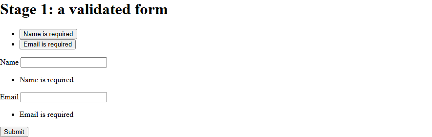

# Quickstart

Five minutes from here you have a Blazor form that blocks an empty submit and clears each message
as soon as the visitor fixes the field and moves on. It needs an interactive page: every page in a
standalone WebAssembly app is interactive already, and a page in a Blazor Web App needs a render
mode of its own.

**You'll learn**

- How a FluentValidation validator drives a Blazor form.
- Where a message appears: at its own field, and in the summary.
- What clears a message without a second submit.

> [!NOTE]
> Which render mode, what prerendering changes, and where each template puts its page files:
> [Hosting models](hosting-models.md).

## Install

Add the Blazor package:

```bash
dotnet add package Formidable.Blazor
```

It carries the core `Formidable` package along as a dependency, so this one install brings both.

## Bring the kit into scope

Every component below lives in the `Formidable.Blazor` namespace. One line in `_Imports.razor`
puts all of them within reach of every page:

```razor
@using Formidable.Blazor
```

> [!NOTE]
> Leave that line out and the Razor compiler reads every `<Formidable…>` element as plain markup.
> Whether the build fails at all, and what it fails with, depends on what else the page does with
> those elements. [Troubleshooting](recipes.md#part-2-troubleshooting) lists `RZ10012`, `RZ9991`
> and `CS0103` by symptom.

## The page

Create `Pages/Signup.razor`. It opens with its route and the namespace the validator needs:

```razor
@page "/signup"
@using FluentValidation
```

The rest is one file holding the model, the validator and the form together:

```razor
<FormidableForm Model="_contact" OnValidSubmit="HandleValid" OnInvalidSubmit="_ => _saved = false">
    <FormidableSummary />

    <label>Name
        <FormidableInputText @bind-Value="_contact.Name" />
    </label>
    <FormidableFieldMessage For="() => _contact.Name" />

    <label>Email
        <FormidableInputText @bind-Value="_contact.Email" />
    </label>
    <FormidableFieldMessage For="() => _contact.Email" />

    <button type="submit">Submit</button>
</FormidableForm>

@if (_saved)
{
    <p>Saved.</p>
}

@code {
    private readonly Contact _contact = new();
    private bool _saved;

    private void HandleValid()
    {
        _saved = true;
    }

    public class Contact
    {
        public string Name { get; set; } = string.Empty;
        public string Email { get; set; } = string.Empty;
    }

    public class ContactValidator : AbstractValidator<Contact>
    {
        public ContactValidator()
        {
            RuleFor(c => c.Name).NotEmpty().WithMessage("Name is required");
            RuleFor(c => c.Email).Cascade(CascadeMode.Stop)
                .NotEmpty().WithMessage("Email is required")
                .EmailAddress().WithMessage("Enter a valid email address");
        }
    }
}
```

<!-- Excerpt from `samples/Formidable.Tutorial/Pages/Stage1.razor` -->

Four components share the work. `FormidableForm` owns the `EditContext`, `FormidableInputText`
renders each field, `FormidableFieldMessage` shows that field's own issues, and
`FormidableSummary` lists everything the form currently has to say at once.

An input names its field in `@bind-Value`. `FormidableFieldMessage` renders no value of its own,
so it names its field the explicit way, with `For`.

## Register it

Two registrations in `Program.cs`, beside the template's own:

```csharp
using FluentValidation;
using Formidable.Blazor;
using YourApp.Pages;

builder.Services.AddFormidableBlazor();
builder.Services.AddScoped<IValidator<Signup.Contact>, Signup.ContactValidator>();
```

The first line registers the services the engine and the kit resolve. The second makes your
validator resolvable as `IValidator<Contact>`, which is how Formidable finds it. That is one line
per validator. The model and the validator are nested in the page class here, so they are named
through it and the `using` is the page's own namespace.

> [!NOTE]
> A Blazor Web App made with `-int Auto` or `-int WebAssembly` has two projects. The server builds
> the form too whenever a page prerenders or runs on its circuit, so both registrations go in
> **both** `Program.cs` files: [Hosting models](hosting-models.md#the-server-builds-the-form-too).

## Run it

Start the app and open `/signup`. Press **Submit** with both boxes empty. Both fields complain at
once: the summary lists them, and each message repeats where its own field renders.



The repo ships this form at every stage under `samples/Formidable.Tutorial`. Run it to compare your
work against a working copy. Every screenshot here comes from it, which is why each one carries a
`Stage N` heading.

Now type a name and leave the field. Its message goes at once, with no second submit, because a
live pass answered for the field you changed. Fill the email in properly and submit again: the
page says `Saved.`, so the handler ran.

Empty a field and press **Submit** once more, and that line goes. Clearing it is what the form's
`OnInvalidSubmit` does here.

## Recap

- `FormidableForm` validates a model with an ordinary FluentValidation validator.
- A blocked submit shows every failure at once, in the summary and at each field.
- A corrected field clears on its own, without a second submit.
- One file suits one small form; move the model and the validator out when another page needs
  them.

**Next:** [Draft vs submit](tutorial/2-draft-and-submit.md)

**Go deeper:** [Why Formidable](why-formidable.md) and [Progressive disclosure](disclosure.md)
