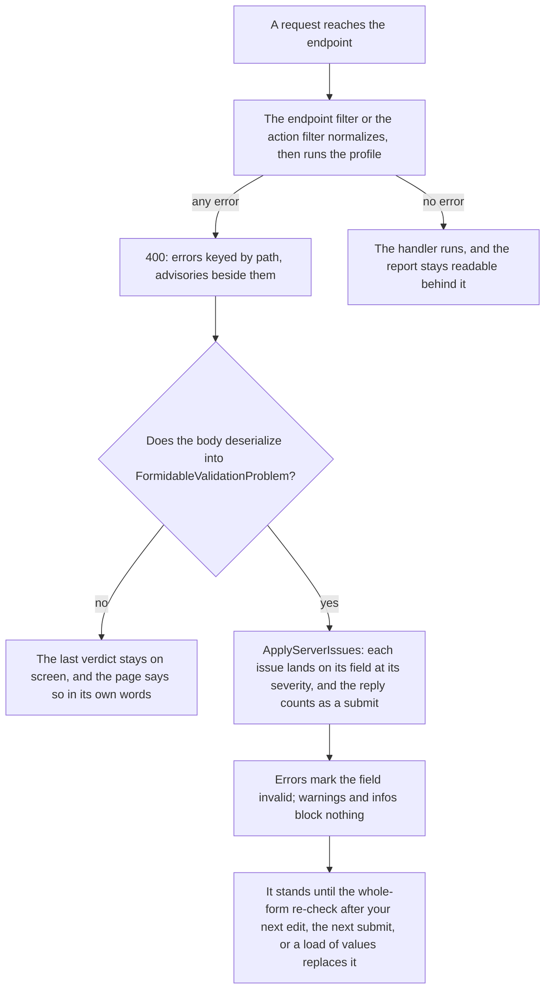

# Server integration

**You should already know:** why the server needs to run the same validator at all, and roughly what
`ApplyServerIssues` does with what comes back ([The server round trip](tutorial/6-server.md)), plus
the draft/submit split that decides which profile a request runs under ([Profiles](profiles.md)).

A save comes back 400 and the page has nowhere to put it but a dialog. The server and the client
disagree about one field and both messages show. A reverse proxy answers a rejected request with
its own HTML page, and the parse throws inside a click handler.

The same FluentValidation rules and profile definitions that drive the client run again on the
server. A request can skip the browser, replay old values, or arrive from a client that never ran a
single rule. A rejected request comes back in the shape the client already knows how to apply.

Here is one request, from the endpoint it reaches to what its reply does on the form:



The questions below take that picture one step at a time, from the reply on the form to the
endpoint behind it, each starting with what you see. After them, a reference tail holds the wire
contract, `Validate<TModel>()`, `[Validate]` and the samples.

## Need to know

One call wires an endpoint into the same validator the form runs, and on the sample's minimal API it
looks like this:

```csharp
// Group-level validation: every endpoint in the group runs the submit profile.
var orders = app.MapGroup("/api/orders").Validate<RoundTripOrder>();
orders.MapPost("/", (RoundTripOrder order) => Results.Ok(new { accepted = true, lines = order.Lines.Count }));
```

<!-- Source: `samples/Formidable.Sample.Api/Program.cs` -->

MVC gets the same thing from `[Validate]`, an action filter instead of an endpoint filter. The two
differ in where you write them and in what the framework builds around their answer. The answer
itself is one wire format, defined once in the core package, and reading it needs no ASP.NET Core or
Blazor dependency.

| | Minimal APIs | MVC |
|---|---|---|
| Where it goes | `Validate<TModel>(profile?)` on a route handler or a route group | `[Validate]` on an action method or on a controller class |
| The profile | a `ValidationProfile` value, fixed at the call site | a `Profile` string, resolved once per request |
| What it validates | the endpoint's first non-null `TModel` argument | every action argument whose type has a registered validator, or exactly the types you name |
| `errors` and `advisories` | one shared mapper: the same paths in the report's own order, the same messages, an empty message kept empty | the same dictionary, from the same mapper |
| The envelope around them | `TypedResults.ValidationProblem` | the app's own `ProblemDetailsFactory` |
| `traceId` | written only under `AddProblemDetails()` | written whatever the host configured |
| A declared body that bound to `null` | left to the platform, and only a refusal is enriched | where MVC binds `null` and runs the action (a nullable parameter under `[ApiController]`, any body parameter on a plain `Controller`), that argument is skipped |

Both of the last two rows are the framework's doing rather than Formidable's. A client keying on
paths and reading messages never sees a `traceId` either way. The null-bound body is the one place
the two adapters part company on more than presentation:
[A body bound to null](#a-body-bound-to-null) below.

On the client side, closing the loop is two calls: deserialize the 400 body into
`FormidableValidationProblem` through `FormidableValidationProblemJsonContext`, and hand it to
`FormidableForm.ApplyServerIssues`. That is the whole authoring surface: pick an adapter, apply what
it sends back.

## What happens to a server error when I edit the field?

It stays, until the whole form is re-checked. Your edit's own live check leaves a message the
server put there standing, whatever the edit did to the value.

The server's verdict stands until a newer whole-form answer replaces it: the whole-form re-check
(behind the next committed edit, or a change to which fields are on screen), the next submit, or a
page saying what its freshly loaded values have earned. At that point a server-only issue with no
matching client rule goes, and one the client agrees with carries on through the client's own
answer, so a client rule failing on the same field keeps its own message throughout.

`RefreshDebounce` (300 ms by default) is how long after that edit the re-check waits.
`Timeout.InfiniteTimeSpan` turns the re-check off, and the server's answer then stands until the
next submit or load of values.

Each apply replaces what the last one applied rather than piling onto it. The server's issues live
apart from the client's own answer, so applying a reply swaps that set outright and touches nothing
the client said, and resubmitting the same or a corrected payload never leaves a stale duplicate
behind.

Why: [how the engine works: what replaces the server's answer](how-the-engine-works.md#what-replaces-the-servers-answer).

## Does applying a reply count as a submit?

Yes. An apply is treated as a submit's verdict arriving late, so it sets `HasSubmitted`, and a
page whose only validation is server-side reaches the submitted state through this call alone. From then on every committed edit re-checks the whole form after `RefreshDebounce`, which is
what keeps the summary truthful for fields the edit never named.

An apply is also a disclosure event for the fields it shows: a client error the last submit
computed but had nowhere to show surfaces alongside the server's, and those fields go under the
same watch a blocked submit puts its fields under
([Disclosure](disclosure.md#why-is-it-still-showing-and-when-does-it-clear)).

It also clears any standing incomplete-validation fault, whatever the client is doing: a verdict
has arrived to stand in for the one a check that threw could not finish.

Why: [how the engine works: what an apply writes](how-the-engine-works.md#what-an-apply-writes).

## Why did focus move when I applied the reply?

Because `FormidableForm.ApplyServerIssues` treats a rejection the way a blocked submit is treated.
A payload carrying an error lands the visitor on the first error on the page, not necessarily the
one just applied, under the same `FocusFirstErrorOnInvalidSubmit` switch (`true` by default) a
blocked client submit uses ([Component kit](component-kit.md#formidableformtmodel)). A payload
with no error in it moves nothing, since nothing about it was rejected.

`Engine.ApplyServerIssues(...)` is the quiet path for an apply nobody just asked for, and
`FormidableValidator`'s two overloads are quiet too. Attach mode does focus a blocked submit's first
error, through its own `ValidateForSubmitAsync()`, but the round trip is the page's own, so what
happens after a rejection is the page's to choose. `FocusFirstErrorAsync()` on the validator is how
it chooses the same move, once the applied verdict is on screen.

Why: [how the engine works: read order](how-the-engine-works.md#read-order).

## How does a 400 reach the client, and what shape must it have?

As a 400 `ValidationProblemDetails` whose `errors` dictionary is keyed by the property-path format
the client uses (`Items[0].Sku`) and whose `advisories` extension carries every non-error issue from
the same report. Two of its members are Formidable's to decide; the envelope around them belongs to
whichever half of the framework built it.

On the client, closing the loop is two calls. Deserialize the 400 body into
`FormidableValidationProblem`, one type in the core package, through
`FormidableValidationProblemJsonContext.Default.FormidableValidationProblem`; then hand the
result to `FormidableForm.ApplyServerIssues`. That method has two overloads, on `FormidableForm` and
on `FormidableValidator` alike: a deserialized `FormidableValidationProblem`, or a sequence of
`ValidationIssue`, which `ToIssues()` produces by flattening the payload, every error entry first and
then the advisories. The engine's own method takes the sequence, and a sequence is enumerated
exactly once.

That first call names generated JSON metadata rather than the plain generic `ReadFromJsonAsync<T>()`
because a WebAssembly Release publish runs the trimmer, and trimmed output cannot deserialize the
type by reflection: it throws `NotSupportedException` when it tries. The metadata takes its options
from `JsonSerializerDefaults.Web`, which is what the generic call applies, so the body reads the
same way either side of a trim.

The severity is the server's to set. An error lands on its field as an error, the one severity that
blocks a submit: it marks the field `formidable-invalid` and reaches the `EditContext`'s message
store. A warning or an info lands on the same field as an advisory: visible in Formidable's own
message components and in the summary, painting `formidable-warning` or `formidable-info` once the
field has been touched or modified, blocking nothing and never reaching that store.

An error arrives carrying a path and a message and nothing else, because the `errors` dictionary has
nowhere to put more. An advisory (a `ValidationProblemAdvisory`) carries its path, its message and
its severity name, and optionally a code and a display name. [The wire contract](#the-wire-contract) below has the JSON, the members
and the tolerance rules.

## What if the 400 is not Formidable's?

Then the parse is where the page finds out, and a guard around it is what keeps the visitor from
meeting an exception. A 400 says the request was rejected, not who rejected it: a reverse proxy, an
API gateway or a WAF in front of the endpoint answers with its own HTML page or its own JSON.
`Content-Type` will not tell the page first, because `ReadFromJsonAsync` reads the body whatever
media type the header names, so an HTML page labelled `application/json` throws exactly as an
unlabelled one does.

| What comes back | What the parse does |
|---|---|
| a body that will not deserialize into the type at all (an HTML page, a line of plain text, an empty body, or JSON whose members conflict with it) | throws `JsonException` |
| a header naming a character set the runtime does not have (`windows-1252` and `Shift_JIS` both throw, where `utf-8` and `iso-8859-1` are read) | throws `InvalidOperationException` |
| the JSON literal `null` | throws nothing: it deserializes to `null`, which `ApplyServerIssues` rejects with `ArgumentNullException` |

Inside a Blazor event handler each of those is an unhandled exception: the page's error UI on
WebAssembly, a faulted circuit on Server. So the parse belongs inside a `try`, a `null` result
counts as no verdict, and the page says so in its own words rather than through the framework's.

Catch what the parse can throw, not only what a foreign body causes. The sample below adds
`NotSupportedException`, which a read that does not name the generated metadata raises under
trimming, so no way of failing reaches the visitor as a crash.

Deserializing is a shape check, not a verdict check. A gateway's own JSON deserializes happily into
a problem carrying no errors and no advisories, and applying that replaces whatever the last
response left on screen with nothing, which reads as a rejection with no reason given. The sample
below posts to its own API, so it stops at the shape; a page in front of infrastructure it does not
control has the emptier case to weigh too.

Not applying does not clear the last verdict, and that cuts both ways. An unreadable response is no
evidence the previous one stopped being true, so wiping the messages a visitor is working through
would cost them their only reasons. A corrected resubmission that comes back unreadable leaves those
same reasons standing under a status line that reads as current. A page that would rather show
nothing than risk showing something stale hands `ApplyServerIssues` an empty sequence, which swaps
the server's answer for nothing.

The sample deliberately skips client-side submit validation so the round trip is visible end to end:
press Send and the server's 400 lands on the exact fields.

```csharp
private async Task Send()
{
    // Normalizing before the POST keeps the client's line list identical to what the
    // server validates (its filter normalizes too) - so issue paths always match rows.
    _order.Normalize();
    var response = await Http.PostAsJsonAsync(_endpoint, _order);

    if (response.IsSuccessStatusCode)
    {
        _status = "Server accepted the order.";
        return;
    }

    // A 400 says the request was rejected, not that the endpoint is what rejected it. A
    // reverse proxy, a gateway or a WAF in front of it answers with its own HTML page or its
    // own JSON, and the parse reads the Content-Type header's character set as well as the
    // body, so either can be something it cannot make sense of. The JSON literal null throws
    // nothing and deserializes to nothing at all. A rejection the page cannot read is still a
    // rejection, and none of these is an exception the visitor should meet.
    FormidableValidationProblem? problem;
    try
    {
        // The generated metadata, not the plain generic overload: publishing a WebAssembly
        // app in Release runs the trimmer, and trimmed output cannot deserialize the type by
        // reflection. The guard below catches that refusal too rather than let it reach the
        // visitor.
        problem = await response.Content.ReadFromJsonAsync(
            FormidableValidationProblemJsonContext.Default.FormidableValidationProblem);
    }
    catch (Exception ex)
        when (ex is JsonException or InvalidOperationException or NotSupportedException)
    {
        problem = null;
    }

    if (problem is null)
    {
        // The last verdict stays on screen. An unreadable response is no evidence that it
        // stopped being true, and the reverse case is real too: a corrected resubmission that
        // comes back unreadable leaves the old reasons standing under the new status line. A
        // page that would rather show nothing hands ApplyServerIssues an empty sequence here.
        _status = "Rejected — but the response is not a verdict this page can read.";
        return;
    }

    // One call for the whole verdict: every issue lands on the field it names, at the
    // severity it carries, so the page needs no advisory plumbing of its own. Each call
    // replaces the previous server verdict — pressing Send again with new input swaps the
    // old messages for the new ones, rather than accumulating them, so a corrected
    // resubmission cannot leave a stale one behind.
    _form!.ApplyServerIssues(problem);
    _status = "Server rejected the order — its verdict is now inline.";
}
```

<!-- Source: `samples/Formidable.Sample/Pages/ServerRoundTrip.razor.cs` -->

## Why did a server error show on a field that is not on screen, while its warning did not?

Because the server judged what was actually submitted, and an error that blocks the save has to
reach the user whether or not the client rendered its field. Errors reach the form's fields the
moment `ApplyServerIssues` runs, with no check that anything renders the field. Only a
`DisclosureOverride` returning `false` hides one.

Advisories in the same payload take the same override-aware visibility answer the client's own
advisories do. A `DisclosureOverride` settles it in either direction, and where none speaks, one
whose field is on screen shows there and one whose field is not is dropped. An advisory blocks
nothing, so hiding one strands no verdict.

Reporting is where the two part company. A dropped advisory here is named by the suppressed-issue
diagnostic, where one a submit drops reaches nothing at all (no Trace line, no logged warning, no
`SuppressedIssueDiagnostic` callback).
[Disclosure](disclosure.md#why-did-a-server-error-show-on-a-hidden-field) has the same answer from
the disclosure side.

Why: [how the engine works: which issues an apply lands](how-the-engine-works.md#which-issues-an-apply-lands).

## Why did the same warning show once when both sides sent it?

Because it is one warning said twice, and the client's copy is the one that shows. Both sides
usually run the same validator, so the same advisory often arrives twice: once from the client's own
submit and once from the response. It shows once, as the client's copy.

The two count as one only on identical message text at the same severity, so a client and a server
phrasing the same advisory differently show both. Keeping the two sides' message resources in step
is the consumer's job, the same way keeping their rules in step is. A payload carrying the same
message twice for one field at one severity lands it once, for the same reason: a reader has no use
for it twice.

Why: [how the engine works: how a server copy folds into the client's](how-the-engine-works.md#read-order).

## Why does a native `ValidationMessage` show a server error but not its warning?

Because the `EditContext`'s message store carries errors only, at no severity it can express, and
collapses repeats on its own terms rather than the issue reads'. A server error reaches it. An
advisory never does, and the page writes no advisory plumbing of its own: a warning or an info shows
in Formidable's own message components and in the summary instead.

The message store exists so a page that already renders a native `ValidationSummary` or
`ValidationMessage`, or calls `GetValidationMessages` directly, keeps working without swapping in
Formidable's own summary and message components. It is rebuilt from the same answers the engine's
own reads give, whenever one of them changes, so a native component reads the same answer
`FormidableFieldMessage` does, as far as the message store is able to carry it.

What the message store does not carry is the curated reading experience. Severities, disclosure,
document order and focus are what Formidable's own summary and message components provide, by
reading the engine directly rather than the message store.

Why: [how the engine works: what the message store carries](how-the-engine-works.md#the-message-store-projection).

### Why does a form with no Formidable components still see its errors?

Because the message store takes the errors each channel discloses and asks nothing further about
registration. A field the submit channel is watching keeps its entry there after it leaves the page,
until a later check answers for it again. The live channel's default discloses an engaged field's
error whether or not anything renders it.

That last one matters most to a form with no Formidable components at all: nothing registers its
fields, so a registration-gated live channel would leave that page's own errors out of the only
surface it reads. A page that wants the narrower behaviour opts into it with
[`FormidableOptions.LiveDisclosure`](options.md#livedisclosure), which moves every surface together
rather than splitting them.

## What can a body I did not write do when I apply it?

Less than a hostile shape might suggest, and one thing worth knowing about. `ToIssues()` reads a
null or unknown value as something harmless rather than throwing: a null collection as empty, a null
path as the model-level path, a null message as empty, a severity no `ValidationSeverity` member
defines as `Warning` ([Tolerance for a foreign payload](#tolerance-for-a-foreign-payload) below has
the table). Tolerance covers the shapes that survive the parse, never the ones that fail it
([above](#what-if-the-400-is-not-formidables)).

A response's paths are read against the live model. Formidable's own adapters send the validator's
own paths, but the apply assumes nothing about where a body came from: an invented path is read
segment by segment for as long as the model has members to match.

Those reads happen wherever the component runs: the visitor's own machine in a WebAssembly app,
the server in a Blazor Server circuit. On a circuit, a segment landing on a getter with a side
effect (an EF navigation property that lazy-loads) is a database query.

Why: [how the engine works: how a path resolves to an object](how-the-engine-works.md#the-walk).

## What do `Validate<TModel>()` and `[Validate]` enforce, and when do they short-circuit?

Both run the same validator under a profile (`Submit` by default), normalize first where the model
implements `INormalizableModel`, and decide on the report. An error-severity issue short-circuits to
the 400 and the handler never runs. Warnings and infos never block on their own, because
`report.IsValid` is `true` whenever the report has no error-severity issues
([Severity](severity.md)): an all-warnings report falls straight through to the handler's own return
value, unmodified, and the report itself is not lost
([below](#what-is-the-report-in-httpcontextitems-for)).

`Validate<TModel>()` validates the endpoint's first non-null `TModel` argument. `[Validate]` validates
every action argument whose type has a registered validator, or exactly the types you name, and
aggregates every issue into one report before deciding: one 400 for the whole action, not one per
argument.

### What stops them from validating at all?

A wiring bug, or a body that never bound. What either refuses as wiring, it refuses on grounds no
request can influence. A handler that `Validate<TModel>()` finds no `TModel`-typed argument on
throws `InvalidOperationException` when the endpoint's request pipeline is built, and routing
materializes every endpoint before it can match a request, so the one mis-wired endpoint fails every
request to the application until it is fixed.

`[Validate]`'s `RequireValidator` (off by default) throws for an action that could never hand it
anything to validate, decided from the action's declared parameters: at model build for named
types, at model build and then the action's first request for discovery.

A declared body that bound to `null` is a different case, and the two adapters part company on it.
The minimal-API filter leaves the decision to the platform and enriches only a refusal. Where MVC
binds `null` and runs the action (a nullable parameter under `[ApiController]`, any body parameter
on a plain `Controller`), `[Validate]` skips the argument. The tail has the rest:
[`Validate<TModel>()` on minimal APIs](#validatetmodel-on-minimal-apis) and
[the attribute on MVC](#validate-on-mvc).

## What is the report in `HttpContext.Items` for?

For reading the verdict after the decision has been made. Both adapters stash the report the moment
validation computes it, before the 400/pass-through decision, and `GetFormidableValidationReport`
reads it back anywhere the `HttpContext` is in reach: inside the handler a passing request went on to
run, or in middleware reading a rejection's severity detail without parsing the response body.

A report with no errors never blocks, so the wire contract has nothing to say about its warnings and
infos. The `advisories` extension exists on a 400 body only; when the report has no errors, both
adapters take the framework's ordinary success path and the handler's or action's own return value
passes through untouched. A handler that wants its 200 to say "saved, but note…" builds that response itself, from the report
the adapter already computed:

```csharp
var orders = app.MapGroup("/api/orders").Validate<RoundTripOrder>();
orders.MapPost("/", (RoundTripOrder order, HttpContext http) =>
{
    // Behind Validate<RoundTripOrder>() the report is always present here: the filter
    // validated before the handler could run.
    var report = http.GetFormidableValidationReport()!;
    return Results.Ok(new
    {
        accepted = true,
        lines = order.Lines.Count,
        // The same advisory shape the 400 path puts on its `advisories` extension, so the
        // client parses a "saved, but note…" 200 with the type it already has.
        advisories = ValidationReportProblemMapper.ToAdvisories(report)
    });
});
```

That `ToAdvisories` call is the same public mapping the 400 path uses, so a "saved, but note…"
response carries its warnings in the exact wire shape the client already parses into
`FormidableValidationProblem.Advisories`.

An MVC action does the same through its own `HttpContext` property; for `[Validate]` the report is
the aggregate across every validated argument. On a request no Formidable adapter validated the
accessor returns `null` (an endpoint outside the filter, say, or an action whose arguments resolved
no validator), so code shared across both kinds of route checks before reading.

## Does the server normalize before it validates?

Yes, where the model has a cleanup hook. Both adapters call `Normalize()` in place, on the exact
instance the framework already deserialized and bound, before handing that instance to
`ValidateAsync`. `Normalize()` mutates the object rather than returning a copy, so the instance the
validator checks is the instance the route handler or action runs against, normalized rather than
wire-deserialized. The hook is one interface a consumer model implements:

```csharp
public interface INormalizableModel
{
    /// <summary>Clears fields not applicable to the current selection state and strips empty collection rows.</summary>
    void Normalize();
}
```

<!-- Source: `src/Formidable/INormalizableModel.cs` -->

The sample's order model implements it to drop rows filled with only whitespace, keeping truly-empty
rows alone:

```csharp
public class RoundTripOrder : INormalizableModel
{
    public string Description { get; set; } = string.Empty;
    public List<OrderLine> Lines { get; set; } = [];

    public void Normalize()
    {
        // Whitespace-only SKUs are noise - drop those lines entirely. A genuinely empty
        // SKU ("") survives on purpose so NotEmpty can point at the row.
        Lines.RemoveAll(line => line.Sku.Length > 0 && string.IsNullOrWhiteSpace(line.Sku));
    }
}
```

<!-- Excerpt from `samples/Formidable.Sample.Shared/RoundTripOrder.cs` -->

Normalize on the client before the POST too, so the line list the client shows is the one the server
validates and every path in the reply matches a row on screen. Call `model.Normalize()` yourself, as
the sample's `Send()` does, or set [`NormalizeOnSubmit`](options.md#normalizeonsubmit) and the submit
normalizes before it validates
([Recipes](recipes.md#i-want-to-validate-on-the-server-and-show-its-verdict)).

## Do the filters cap how much a client can send?

No. Collection sizes are the host's job, not the validator's: both sample endpoints validate
whatever collection a client sends without capping how large it can get. The request body's size
limit is the only ceiling on `RoundTripOrder.Lines` or
[`/workout`](../samples/Formidable.Sample/Pages/Workout.razor)'s `EventRegistration.Attendees`, and
that page's own attendee-count rule is `Warning` severity ([Severity](severity.md)), so it never
blocks a submit by itself.

A real API should add an error-severity cap alongside the format rules already in place:

```csharp
RuleFor(x => x.Attendees).Must(a => a.Count <= 100).WithMessage("Too many attendees in one request");
```

Pair it with a request-size limit at the transport level too, such as Kestrel's `MaxRequestBodySize`
or the equivalent on a reverse proxy in front of it, because the rule above only runs once the body
has already been deserialized. Nesting depth is a different limit: MVC's own two caps stop a deep
request before `[Validate]` runs, and `[Validate]` adds none of its own
([The 400's envelope on MVC](#the-400s-envelope-on-mvc)).

## The wire contract

A rejected request returns a 400 `ValidationProblemDetails`. Two of its members are Formidable's to
decide, and the envelope around them belongs to whichever half of the framework built it.

`errors` is the standard dictionary, keyed by the same property-path format the client uses
internally (`Items[0].Sku`, and so on;
[Collections and row identity](collections-and-row-identity.md) has the format). `advisories` is an
extension beside it, carrying every non-error issue from the same report.

```json
{
  "type": "https://tools.ietf.org/html/rfc9110#section-15.5.1",
  "title": "One or more validation errors occurred.",
  "status": 400,
  "errors": { "Items[0].Sku": ["Required"] },
  "advisories": [
    { "path": "Description", "message": "Avoid hyphens", "severity": "Warning", "code": null, "displayName": "Description" }
  ]
}
```

The client-side shape of that body is one type in the core `Formidable` package,
`FormidableValidationProblem`. Deserialize an HTTP 400 into it through
`FormidableValidationProblemJsonContext.Default.FormidableValidationProblem`, then hand the result
to the form. That metadata takes its options from `JsonSerializerDefaults.Web` and needs no
reflection, so a trimmed publish reads the body too.

| Member | Type | What it holds |
|---|---|---|
| `Errors` | `Dictionary<string, string[]>` | the `errors` dictionary, paths to messages |
| `Advisories` | `List<ValidationProblemAdvisory>` | the `advisories` extension |
| `ToIssues()` | `IReadOnlyList<ValidationIssue>` | the payload flattened for the engine: every error entry first, one issue per message, then the advisories |

An error arrives carrying a path and a message and nothing else, because the `errors` dictionary has
nowhere to put anything more. An advisory is a record with room for four things beside its path:

| Field | Type | What it is |
|---|---|---|
| `Path` | `string` | property path in the client's format, e.g. `Items[0].Sku` |
| `Message` | `string` | the message to show |
| `Severity` | `string` | the `ValidationSeverity` member name, `"Warning"` or `"Info"` |
| `Code` | `string?` | optional machine-readable code |
| `DisplayName` | `string?` | optional user-facing field name |

### Tolerance for a foreign payload

`FormidableValidationProblem.ToIssues()` deliberately tolerates a null or hostile payload shape
rather than throwing. A foreign 400 body (a proxy, a gateway, a handwritten test double) can carry
explicit JSON nulls anywhere its shape admits one. The deserializer does not enforce
nullable-reference annotations, so the type's own property initializers guarantee nothing.

| What the body carries | What `ToIssues()` makes of it |
|---|---|
| a null `errors` or `advisories` collection | an empty one |
| a null message array under a key | no issues for that key |
| a null message inside such an array | an empty message |
| a null advisory entry | skipped, since it carries nothing to show |
| a null advisory path | `""`, the model-level path |
| a null advisory message | an empty message |
| a severity no `ValidationSeverity` member defines | `Warning` |
| `"Error"` as an advisory severity | `Warning`, because the `errors` dictionary is the only error channel |

Severity is parsed case-insensitively and then checked with `Enum.IsDefined`. A numeric string such
as `"99"` and a comma-joined list such as `"Info, Warning"` are undefined severities, so both land
as `Warning`.

Tolerance covers the shapes that survive the parse, never the ones that fail it. What to do about
those is [the guard around the parse](#what-if-the-400-is-not-formidables) above.

### The server-side mapper

`ValidationReportProblemMapper` in `Formidable.AspNetCore` turns a `ValidationReport` into the
`errors` dictionary and the `advisories` payload, and both adapters call it.

| Member | What it gives back |
|---|---|
| `ToErrorDictionary(report)` | the report's errors grouped by path, preserving issue order within each path |
| `ToAdvisories(report)` | the report's non-error issues, in issue order |
| `AdvisoriesExtensionKey` | `"advisories"`, the extension key `ToAdvisories`' result is attached under |

The mapper tolerates a null path and a null message exactly as the client does: a hand-rolled
`IModelValidator<TModel>` can hand back either, whatever the type's annotations say.

One shape it refuses. An issue carrying a `ValidationSeverity` value no member defines makes
`ToAdvisories` throw `ArgumentException` rather than write a number.

Both adapters reach that mapping only while building a rejection, so such an issue fails the 400 it
would have ridden. A report with no errors passes both of them unmapped, and the refusal then lands
wherever the report's advisories are next asked for (a handler building its own 200 from
`ToAdvisories`, say).

Nothing shipped can produce such a value, so it comes from a cast in a hand-rolled validator, and
the refusal is what tells its author.

**Messages can echo user input.** A FluentValidation message built with `{PropertyValue}` embeds the
field's own value into the response body verbatim.

`FormidableFieldMessage`, `FormidableCollectionMessage`, `FormidableModelMessage` and
`FormidableSummary` render every message as text, so nothing in the kit turns one into markup. A
consumer reading the same `errors`/`advisories` payload outside those components needs to do the
same: render each message as text, never interpolate it into HTML.

**Codes name the validator that failed.** Each advisory carries its issue's `Code`, which behind the
FluentValidation adapter is that failure's `ErrorCode`. The code FluentValidation supplies by
default is the name of the validator underneath: `EmailValidator`, `MaximumLengthValidator`,
`PredicateValidator` for a `Must`, and whatever a `PropertyValidator<T, TProperty>` of your own
returns from its required `Name`.

Those describe the implementation rather than the problem, and this body carries one to whoever
holds the response. The `errors` dictionary is paths to messages and nothing else, so a code rides
on an advisory or not at all. `WithErrorCode("...")` replaces one, and it attaches to the validator
it follows rather than to the rule: on a chain, each component needs its own, and the ones nothing
names keep the default.

## `Validate<TModel>()` on minimal APIs

`Validate<TModel>(profile?)` is an endpoint-filter extension with two overloads: one route handler
at a time, or every handler in a route group at once.

Both overloads default to `ValidationProfile.Submit` and install the same filter. The group overload
just attaches it to every endpoint the group defines, checking each handler's own signature for a
`TModel` parameter rather than sharing one answer across the whole group. Where a handler declares
more than one parameter of that type, only the first one that bound non-null is validated.

The filter normalizes, validates, then decides. Normalize runs only where `TModel` implements
`INormalizableModel`. An error-severity issue short-circuits to the 400 above; warnings and infos
never block on their own.

`report.IsValid` is `true` whenever the report has no error-severity issues, and warnings and infos
don't affect it (see [Severity](severity.md)). That is why an all-warnings report falls straight
through to the handler's own return value, unmodified. The report itself is not lost:
[the report in `HttpContext.Items`](#what-is-the-report-in-httpcontextitems-for) above shows the
handler reading it back.

Derived instances get the base-type guarantee for free here: the filter retrieves the argument by
`TModel`, fixed at the call site, so there is no runtime type to steer
([Which type an argument is validated as](#which-type-an-argument-is-validated-as) has MVC's rule).

### An endpoint with nothing to validate

A handler that `Validate<TModel>()` finds no `TModel`-typed argument on is a wiring bug, not
something a request can influence. The filter factory refuses it with an `InvalidOperationException`
when the endpoint's request pipeline is built, so no filter is ever installed for it.

Routing materializes every mapped endpoint before it can match any request. So one mis-wired
endpoint fails every request to the application until it is fixed, rather than hiding as a 500 on
the one broken route. A group carrying one fails route materialization as a whole, rather than
leaving that endpoint to 500 among working siblings.

There is no discovery mode here to silently skip a resolvable-but-unregistered validator either.
`GetRequiredService<IModelValidator<TModel>>()` throws on its own if `AddFormidable()` was never
called, so this side needs no equivalent to `[Validate]`'s
[`RequireValidator`](#strict-validator-resolution).

### A body bound to null

A declared `TModel` argument that bound to `null` is not a wiring bug, and the filter does not treat
it as one. Whether a missing body is acceptable is something the endpoint's own signature already
answers, and the platform reads that answer (nullability, a default value, an `[FromBody]`
`EmptyBodyBehavior`) before the filter is reached.

So the filter hands the decision back by calling `next`, exactly as if it were not installed.
Declare the parameter nullable and the handler runs with `null`, as it would with no filter in front
of it. Declare it non-nullable and the platform refuses the request itself.

The platform's own refusal is a bare 400 with `Content-Length: 0`, cause-blind even with
`AddProblemDetails()` and `UseStatusCodePages()` configured. The filter replaces that empty body
with a model-level error, through the same mapping every other rejection in this document uses.

That message is `"A request body is required."` unless the call site named another one:
`Validate<TModel>(missingBodyMessage: ...)`. Passing null keeps the default; any other string is
used as given, which is where a localized application replaces it.

The filter replaces the body only where the platform is visibly the one refusing: an empty result
came back, a 400 stands on the response, and nothing has been written yet. Anything else (a
downstream filter's own 400, a response already on the wire) passes through untouched.

MVC lands somewhere else. For a nullable parameter under `[ApiController]`, and for any body
parameter on a plain `Controller`, it binds `null` and runs the action, so `[Validate]` has nothing
to validate and says nothing. `ModelState` stays valid for the nullable parameter and, on a plain
`Controller`, carries the platform's own required-body errors for a non-nullable one. Minimal APIs
decide more strictly than MVC does for a non-nullable parameter, and that difference is the
platform's rather than either adapter's.

## `[Validate]` on MVC

`[Validate]` is an `ActionFilterAttribute` usable on a method or a class. Without constructor
arguments it discovers which action arguments to validate by probing DI for a registered
FluentValidation `IValidator<T>`. Passed explicit types (`[Validate(typeof(Order))]`) it validates
exactly those argument types, regardless of how their `IModelValidator<T>` adapter is registered.

Placed on a class, `[Validate]` applies to every action on it. The sample uses exactly this shape,
with no explicit model types, relying on discovery:

```csharp
[ApiController]
[Route("api/agreements")]
[Validate] // class-level: every action's validatable arguments run the Submit profile
public class AgreementsController : ControllerBase
{
    [HttpPost]
    public IActionResult Create([FromBody] RoundTripOrder order) =>
        Ok(new { accepted = true, lines = order.Lines.Count });
}
```

<!-- Source: `samples/Formidable.Sample.Api/Controllers/AgreementsController.cs` -->

An action can bind more than one validatable argument. `[Validate]` runs normalize-then-validate on
every one of them and aggregates every issue from every argument into a single `ValidationReport`
before deciding whether to short-circuit. That is one 400 for the whole action, not one per
argument.

The merge is flat: the 400's `errors` dictionary keys each issue by its own property path with no
per-argument prefix, so two validated models sharing a property name land under one key.

`null` arguments are skipped entirely (neither normalized nor validated) and the aggregate's
`IsValid` gate runs once, after every argument has been through. The report is stashed before that
gate, so `GetFormidableValidationReport` reads back the aggregate whether the request went on to a
400 or to the action ([the report in `HttpContext.Items`](#what-is-the-report-in-httpcontextitems-for)).

None of the filter's own per-argument checks can throw over what a request bound or failed to bind.
The one strictness check that runs per request happens before any argument is looked at, and it
reads the action's declared parameters rather than its arguments.
[Strict validator resolution](#strict-validator-resolution) has both halves.

What can still throw is the consumer's own code. Each bound model's `Normalize()` runs, and then the
model is handed to the validator, dispatched without exception wrapping. So either hop's
data-dependent throw surfaces its own exception type, exactly as it would through the endpoint
filter's direct calls.

### Which type an argument is validated as

Every non-null action argument's type is resolved before it is validated, and the order matters:

| Tried | What happens |
|---|---|
| the parameter's DECLARED type, looked up on `ActionDescriptor.Parameters` by argument name | when it has a registered validator, it wins outright |
| the argument's own runtime type | tried only where the declared type resolves nothing, so a validator registered only for a derived type still runs |
| neither resolves one | the argument is skipped |

Where the action descriptor carries no matching declared parameter at all (a hand-built
`ActionDescriptor` outside MVC's own pipeline, say) the runtime type is used directly, with no
declared type to prefer.

A declared type that has a registered validator wins outright, which is what stops a request
choosing its own. `[FromBody] Order order` paired with a `[JsonPolymorphic]`/`[JsonDerivedType]`
hierarchy binds a *derived* instance to `order`, chosen by the body's own `$type` discriminator,
while the parameter stays declared as the base `Order`. Whatever `$type` picked, the base type's
registered validator is what runs.

One residual the order leaves: where nothing registered validates the declared type, the body's own
`$type` decides. The derived type's validator runs where one is registered, and the argument is
skipped silently where none is. Name the base type on the attribute (`[Validate(typeof(Order))]`)
to close it.

That is the recommended shape for any action that accepts polymorphic model binding. An explicit
type is validated as the declared type whatever the runtime type turns out to be, and a missing
`IValidator<Order>` for it throws rather than being skipped.

### Strict validator resolution

`RequireValidator` (default `false`) makes `[Validate]` throw `InvalidOperationException` when the
action could never hand the filter anything to validate. Two shapes reach it: an explicit
constructor type (`[Validate(typeof(Order), RequireValidator = true)]`) that matches no declared
parameter, and a parameter list nothing registered validates.

It is decided from the action's DECLARED parameters, which is what keeps it out of a client's reach:
an action's parameter list is fixed, where what a request happens to bind is not.

Where it is decided depends on whether you name the types:

| Mode | Decided | What it checks |
|---|---|---|
| explicit types | while MVC builds its application model, before the host serves anything | that some declared parameter could carry one of the named types; the message names the model type the attribute asked for |
| discovery | in two places (the model build, then the action's first request) | that the action declares parameters at all, then that some declared parameter type has a registered `IValidator<T>` |

The model build needs no startup hook. `[Validate]` carries its own convention, on a method and on a
class alike, so it needs no `AddControllers(options => …)` registration. A class-level
`[Validate(RequireValidator = true)]` is judged action by action.

Discovery mode needs a second place, because a registration is what makes a parameter validatable
and the model build has no container to ask. The first request to the action probes each declared
parameter type for a registered `IValidator<T>`.

Declared, not bound: the answer is the same on every request, so it is computed once per action, and
a dropped `AddValidatorsFromAssembly()` then fails every request to that action rather than quietly
validating nothing.

One shape is refused that the filter would otherwise have validated: a base-typed parameter whose
only registered validator is for a *derived* type. The filter reaches that at run time by falling
back to the bound argument's own type, which strict mode will not read.

**Naming the model types is the stronger mode.** It is answered entirely at model build, it admits a
base-typed parameter for a named derived model, and it is the same move that closes the polymorphic
residual above. A named type with no `IValidator<T>` throws pointing at `AddValidatorsFromAssembly`,
and an unwired adapter throws pointing at `AddFormidable()`.

Off by default: an action mixing validatable models with ordinary parameters (route values, query
strings, injected services) is free to declare no model at all, and that is not a misconfiguration.

### Profile string mapping

`[Validate]`'s `Profile` property is a string (`"Submit"` by default), resolved once per request
through `ValidationProfile.FromName`.

| The name | What it resolves to |
|---|---|
| `"Draft"` or `"Submit"`, matched case-insensitively | the built-in profile of that name, the same two the client uses (see [Profiles](profiles.md)) |
| any other single name | a custom profile shaped the same way `Submit` itself is built: default rules plus one ruleset with the same name |
| a blank name, or one joining several with `,` or `;` | refused loudly, throwing on every request to the action |

FluentValidation splits a joined name where a rule is *declared*, never where one is selected, so a
profile naming one would silently select nothing
([Profiles](profiles.md#how-do-i-pick-a-profile-on-the-server)).

The minimal-API filter takes a `ValidationProfile` value directly instead of a name string, because
an attribute argument has to be a compile-time constant and a `ValidationProfile` is built at
runtime.

So `[Validate(Profile = "Submit")]` and `Validate<Order>(ValidationProfile.Submit)` select exactly
the same rules. Read the string as the name of the profile the value names directly, and the same
pairing holds for `"Draft"` and for any custom profile name.

### The 400's envelope on MVC

Both adapters' `errors` come from the report, never through `ModelStateDictionary`. The MVC filter
asks the app's own `ProblemDetailsFactory` (which is what `ControllerBase.ValidationProblem()` uses)
for the envelope with an empty `ModelStateDictionary`, then puts the mapper's dictionary into
`Errors` directly.

That is where this filter's 400 picks up the trace identifier, the
`ApiBehaviorOptions.ClientErrorMapping` type link and any consumer factory's own additions.

No error passes through the `ModelStateDictionary`, so `[Validate]` caps neither how deep a model
nests nor how many issues it produces. MVC's own two caps stop a deep request first, both before any
action filter runs: its JSON formatter at `JsonOptions.MaxDepth` (32 on MVC, where minimal APIs read
System.Text.Json's own 64), its validation visitor at `MvcOptions.MaxValidationDepth` (32). Raise
both, and `[Validate]` adds no cap of its own.

Setting `Errors` directly is what keeps both adapters serving one dictionary.

**Two consumer seams see an empty `Errors` on this path.** The errors are out of the factory's
reach. An app's own `ProblemDetailsFactory` override receives the empty `ModelStateDictionary`, and
`ProblemDetailsOptions.CustomizeProblemDetails` runs inside the factory before the dictionary is
set.

Either sees that empty `Errors` where `TypedResults.ValidationProblem` shows the hook the full set
and asks no `ProblemDetailsFactory` for anything. So anything either derives from the errors (a
count, a log line) is derived from nothing, and an `Errors` entry either writes is replaced by the
mapper's dictionary.

Everything else either does, such as reading the request or adding an extension, lands on the
response as it does for the app's other 400s.

## Samples

[`/server`](../samples/Formidable.Sample/Pages/ServerRoundTrip.razor) and
[`samples/Formidable.Sample.Api/Program.cs`](../samples/Formidable.Sample.Api/Program.cs) for the
Minimal API endpoint, with its MVC twin at
[`samples/Formidable.Sample.Api/Controllers/OrdersController.cs`](../samples/Formidable.Sample.Api/Controllers/OrdersController.cs).
The page's endpoint picker posts to either one, with a caption under the radios naming the live URL,
so the two 400s are traceable to their source.

[`samples/Formidable.Sample.Api/requests.http`](../samples/Formidable.Sample.Api/requests.http) has
ready-made requests against both endpoints for use outside the browser.

Run the API first (`dotnet run --project samples/Formidable.Sample.Api`), then open `/server` in the
Blazor sample and press "Send to server". Pressing Enter triggers the browser's implicit form
submission, which runs the client-side submit pipeline this page deliberately skips.
