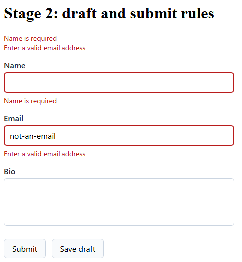

# Stage 2: draft and submit rules

A form spends most of its life half-filled. Demand a name on the first keystroke and the page nags.
Wait until submit to check anything and a malformed email sits wrong the whole time. One validator
can answer both questions, from two buckets of rules.

**You'll learn**

- How one validator carries draft rules and submit rules.
- How to save a draft without demanding anything.
- How to make field state visible.

## Split the rules in two

This stage adds a bio, which gives the draft bucket something to check. Put it on the model:

```razor
public string Email { get; set; } = string.Empty;
public string Bio { get; set; } = string.Empty;
```

<!-- Excerpt from `samples/Formidable.Tutorial/Pages/Stage2.razor` -->

Then in the markup, under Email, with the kit's `FormidableInputTextArea`:

```razor
<label>Bio
    <FormidableInputTextArea @bind-Value="_contact.Bio" />
</label>
<FormidableFieldMessage For="() => _contact.Bio" />
```

<!-- Excerpt from `samples/Formidable.Tutorial/Pages/Stage2.razor` -->

Now change the validator's base class, and override two methods instead of writing a constructor:

```razor
public class ContactValidator : DraftSubmitValidator<Contact>
{
    protected override void ConfigureDraftRules()
    {
        RuleFor(c => c.Email)
            .EmailAddress().WithMessage("Enter a valid email address")
            .When(c => !string.IsNullOrEmpty(c.Email));
        RuleFor(c => c.Bio).MaximumLength(280).WithMessage("Bio is 280 characters max");
    }

    protected override void ConfigureSubmitRules()
    {
        RuleFor(c => c.Name).NotEmpty().WithMessage("Name is required");
        RuleFor(c => c.Email).NotEmpty().WithMessage("Email is required");
    }
}
```

<!-- Excerpt from `samples/Formidable.Tutorial/Pages/Stage2.razor` -->

That is the convention. Draft rules ask whether a value is malformed, and count an empty one as
fine. Submit rules ask whether it is there at all. Email answers to both, declared once in each
bucket, in the one class.

The `When` guard is what keeps a shape rule quiet on an empty box. `EmailAddress()` fails an empty
string the moment it runs, so without the guard an empty Email would count as malformed, and the
draft check below would never read zero.

`DraftSubmitValidator<T>` is core Formidable, so add `@using Formidable` to `_Imports.razor` beside
the `Formidable.Blazor` line already there. The class name has not changed, so its registration in
`Program.cs` stays exactly as it is.

## Save a draft

Add a second button beside Submit, and a readout under the form:

```razor
    <button type="submit">Submit</button>
    <button type="button" @onclick="SaveDraft">Save draft</button>
</FormidableForm>

@if (_saved)
{
    <p>Saved.</p>
}

@if (_draftFailureCount is not null)
{
    <p>Draft check: @_draftFailureCount finding(s).</p>
}
```

<!-- Excerpt from `samples/Formidable.Tutorial/Pages/Stage2.razor` -->

The handler needs the validator itself, and somewhere to keep the count:

```razor
[Inject]
private IValidator<Contact> Validator { get; set; } = default!;

private readonly Contact _contact = new();
private bool _saved;
private int? _draftFailureCount;
```

<!-- Excerpt from `samples/Formidable.Tutorial/Pages/Stage2.razor` -->

Then the handler itself, naming the profile it wants:

```razor
private async Task SaveDraft()
{
    var result = await Validator.ValidateAsync(_contact, ValidationProfile.Draft);
    _draftFailureCount = result.Errors.Count;
}
```

<!-- Excerpt from `samples/Formidable.Tutorial/Pages/Stage2.razor` -->

`ValidationProfile.Draft` selects the draft bucket alone. The overload taking it is Formidable's,
on the validator you already registered, and what comes back is FluentValidation's ordinary result.
So `Errors` lists everything the draft rules found.

A draft save skips the form's submit pipeline. It is a plain call against the validator, so nothing
on the form changes but the count.

Run it. Click **Save draft** with the form empty, and the readout says `0 finding(s)`. Nothing is
malformed yet, and presence is a submit question.

Press **Submit** on that same empty form, and both presence messages appear. Now type
`not-an-email` into Email and click **Save draft** again for one finding, this time from the draft
rules.

## See the state

Formidable puts a class on each field as its state changes, and ships no CSS of its own. The look
is yours. This stylesheet gives the form one and hangs the state classes off it. Put it in
`wwwroot/css/app.css`:

```css
form {
    max-width: 29rem;
    font-family: system-ui, -apple-system, "Segoe UI", sans-serif;
    color: #1f2937;
}

label {
    display: block;
    margin-top: 1rem;
    font-weight: 600;
}

input,
textarea {
    box-sizing: border-box;
    display: block;
    width: 100%;
    margin-top: 0.25rem;
    padding: 0.5rem 0.625rem;
    border: 1px solid #cbd5e1;
    border-radius: 6px;
    font: inherit;
    font-weight: 400;
}

textarea { min-height: 6rem; }

.formidable-invalid { border: 2px solid #b91c1c; }
.formidable-valid { border: 2px solid #15803d; }
.formidable-warning { border: 2px solid #b45309; }
.formidable-info { border: 2px solid #1d4ed8; }
.formidable-pending { border: 2px dashed #9ca3af; }

.formidable-message-list,
.formidable-summary__group {
    margin: 0.375rem 0 0;
    padding: 0;
    list-style: none;
}

.formidable-message { font-size: 0.875rem; color: #b91c1c; }
.formidable-message--warning { color: #b45309; }
.formidable-message--info { color: #1d4ed8; }

.formidable-summary__band { font-size: 0.875rem; color: #b91c1c; }
.formidable-summary__band--warning { color: #b45309; }
.formidable-summary__band--info { color: #1d4ed8; }

.formidable-summary__link {
    padding: 0;
    border: none;
    background: none;
    color: inherit;
    font: inherit;
    text-align: left;
    cursor: pointer;
}

button:not(.formidable-summary__link) {
    margin: 1.25rem 0.5rem 0 0;
    padding: 0.5rem 1rem;
    border: 1px solid #cbd5e1;
    border-radius: 6px;
    background: #f8fafc;
    font: inherit;
    cursor: pointer;
}
```

The first rules are ordinary form styling: a narrow column, labels on their own line, controls that
fill it. The rules naming `formidable-` classes are the ones Formidable drives. A summary entry is
a button as well, so the button rule steps around it.

Two of the state classes matter this stage. A field carrying an error wears `formidable-invalid`,
touched or not. A field the visitor has touched or changed wears `formidable-valid` once it has
nothing wrong and would pass a submit. Warning, info and pending arrive in later stages.

The message rules reach both places a message appears: under its own field, and in the summary.
Each list drops its bullets, and each severity takes a colour of its own.

Submit again, with Email still holding `not-an-email` and Name still empty:



Two messages, one from each bucket. Name is missing, which is the submit rule's complaint. Email is
present and malformed, which is the draft rule's. Bio breaks nothing and still wears the plain
border every field starts with, because the valid class waits for the visitor to touch the field.

> [!NOTE]
> A fresh form says nothing, and until a submit, neither does a field the visitor has not changed.
> A message waits for a change to its own field, or for a submit — never for a rule to be switched
> off. The whole story is [Progressive disclosure](../disclosure.md).

## Recap

- `DraftSubmitValidator<T>` splits one validator in two: draft judges shape, submit demands
  presence.
- A draft save is a plain validator call under `ValidationProfile.Draft`.
- A submit runs both buckets, so shape and presence are checked together.
- Guard a shape rule an empty value would fail, and the shape rule stays quiet on an empty box.

**Compare your work:** [`/stage2`](../../samples/Formidable.Tutorial/Pages/Stage2.razor) in
`samples/Formidable.Tutorial`.

**Next:** [Severity](3-severity.md)

**Go deeper:** [Validation profiles](../profiles.md)
