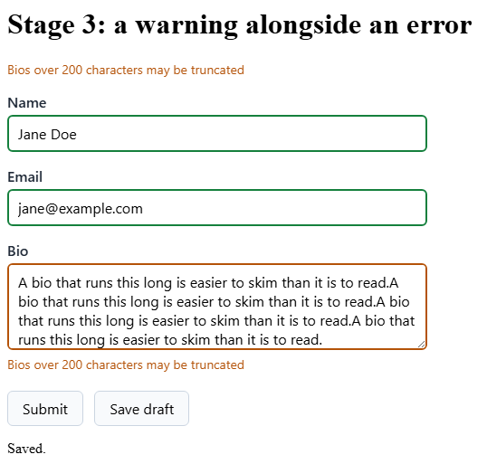

# Stage 3: a warning alongside an error

Not everything a form has to say is a refusal. A bio that runs long may be truncated somewhere
downstream. That is worth saying, and it is not worth blocking a submit over.

**You'll learn**

- How a rule advises instead of blocking.
- Why severity attaches per chain component.
- What a submit looks like with a warning showing.

## Add the warning

Bio already carries a length rule in the draft bucket. Give it a second, shorter one that only
advises:

```razor
RuleFor(c => c.Bio)
    .MaximumLength(280).WithMessage("Bio is 280 characters max")
    .MaximumLength(200).WithSeverity(Severity.Warning).WithMessage("Bios over 200 characters may be truncated");
```

<!-- Excerpt from `samples/Formidable.Tutorial/Pages/Stage3.razor` -->

`Severity` is FluentValidation's own enum, covered by the `@using FluentValidation` at the top of
the page. Without the call, a failure is an error, which is what every rule so far has produced.

`.WithSeverity` attaches to the validator it follows, not to the rule around it. It follows the
200 check here, so that one advises. The 280 check has no call of its own, so it stays an error
and still blocks. Each component of a chain that should advise needs its own call.

## Submit anyway

Run it. Type `Jane Doe` into Name and `jane@example.com` into Email. In Bio, paste this sentence
four times:

`A bio that runs this long is easier to skim than it is to read.`

That lands near 250 characters: past the warning at 200, inside the cap at 280. Now submit.



The warning is on screen and the submit went through anyway. That is the whole rule, and it runs
one way only: errors block a submit, while warnings and infos say their piece and let it through.

## Style the tiers

You added the tier rules at stage 2, in the same block as the invalid and valid ones. These two
paint the field:

```css
.formidable-warning { border: 2px solid #b45309; }
.formidable-info { border: 2px solid #1d4ed8; }
```

A field the visitor has touched or changed wears `formidable-warning` for a warning, and
`formidable-info` when infos are all it has left. An error outranks both: it paints
`formidable-invalid` whether the field was touched or not.

A message carries a severity class of its own, beside `formidable-message`. Stage 2's stylesheet
colours that one too, and the summary's bands to match:

```css
.formidable-message--warning { color: #b45309; }
.formidable-summary__band--warning { color: #b45309; }
```

So Bio's border, its message and its summary entry are one colour, and an error's three stay red.
See both tiers at once: empty Name and submit again. Name turns red, the submit blocks, Bio keeps
its orange, and the summary lists one of each.

## Recap

- `.WithSeverity(Severity.Warning)` makes a failure advisory; leaving it off leaves it an error.
- Severity attaches to the validator it follows, so each chain component that should advise needs
  its own call.
- Errors block a submit. Warnings and infos show and let it through.
- The state classes rank error first, then warning, then info.

**Next:** [Collections](4-collections.md)

**Go deeper:** [Severity](../severity.md)
