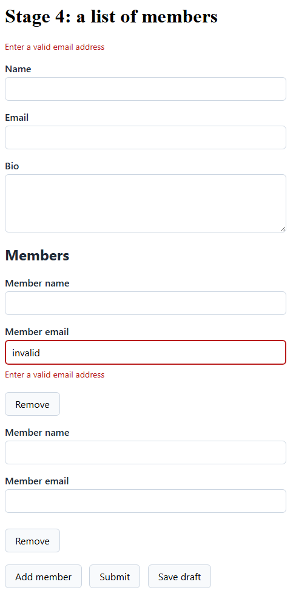

# Stage 4: a list of members

A signup can bring a team along. Each member is an object with its own fields, its own rules, and
its own messages. Rows come and go, and a message has to travel with its row.

**You'll learn**

- How a row carries rules of its own.
- Why an error stays with the row that owns it.
- How to give the list itself a rule.

## Add the rows

Give `Contact` a list, and give the list an item type:

```razor
    public List<Member> Members { get; set; } = [];
}

public class Member
{
    public string Name { get; set; } = string.Empty;
    public string Email { get; set; } = string.Empty;
}
```

<!-- Excerpt from `samples/Formidable.Tutorial/Pages/Stage4.razor` -->

A row is an ordinary object. The list holds the rows, and the rows hold the values.

Render one block per member, inside a `FormidableField` wrapping the whole list:

```razor
<FormidableField For="() => _contact.Members" Context="membersField">
    @foreach (var member in _contact.Members)
    {
        <div @key="member">
            <label>Member name
                <FormidableInputText @bind-Value="member.Name" />
            </label>
            <FormidableFieldMessage For="() => member.Name" />

            <label>Member email
                <FormidableInputText @bind-Value="member.Email" />
            </label>
            <FormidableFieldMessage For="() => member.Email" />

            <button type="button" @onclick="() => RemoveMember(_contact.Members, member, membersField)">Remove</button>
        </div>
    }

    <button type="button" @onclick="() => AddMember(_contact.Members, membersField)">Add member</button>
</FormidableField>
```

<!-- Excerpt from `samples/Formidable.Tutorial/Pages/Stage4.razor` -->

Two habits keep each row's messages on that row. Key the row's root element by the row instance —
`@key="member"`, never the loop index. And write every `For` lambda as a closure over that same
instance, the way `() => member.Name` does.

`FormidableField` renders no markup of its own. It hands its content the list's field context, which
the Add and Remove buttons pass along to their handlers:

```razor
private static void AddMember(List<Member> members, FormidableFieldContext field)
{
    members.Add(new Member());
    field.NotifyChanged();
}

private static void RemoveMember(List<Member> members, Member member, FormidableFieldContext field)
{
    members.Remove(member);
    field.NotifyChanged();
}
```

<!-- Excerpt from `samples/Formidable.Tutorial/Pages/Stage4.razor` -->

Adding or removing a row edits the list directly. An edit the engine never hears about starts no
pass, so `NotifyChanged()` tells it.

## Give each row its rules

Row rules go in the same two buckets as the rest of the form. `RuleForEach` runs a set of child
rules once per item, so a shape check on draft reads like this:

```razor
RuleForEach(c => c.Members).ChildRules(member =>
{
    member.RuleFor(m => m.Email)
        .EmailAddress().WithMessage("Enter a valid email address")
        .When(m => !string.IsNullOrEmpty(m.Email));
});
```

<!-- Excerpt from `samples/Formidable.Tutorial/Pages/Stage4.razor` -->

That is the guarded idiom Email already uses, one level down. The `When` guard is why an empty
member email says nothing. Without it, the empty string a new row starts with fails the format check
straight away.

Presence itself goes in the submit bucket:

```razor
RuleForEach(c => c.Members).ChildRules(member =>
{
    member.RuleFor(m => m.Name).NotEmpty().WithMessage("Member name is required");
});
```

<!-- Excerpt from `samples/Formidable.Tutorial/Pages/Stage4.razor` -->

A member with no name now blocks a submit, and says so on its own row.

## Delete a row

Run it. Click **Add member** three times, type `invalid` into the second row's Member email, then
leave the field. The message appears under that row. Now remove the first row:



The message stayed with the row holding `invalid`, which is now the row at the top. An error here
belongs to a row, never to a position in a list.

## A rule for the list

The list can carry a rule of its own. This one sits beside the row rules in the submit bucket:

```razor
RuleFor(c => c.Members).Must(m => m.Count >= 1).WithMessage("Add at least one member");
```

<!-- Excerpt from `samples/Formidable.Tutorial/Pages/Stage4.razor` -->

A `List<Member>` property has no input of its own, so that failure has nowhere to appear.
`FormidableCollectionMessage` gives it somewhere:

```razor
<FormidableCollectionMessage For="() => _contact.Members" />
```

<!-- Excerpt from `samples/Formidable.Tutorial/Pages/Stage4.razor` -->

Remove both rows, then submit, and the message lands there.

## Recap

- `RuleForEach(...).ChildRules(...)` gives a row its own rules, split by bucket like any field's.
- `@key` by instance, and `For` closed over that instance, keep each message on its own row.
- A page that edits the list itself calls `NotifyChanged()`.
- A collection-level rule needs `FormidableCollectionMessage` to have anywhere to appear.

**Compare your work:** [`/stage4`](../../samples/Formidable.Tutorial/Pages/Stage4.razor) in
`samples/Formidable.Tutorial`.

**Next:** [Async rules](5-async.md)

**Go deeper:** [Collections and row identity](../collections-and-row-identity.md)
