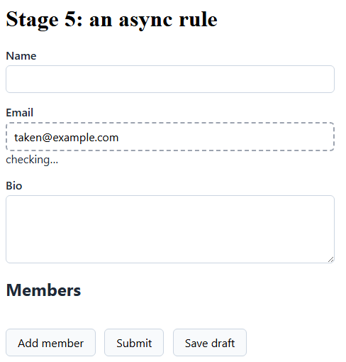

# Stage 5: an async rule

Some checks need an answer the browser does not have. Has someone already registered this
address? Only a directory knows. Ask it, and show the visitor that you are asking.

**You'll learn**

- An async rule is `MustAsync`, and nothing else changes.
- How a validator asks a service for an answer.
- How to show a pending state while that answer is in flight.

## Ask a service

Give the lookup an interface. The validator depends on the question, not on how it gets answered:

```csharp
public interface IEmailDirectory
{
    Task<bool> IsTakenAsync(string email, CancellationToken ct);
}
```

<!-- Excerpt from `samples/Formidable.Tutorial/Services/EmailDirectory.cs` -->

The tutorial's implementation stands in for a real one. It holds a single taken address, and it
waits 400 ms first, the way a network call would:

```csharp
public sealed class InMemoryEmailDirectory : IEmailDirectory
{
    private static readonly HashSet<string> Taken = new(StringComparer.OrdinalIgnoreCase)
    {
        "taken@example.com",
    };

    public async Task<bool> IsTakenAsync(string email, CancellationToken ct)
    {
        await Task.Delay(400, ct);
        return Taken.Contains(email);
    }
}
```

<!-- Excerpt from `samples/Formidable.Tutorial/Services/EmailDirectory.cs` -->

Register it in `Program.cs` beside the validator. A validator is a service like any other, so it
can take one in its constructor:

```razor
public class ContactValidator : DraftSubmitValidator<Contact>
{
    private readonly IEmailDirectory _directory;

    public ContactValidator(IEmailDirectory directory)
    {
        _directory = directory;
    }
```

<!-- Excerpt from `samples/Formidable.Tutorial/Pages/Stage5.razor` -->

Now the rule itself, beside the presence rule Email already carries in the submit bucket:

```razor
RuleFor(c => c.Email)
    .NotEmpty().WithMessage("Email is required")
    .MustAsync(async (email, ct) => !await _directory.IsTakenAsync(email, ct))
        .WithMessage("That email is already registered");
```

<!-- Excerpt from `samples/Formidable.Tutorial/Pages/Stage5.razor` -->

`MustAsync` is FluentValidation's own, awaited like any other rule. Nothing about writing one
changes because Formidable is running it.

## Show that you are checking

While the rule is in flight, its field carries a pending state. Wrap Email in a
`FormidableField` and read the flag off the context:

```razor
<FormidableField For="() => _contact.Email" Context="field">
    <label>Email
        <FormidableInputText @bind-Value="_contact.Email" />
    </label>
    <span role="status">@(field.State.IsValidating ? "checking…" : null)</span>
</FormidableField>
```

<!-- Excerpt from `samples/Formidable.Tutorial/Pages/Stage5.razor` -->

The `<span>` renders either way, and only its text comes and goes. A live region announces
reliably when assistive technology was told about it before the content arrived.

The same flag puts `formidable-pending` on the input, so a stylesheet can mark the field too. The
tutorial's CSS gives it a dashed border.

Run it. Type `taken@example.com` into Email, then leave the field:



The status text holds for as long as the lookup takes, and then the message arrives. You did not
submit to see it. Committing a change to a field is enough: by default, live validation runs the
rules a submit would run, and a field you have changed shows what they say.

> [!NOTE]
> What starts a check, what becomes of one whose value has already gone stale, and how a burst of
> keystrokes settles into a single answer are their own story:
> [Async validation](../async-validation.md).

## Recap

- An async rule is `MustAsync`; the validator takes services in its constructor.
- `field.State.IsValidating` is true while that field's check is in flight.
- Render the status element always, and change only its text.

**Compare your work:** [`/stage5`](../../samples/Formidable.Tutorial/Pages/Stage5.razor) in
`samples/Formidable.Tutorial`.

**Next:** [The server round trip](6-server.md)
