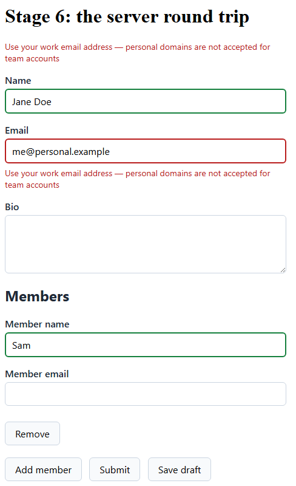

# Stage 6: the server round trip

The client's verdict is a convenience. The server's is the one that counts, and it answers with the
rules you have already written.

**You'll learn**

- How to run the same validator on the server.
- How a rejected submit lands on the exact fields it names.
- Why reading a rejection body needs a guard.

## Turn it on at the endpoint

Formidable's server-side filters run the Submit profile over the model the request carried. Minimal
APIs take one call:

```csharp
var orders = app.MapGroup("/api/orders").Validate<RoundTripOrder>();
```

<!-- Source: `samples/Formidable.Sample.Api/Program.cs` -->

MVC controllers take an attribute:

```csharp
[Validate] // class-level: every action's validatable arguments run the Submit profile
```

<!-- Source: `samples/Formidable.Sample.Api/Controllers/AgreementsController.cs` -->

Either way, a rejected request comes back as a 400 carrying `ValidationProblemDetails`: the
failures, keyed by the field paths they belong to. That is a format the client already reads.

## Post the form

Capture the form component, so you can hand it the server's answer later:

```razor
<FormidableForm Model="_contact" OnValidSubmit="HandleValid" OnInvalidSubmit="_ => _saved = false" @ref="_form">
```

<!-- Excerpt from `samples/Formidable.Tutorial/Pages/Stage6.razor` -->

`@ref` fills a field of your own:

```razor
private FormidableForm<Contact>? _form;
```

<!-- Excerpt from `samples/Formidable.Tutorial/Pages/Stage6.razor` -->

`OnValidSubmit` runs only once the client's rules pass, so posting is the next question rather than
the first one:

```razor
private async Task HandleValid()
{
    var response = await Http.PostAsJsonAsync("/api/signups", _contact);

    if (response.IsSuccessStatusCode)
    {
        _saved = true;
        return;
    }
```

<!-- Excerpt from `samples/Formidable.Tutorial/Pages/Stage6.razor` -->

## Apply the verdict

Read the body inside a `try`. A 400 says the request was rejected, not that your endpoint rejected
it: a proxy or a gateway in front of it sends its own body, often not JSON at all. Treat a body you
cannot read as no verdict, and apply nothing:

```razor
    FormidableValidationProblem? problem;
    try
    {
        problem = await response.Content.ReadFromJsonAsync(
            FormidableValidationProblemJsonContext.Default.FormidableValidationProblem);
    }
    catch (Exception ex)
        when (ex is JsonException or InvalidOperationException or NotSupportedException)
    {
        problem = null;
    }

    if (problem is null)
    {
        return;
    }

    _form!.ApplyServerIssues(problem);
}
```

<!-- Excerpt from `samples/Formidable.Tutorial/Pages/Stage6.razor` -->

> [!NOTE]
> The read names `FormidableValidationProblemJsonContext`, generated JSON metadata that needs no
> reflection. Publishing a WebAssembly app trims it, and a trimmed build cannot read the type by
> reflection at all.

`ApplyServerIssues` puts each issue on the field it names, at the severity it carries. Errors block
and mark their field invalid; warnings and infos land as advisories that block nothing. Each call
replaces the last server verdict, so resubmitting leaves no stale duplicate behind.

> [!NOTE]
> The tutorial app under `samples/Formidable.Tutorial` fakes the wire, so its `/stage6` page runs
> this round trip live with no server at all. `Program.cs` builds the browser's `HttpClient` over a
> message handler that answers `/api/signups` in-process. The hosted demo of the main sample uses
> the same trick.

Run it. Fill in Name, put `me@personal.example` in Email, add a member and give it a name, then
submit. The client is satisfied; the server is not:



Nothing on the page treats that message as special. It sits where the client's own message would
sit: in the summary, and under the field it names.

## Recap

- One call or one attribute runs the same validator server-side.
- The response names fields, so `ApplyServerIssues` can land each issue on its own.
- Guard the deserialize: a 400 you did not write can carry anything.
- Six stages, one form. That is the tutorial.

**Compare your work:** [`/stage6`](../../samples/Formidable.Tutorial/Pages/Stage6.razor) in
`samples/Formidable.Tutorial`.

**Next:** [Recipes](../recipes.md) — the tutorial ends here, and the recipes pick up from "I want
to…".

**Go deeper:** [Server integration](../server-integration.md)
